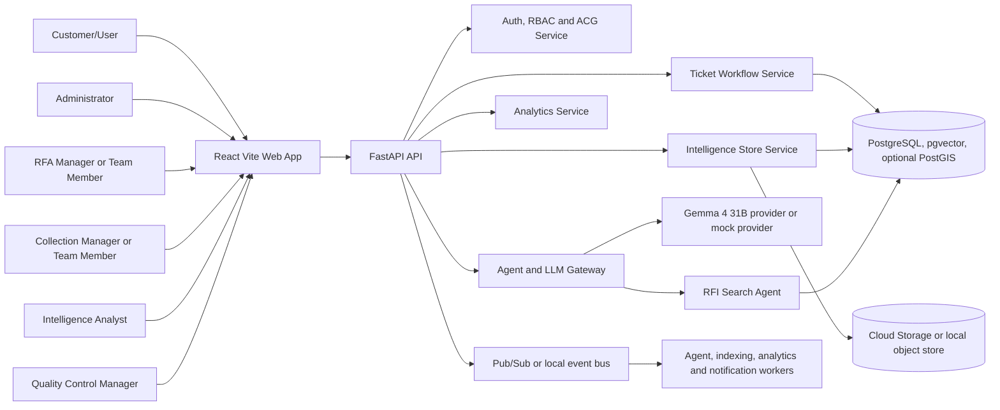

# Coeus: Spec-driven implementation plan

Version: 1.1  
Target repository: `ShabalalaWATP/coeus`  
Product name: **Coeus**  
Suggested product strapline: **Knowledge-led intelligence tasking and product orchestration**

## Confirmed project details

Use these values for local documentation, deployment notes, GitHub Actions variables, and Terraform environment configuration. Do not commit personal account emails, browser screenshots, private credentials, billing details, or service account keys.

```text
GitHub repository: ShabalalaWATP/coeus
Google Cloud project name: Coeus
Google Cloud project ID: `<work-gcp-project-id>`
Google Cloud project number: `<work-gcp-project-number>`
Default development environment name: dev
```

For Terraform and CI/CD, keep project-specific values in checked-in example files and environment-specific values in GitHub environment variables or Google Secret Manager. Use examples such as `.env.example`, `terraform.tfvars.example`, and GitHub Actions documentation rather than committing real secrets.

## 1. Executive summary

Coeus is a secure, role-based intelligence tasking and intelligence product management platform. It gives customers a conversational way to raise Requests for Intelligence, then orchestrates the request through existing product search, Request for Assessment review, Collection Management review, analyst production, Quality Control, dissemination, feedback, and learning.

The platform must be built with:

- Backend: Python 3.12+, FastAPI, Pydantic v2, SQLAlchemy 2 async, Alembic, PostgreSQL, pgvector, optional PostGIS.
- Frontend: React, Vite, TypeScript, React Router, TanStack Query, React Hook Form, Zod, Vitest, React Testing Library, Playwright.
- Cloud: Google Cloud Platform services where suitable, especially Cloud Run, Cloud SQL for PostgreSQL, Cloud Storage, Secret Manager, Pub/Sub, Artifact Registry, Cloud Logging, Cloud Monitoring, Cloud KMS, and a configurable Gemma 4 31B LLM provider.
- Security: secure by design, UK Gov-aligned, NCSC Cloud Security Principles, OWASP ASVS, least privilege, complete auditability, defensive logging, supply-chain security, and strong CI/CD gates.
- Testing: 95% minimum line and branch coverage for backend and frontend application code.

The application must be dark themed by default, with a light theme option. It must support a professional login page with space for a Coeus logo. MFA is out of scope because the target end state is an air-gapped private hosting environment, but session security, password handling, rate limiting, audit, and RBAC must still be treated as critical.

Important public repository rule: `ShabalalaWATP/coeus` is planned as a public repository. The repo must never contain real intelligence products, real operational examples, real screenshots, real API schemas, real credentials, internal URLs, classified strings, classification-marked content, or real organisational data. All seed data must be synthetic and clearly labelled as mock.


## 2. Coding-agent operating rules

Give these rules to the coding agent before implementation starts.

1. Work phase by phase. Do not jump ahead to later features before the current phase passes its tests and acceptance criteria.
2. Every feature must start with a Markdown spec in `docs/specs/`.
3. Every material design decision must have an ADR in `docs/adr/`.
4. Every security-sensitive feature must update `docs/threat-model/`.
5. Backend route handlers must stay thin. Business logic belongs in services, domain modules, repositories, or agents.
6. Frontend components must stay small. Keep view orchestration separate from reusable UI components.
7. Keep all generated clients, migrations, and seed fixtures isolated from business logic.
8. Do not add mock shortcuts in production code. Use dependency injection and test providers.
9. Do not commit real secrets, internal hostnames, private URLs, sample classified content, or real documents.
10. Do not lower coverage gates to make CI pass.
11. No role check should exist only in the frontend. Backend RBAC and object-level access checks are mandatory.
12. No intelligence product should be visible unless both RBAC and Access Control Group checks pass.
13. No LLM output should drive an irreversible action without validation and, where required, human approval.
14. Agents must return structured outputs validated by Pydantic models.
15. Prefer explicit state machines over scattered strings and ad hoc conditions.

## 3. Repo structure

Use a monorepo.

```text
coeus/
  apps/
    api/
      src/coeus/
      tests/
    web/
      src/
      tests/
  packages/
    contracts/
    test-fixtures/
    mock-product-generators/
  infra/
    terraform/
    docker/
    local/
  docs/
    specs/
    adr/
    threat-model/
    user-stories/
    runbooks/
  scripts/
    seed/
    security/
  .github/
    workflows/
    dependabot.yml
    CODEOWNERS
```

## 4. Key terms

| Term | Meaning |
|---|---|
| RFI | Request for Intelligence raised by a customer or user. |
| RFA | Request for Assessment route, used when an assessment team can answer the requirement. |
| CM | Collection Management route, used when the answer requires collection tasking or collection coordination. |
| Intelligence Product | A stored report, assessment, imagery product, SIGINT-style mock product, geospatial layer, structured dataset, or finished output. |
| Intelligence Store | The searchable, access-controlled repository of intelligence products and supporting assets. |
| ACG | Access Control Group. Product visibility is governed by ACG membership as well as RBAC. |
| Orchestration Agent | The agent that manages intake, routing, agent coordination, and customer-facing status. |
| Existing Product | A product already present in the Intelligence Store before the current RFI was raised. |
| New Product | A product produced by analysts during the workflow and automatically ingested into the Intelligence Store after QC approval. |

## 5. Product identity and UI direction

Product name: **Coeus**

Brand direction:

- Professional, dark by default, calm, intelligence command-centre feel.
- Avoid gimmicky spy themes.
- Use restrained motion, clear status indicators, and strong hierarchy.
- Include a logo slot on the login page, app shell, Intelligence Store, generated product preview, and admin settings.
- UI should feel closer to a secure enterprise operations platform than a chatbot demo.

Initial design tokens:

```text
Default theme: dark
Primary surface: near-black graphite
Secondary surface: deep blue-grey
Accent: controlled cyan or blue
Warning: amber
Critical: red
Success: green
Typography: clean sans-serif, high readability
Density: enterprise dashboard, not consumer social app
```

Theme requirements:

- Dark mode is the default.
- Light mode is available.
- Theme preference is saved locally and later persisted to the user profile.
- Accessibility contrast must pass automated checks.

## 6. High-level architecture



## 7. Roles, views and permissions

### 7.1 Roles

| Role | Purpose | Default view |
|---|---|---|
| Administrator | Platform administration, users, roles, ACGs, products, audit, settings, global dashboards. | `/admin/overview` |
| User / Customer | Raise RFIs, chat with Coeus, view own tickets, view permitted products, provide feedback. | `/app/requests` |
| Request for Assessment Manager | Review RFA capability decisions, assign analysts, approve route, view RFA analytics. | `/rfa/queue` |
| Request for Assessment Team Member | Add existing products, support RFA work, view RFA-authorised products and assigned work. | `/rfa/products` |
| Collection Manager | Review CM capability decisions, approve collection route, view CM analytics. | `/collection/queue` |
| Collection Team Member | Add existing collection products, support CM work, view CM-authorised products and assigned work. | `/collection/products` |
| Intelligence Analyst | Work on assigned tasks, draft products, add notes, submit to QC. | `/analyst/workbench` |
| Quality Control Manager | Review products, approve, reject, disseminate, trigger Intelligence Store indexing. | `/qc/queue` |

A person can have multiple roles. The permission system must support multiple role assignments per user.

### 7.2 RBAC permissions

Minimum permissions:

```text
auth:login
auth:logout
user:read_self
user:update_self
user:create
user:disable
user:assign_role
role:manage
acg:create
acg:update
acg:assign_user
acg:assign_product
acg:view
ticket:create
ticket:read_own
ticket:read_assigned
ticket:read_all
ticket:add_information
ticket:add_comment
ticket:transition
chat:use
rfi:search
rfi:offer_product
rfi:accept_product
rfi:reject_product
rfa:review
rfa:assign
rfa:add_product
collection:review
collection:assign
collection:add_product
analyst:work
analyst:submit_product
qc:review
qc:approve
qc:reject
product:create_existing
product:create_from_qc
product:read
product:read_restricted
product:update_metadata
product:manage_assets
product:publish
product:archive
product:search
product:download
product:disseminate
feedback:create
feedback:read
analytics:view_own
analytics:view_team
analytics:view_global
audit:read
system:configure
```

### 7.3 Access Control Groups

RBAC answers: **what can this user do?**  
ACGs answer: **what products can this user see?**

Rules:

1. Default deny.
2. A user must be active.
3. The user must have a role permission that allows the action.
4. The user must be a member of at least one ACG attached to the product or ticket unless the user has a specific administrative override permission.
5. The product classification level must be less than or equal to the user's clearance level.
6. Product caveats and releasability rules must pass.
7. Draft products must be visible only to assigned analysts, relevant managers, QC, and administrators.
8. QC-approved products become searchable, but search results must still be filtered by ACG and clearance.
9. ACG membership changes must be audited.

Example access check:

```python
async def can_view_product(user: User, product: IntelligenceProduct) -> bool:
    if not user.is_active:
        return False
    if not user.has_permission("product:read"):
        return False
    if user.clearance_level < product.classification_level:
        return False
    if not product.releasability_rules.allow(user):
        return False
    if not set(user.acg_ids).intersection(product.acg_ids):
        return False
    return True
```

## 8. Main workflow state machine

Every transition must be performed by the backend state machine. Every transition must create an immutable event.

| State | Owner | Description | Exit condition |
|---|---|---|---|
| `DRAFT_INTAKE` | User and Orchestration Agent | Chatbot collects the requirement. | Minimum intake fields complete. |
| `INFO_REQUIRED` | User | More detail is needed. | User supplies the missing information. |
| `RFI_SEARCHING` | RFI Search Agent | Search existing products in the Intelligence Store and permitted connectors. | Match found or no useful match. |
| `RFI_MATCH_OFFERED` | User | Existing products are offered. | User accepts or rejects. |
| `CLOSED_EXISTING_PRODUCT_ACCEPTED` | System | User accepted an existing product. | Ticket closed. |
| `ROUTE_ASSESSMENT` | Orchestration Agent | RFA and CM capability checks are requested. | Capability responses received. |
| `RFA_MANAGER_REVIEW` | RFA Manager | RFA route needs human approval. | Approved, rejected, or clarification requested. |
| `CM_MANAGER_REVIEW` | Collection Manager | CM route needs human approval. | Approved, rejected, or clarification requested. |
| `ANALYST_ASSIGNMENT` | RFA or CM Manager | Work is assigned to analysts. | Analyst accepts assignment. |
| `ANALYST_IN_PROGRESS` | Intelligence Analyst | Product is being produced. | Product submitted to QC. |
| `QC_REVIEW` | QC Manager | Product is checked. | Approved or returned for rework. |
| `REWORK_REQUIRED` | Analyst and Manager | Product needs changes. | Resubmitted to QC. |
| `DISSEMINATION_READY` | QC Manager | Product is approved and ready to send. | Dissemination confirmed. |
| `DISSEMINATED` | System | Product has been sent and stored. | Feedback requested. |
| `FEEDBACK_PENDING` | User | User can accept, reject, or request changes. | Feedback received. |
| `CLOSED_ACCEPTED` | System | User accepted final output. | Ticket closed. |
| `CLOSED_REJECTED` | System | User rejected and no further action is authorised. | Ticket closed. |
| `CANCELLED` | User or Manager | Ticket cancelled. | Ticket closed. |

## 9. Intelligence Store

The Intelligence Store is a core part of Coeus, not a later add-on.

### 9.1 Purpose

The Intelligence Store must allow authorised teams to store, tag, search, retrieve, and reuse intelligence products. It supports the RFI Search Agent, analyst workflows, product dissemination and trend analysis.

### 9.2 Product types

Support these product types from the start:

| Product type | File or data examples |
|---|---|
| Assessment report | PDF, DOCX, Markdown-derived PDF, structured JSON summary. |
| Intelligence summary | PDF, DOCX, HTML preview. |
| Satellite imagery product | PNG, JPEG, GeoTIFF placeholder metadata in MVP. |
| SIGINT-style mock data | CSV, JSON, TXT summary, structured signal event records. |
| Geographic product | GeoJSON, KML, shapefile placeholder metadata, PostGIS geometry. |
| Database extract | CSV, JSON, Parquet placeholder metadata. |
| Product bundle | Multiple assets linked to one product record. |
| Finished Coeus output | QC-approved analyst product generated by the workflow. |

### 9.3 Who can add existing products

Existing products can be added by:

- Administrators.
- Request for Assessment Team Members with `rfa:add_product` and `product:create_existing`.
- Collection Team Members with `collection:add_product` and `product:create_existing`.
- Managers who inherit the relevant team member permissions.

New products created during Coeus workflows are automatically added to the Intelligence Store after QC approval. The QC Manager approves release; the system then creates or updates the Intelligence Store product, stores the assets, generates embeddings, applies metadata, applies ACGs, and indexes the product.

### 9.4 Product metadata taxonomy

Use rich metadata from the start. Search quality will depend on this.

| Metadata group | Fields |
|---|---|
| Core | `title`, `summary`, `description`, `product_type`, `language`, `version`, `status`, `origin`, `source_system`, `created_by`, `created_at`, `updated_at`. |
| Security and access | `classification`, `handling_caveats`, `releasability`, `acg_ids`, `owner_team_id`, `clearance_required`, `need_to_know_tags`, `review_required`. |
| Temporal | `time_period_start`, `time_period_end`, `reporting_period`, `event_time`, `collection_time`, `published_at`. |
| Geographic | `area_or_region`, `country`, `admin_area`, `grid_reference`, `bounding_box`, `centroid`, `geojson_ref`, `geometry`, `spatial_confidence`. |
| Source and collection | `source_type`, `collection_method`, `source_reliability`, `information_credibility`, `collector_team`, `sensor_type`, `source_ids`. |
| Entities | `people`, `organisations`, `locations`, `equipment`, `facilities`, `networks`, `keywords`. Use synthetic entities in seed data. |
| Analytical | `themes`, `threat_categories`, `confidence`, `assessment_type`, `key_judgements`, `assumptions`, `intelligence_gaps`. |
| Workflow | `linked_ticket_ids`, `linked_task_ids`, `qc_review_id`, `dissemination_ids`, `feedback_ids`. |
| Assets | `asset_count`, `primary_asset_id`, `asset_types`, `file_hashes`, `mime_types`, `object_storage_keys`. |
| Search | `tags`, `aliases`, `full_text`, `embedding_model`, `embedding`, `search_boost`, `last_indexed_at`. |
| Quality | `qc_status`, `qc_reviewer_id`, `release_manager_id`, `review_notes`, `expiry_review_date`, `superseded_by_product_id`. |

### 9.5 Search behaviour

The Intelligence Store must provide:

- Full-text search.
- Vector similarity search via pgvector.
- Metadata filtering.
- ACG-filtered results.
- Classification and releasability filtering.
- Date and geography filtering.
- Product type filtering.
- Team and source filtering.
- Linked ticket search.
- Search explanations for RFI Search Agent results.
- Search result snippets with no leakage of unauthorised content.

## 10. Mock product seed strategy

The seed data must be synthetic, deterministic, and safe for a public repository.

### 10.1 Seed data principles

- Use fixed random seeds so tests are repeatable.
- Use fictional region names and organisations.
- Use mock classification values, not real marking strings.
- Add a visible `MOCK DATA ONLY` banner or metadata field to generated documents.
- Do not copy real report structure, internal templates, real source labels, or real operational terms.
- Generate assets at seed time where possible rather than committing binary files.
- Keep a small safe fixture set in the repo for tests.
- Store large generated assets outside Git, either in local object storage or Cloud Storage.

### 10.2 Seed asset volumes

Initial seed should create at least:

| Asset category | Initial count | Format |
|---|---:|---|
| Mock assessment reports | 40 | PDF and DOCX |
| Mock intelligence summaries | 40 | PDF and DOCX |
| Mock imagery products | 30 | PNG and JPEG |
| Mock geographic layers | 25 | GeoJSON and KML |
| Mock SIGINT-style records | 25 | CSV and JSON |
| Mock database extracts | 15 | CSV and JSON |
| Mixed product bundles | 15 | Linked PDF, image, GeoJSON, and CSV assets |

### 10.3 Seed scripts

Create:

```text
scripts/seed/seed_users.py
scripts/seed/seed_acgs.py
scripts/seed/seed_mock_products.py
scripts/seed/seed_mock_tickets.py
scripts/seed/seed_mock_feedback.py
packages/mock-product-generators/
  pdf_generator.py
  docx_generator.py
  image_generator.py
  geojson_generator.py
  sigint_generator.py
  metadata_factory.py
```

Suggested generation libraries:

```text
PDF: reportlab or WeasyPrint
DOCX: python-docx
Images: Pillow
GeoJSON/KML: geojson, shapely, simplekml if needed
CSV/JSON: Python standard library and pandas only where useful
Embeddings: mock deterministic embeddings in tests, real provider in dev when configured
```

### 10.4 Seed access groups

Create synthetic ACGs such as:

```text
ACG-ALPHA-REGIONAL
ACG-BRAVO-COLLECTION
ACG-CHARLIE-ASSESSMENT
ACG-DELTA-GEO
ACG-ECHO-SIGINT-MOCK
ACG-FOXTROT-CUSTOMER-A
ACG-GOLF-CUSTOMER-B
```

Each mock product must have at least one ACG. Some products should have multiple ACGs to test cross-team access.

### 10.5 Seed test scenarios

Include seed scenarios for:

1. User can see a product because they share an ACG.
2. User cannot see a product because they lack the ACG.
3. User cannot see a product because their clearance is too low.
4. Administrator can find the product but must see an administrative access reason.
5. RFI Search Agent returns only products the user is allowed to see.
6. Analyst can see draft product for assigned work.
7. User cannot see draft product before dissemination.
8. QC-approved product is automatically indexed.
9. Superseded product links to the newer product.
10. Product bundle returns all permitted assets and hides non-permitted assets.

## 11. Agent model

Agents must be implemented as backend services behind interfaces. Agents recommend and summarise; they do not silently approve controlled workflow steps.

| Agent | Responsibility |
|---|---|
| Orchestration Agent | Owns the conversation, missing information, routing, user-facing status, and coordination. |
| Intake Agent | Extracts structured fields from natural language. |
| RFI Search Agent | Searches the Intelligence Store and mock connectors, ranks permitted products, explains matches. |
| RFA Capability Agent | Checks whether RFA teams can meet the request and what they need. |
| CM Capability Agent | Checks whether collection can meet the request and what they need. |
| Task Breakdown Agent | Converts approved requirements into work packages. |
| Intelligence Store Metadata Agent | Suggests tags, entities, summaries, ACG candidates, and metadata for uploaded mock products. Human confirmation required for access control metadata. |
| Quality Support Agent | Assists QC with checklist prompts and metadata completeness. It cannot approve. |
| Trends Analysis Agent | Reviews process data to identify demand, bottlenecks, and repeated gaps. |
| Feedback Learning Agent | Summarises user feedback and suggests process improvements. |

LLM provider interface:

```python
class LlmProvider(Protocol):
    async def complete_structured(
        self,
        *,
        system_prompt: str,
        user_prompt: str,
        response_model: type[BaseModel],
        tools: list[ToolSpec] | None = None,
        metadata: dict[str, str] | None = None,
    ) -> BaseModel:
        ...
```

Provider implementations:

```text
MockLlmProvider
GemmaVertexProvider
GemmaVllmProvider
```

All unit tests must use `MockLlmProvider`.

## 12. Comprehensive user stories

Use these as the first backlog. Each story should become one or more tickets with tests.

### 12.1 Authentication, roles and sessions

| ID | Actor | User story | Acceptance criteria |
|---|---|---|---|
| AUTH-001 | User | As a user, I want to log in securely so that I can access Coeus. | Valid credentials create a secure session cookie, invalid credentials return a generic error, auth event is audited. |
| AUTH-002 | User | As a user, I want to log out so that my session is ended. | Logout invalidates the server-side session and redirects to login. |
| AUTH-003 | User | As a user, I want expired sessions to be handled cleanly so that I know why I must log in again. | Expired session returns 401 and frontend shows session expired page. |
| AUTH-004 | Administrator | As an administrator, I want to create users so that people can access the platform. | Admin can create users with one or more roles, clearance level, and starting ACGs. |
| AUTH-005 | Administrator | As an administrator, I want to disable users so that leavers or blocked users cannot access the system. | Disabled users cannot log in and active sessions are revoked. |
| AUTH-006 | Administrator | As an administrator, I want to assign roles so that users receive the correct views and permissions. | Role changes are audited and effective after refresh. |
| AUTH-007 | Security reviewer | As a security reviewer, I want RBAC enforced in the backend so that frontend bypasses do not grant access. | Direct API calls without permission return 403. |
| AUTH-008 | User | As a user, I want errors to avoid leaking account validity so that login cannot be enumerated. | Failed username and failed password produce the same response. |
| AUTH-009 | Administrator | As an administrator, I want login failures rate-limited so that brute-force attacks are slowed. | Repeated failures trigger lockout or cooldown and audit events. |
| AUTH-010 | User | As a user, I want theme preference saved so that my preferred display mode persists. | Dark is default, light toggle persists locally and later in profile. |

### 12.2 Access Control Groups and product access

| ID | Actor | User story | Acceptance criteria |
|---|---|---|---|
| ACG-001 | Administrator | As an administrator, I want to create ACGs so that product access can be controlled. | ACG has name, description, owner, status, and audit history. |
| ACG-002 | Administrator | As an administrator, I want to add users to ACGs so that they can see permitted products. | User membership is effective immediately and audited. |
| ACG-003 | Administrator | As an administrator, I want to remove users from ACGs so that access can be withdrawn. | Removed users lose product access on next request. |
| ACG-004 | Product owner | As a product owner, I want to attach ACGs to products so that only permitted users can see them. | Product requires at least one ACG before publication. |
| ACG-005 | User | As a user, I want search results filtered by my ACGs so that I only see products I am allowed to access. | Unauthorised products do not appear in search results or counts. |
| ACG-006 | Administrator | As an administrator, I want to see why a product is or is not visible to a user so that access issues can be resolved. | Access diagnostic page explains RBAC, ACG, clearance, caveat, and product status outcomes. |
| ACG-009 | Administrator | As an administrator, I want ACG changes to be auditable so that access decisions are traceable. | Every membership and product ACG change creates immutable audit entries. |
| ACG-010 | Security reviewer | As a security reviewer, I want object-level tests so that IDOR issues are caught. | Tests prove users cannot fetch unauthorised products, assets or tickets by ID. |

### 12.3 Chatbot intake and ticket creation

| ID | Actor | User story | Acceptance criteria |
|---|---|---|---|
| CHAT-001 | User | As a user, I want to describe my intelligence requirement in natural language so that I do not need to fill a long form first. | Chat accepts free text and starts a `DRAFT_INTAKE` ticket. |
| CHAT-002 | User | As a user, I want Coeus to ask follow-up questions so that the requirement is complete enough for analysts. | Missing required fields produce targeted questions. |
| CHAT-003 | User | As a user, I want to see extracted requirement details so that I can correct them. | Extracted fields are shown in an editable panel. |
| CHAT-004 | User | As a user, I want to submit the requirement only when enough information has been collected. | Submit button stays disabled until minimum field completeness is met. |
| CHAT-005 | User | As a user, I want to attach supporting material metadata so that the team understands what I already have. | MVP supports attachment metadata placeholders and later real upload. |
| CHAT-006 | User | As a user, I want to add information after submission so that new context reaches the right team. | Additional information is added to ticket timeline and routed by orchestration. |
| CHAT-007 | Orchestration Agent | As the orchestration agent, I want structured intake output so that downstream services receive predictable data. | Pydantic model validation blocks malformed agent output. |
| CHAT-008 | Manager | As a manager, I want to see original chat context so that I understand user intent. | Authorised managers see chat transcript, extracted fields and edits. |
| CHAT-009 | Security reviewer | As a security reviewer, I want prompt injection regression tests so that malicious user text cannot alter system rules. | Tests cover attempts to bypass RBAC, reveal hidden prompts, and fabricate products. |

### 12.4 RFI search and product offer

| ID | Actor | User story | Acceptance criteria |
|---|---|---|---|
| RFI-001 | RFI Search Agent | As the search agent, I want to search existing products so that repeated work is avoided. | Agent searches permitted Intelligence Store products using hybrid search. |
| RFI-002 | User | As a user, I want to be offered matching products so that I can close the request quickly if the answer already exists. | Matched products appear with summary, reason, date, product type and confidence. |
| RFI-003 | User | As a user, I want only products I am allowed to see. | Offer list is ACG, clearance, caveat and releasability filtered. |
| RFI-004 | User | As a user, I want to accept an existing product so that the ticket can close. | Accepting creates dissemination record and closes ticket as existing product accepted. |
| RFI-005 | User | As a user, I want to reject an existing product with a reason so that the team knows what is missing. | Rejection reason is captured and routed to RFA and CM checks. |
| RFI-006 | Manager | As a manager, I want to know why search failed so that we can improve tags and products. | No-match outcome records query, filters and safe diagnostic reason. |
| RFI-007 | Administrator | As an administrator, I want search metrics so that product reuse can be measured. | Dashboard includes hit rate and existing product acceptance rate. |
| RFI-008 | Security reviewer | As a security reviewer, I want no leakage in search counts so that unauthorised users cannot infer product existence. | Counts and facets are calculated only after access filtering. |

### 12.5 Intelligence Store product management

| ID | Actor | User story | Acceptance criteria |
|---|---|---|---|
| STORE-001 | Administrator | As an administrator, I want to add an existing product so that the store can be populated. | Admin can upload product metadata and one or more assets. |
| STORE-002 | RFA Team Member | As an RFA team member, I want to add existing RFA products so that future RFIs can reuse them. | Role can create products only within allowed teams and ACGs. |
| STORE-003 | Collection Team Member | As a collection team member, I want to add collection products so that collection outputs become discoverable. | Role can create products only within allowed collection ACGs. |
| STORE-004 | Product creator | As a product creator, I want to tag products with rich metadata so that they are searchable. | Required metadata fields must be completed before publication. |
| STORE-005 | Product creator | As a product creator, I want to attach ACGs so that product access is controlled. | Product cannot be published with zero ACGs. |
| STORE-006 | Product creator | As a product creator, I want metadata suggestions so that tagging is faster. | Metadata agent suggests tags but human confirms before save. |
| STORE-007 | User | As a user, I want to search permitted products so that I can self-serve knowledge. | User sees only permitted products and safe previews. |
| STORE-008 | User | As a user, I want to filter products by type, date, region and tag so that I can find relevant products quickly. | Search filters work and update result counts after access filtering. |
| STORE-009 | Analyst | As an analyst, I want to link store products to my task so that evidence and context are traceable. | Analyst can attach permitted products to task notes. |
| STORE-010 | QC Manager | As a QC manager, I want approved products automatically stored so that finished outputs are reusable. | QC approval triggers product creation, asset storage, embeddings and indexing. |
| STORE-011 | Product owner | As a product owner, I want to supersede old products so that users find the latest version. | Product can link to replacement and search can prioritise latest. |
| STORE-012 | Product owner | As a product owner, I want to archive products so that outdated products are not offered by default. | Archived products are hidden from default search but visible to authorised admins. |
| STORE-013 | User | As a user, I want to preview product metadata before opening an asset so that I can decide whether it is relevant. | Product detail shows summary, tags, time, region, type and access caveats. |
| STORE-014 | User | As a user, I want to download permitted assets so that I can use the product. | Signed or controlled download succeeds only if access check passes. |
| STORE-015 | Security reviewer | As a security reviewer, I want asset access checks so that object storage URLs do not bypass RBAC or ACGs. | Asset download endpoint checks product access before issuing URL or streaming file. |
| STORE-016 | Data steward | As a data steward, I want file hashes recorded so that product integrity can be checked. | Each asset stores hash, size, MIME type and object key. |
| STORE-017 | Data steward | As a data steward, I want geospatial metadata stored so that map and location search work. | GeoJSON/KML products store bounding box, centroid and geometry when available. |
| STORE-018 | Administrator | As an administrator, I want seed scripts to create mock products so that dev and test environments are useful. | Seed creates PDF, DOCX, images, GeoJSON, KML, CSV and JSON products with ACGs. |

### 12.6 RFA and CM workflow

| ID | Actor | User story | Acceptance criteria |
|---|---|---|---|
| ROUTE-001 | Orchestration Agent | As the orchestration agent, I want to request RFA and CM capability checks when search is insufficient. | Both checks run and store structured results. |
| ROUTE-002 | RFA Capability Agent | As the RFA agent, I want to decide whether assessment can satisfy the request. | Output includes capability, confidence, gaps, work packages and risks. |
| ROUTE-003 | CM Capability Agent | As the CM agent, I want to decide whether collection can satisfy the request. | Output includes route, collection needs, confidence, gaps and risks. |
| ROUTE-004 | RFA Manager | As an RFA manager, I want to approve the RFA route so that analysts can be assigned. | Approval transitions ticket to analyst assignment. |
| ROUTE-005 | RFA Manager | As an RFA manager, I want to reject or request clarification so that poor tasks do not reach analysts. | Rejection or clarification reason is required and audited. |
| ROUTE-006 | Collection Manager | As a collection manager, I want to approve collection route so that collection work can begin. | Approval transitions ticket to collection-backed assignment. |
| ROUTE-007 | Collection Manager | As a collection manager, I want fallback from RFA to CM so that unsatisfied RFAs are not dropped. | If RFA cannot satisfy and CM can, ticket routes to CM review. |
| ROUTE-008 | Manager | As a manager, I want to override agent recommendations so that human judgement remains authoritative. | Override requires reason and creates audit event. |
| ROUTE-009 | User | As a user, I want clarification requests shown clearly so that I can unblock the task. | User receives focused questions and ticket moves to `INFO_REQUIRED`. |
| ROUTE-010 | Administrator | As an administrator, I want route statistics so that bottlenecks are visible. | Dashboard shows RFA acceptance, CM fallback and clarification rates. |

### 12.7 Analyst, QC and dissemination

| ID | Actor | User story | Acceptance criteria |
|---|---|---|---|
| WORK-001 | Manager | As a manager, I want to assign analysts so that approved tasks have owners. | Assignment creates analyst task and audit event. |
| WORK-002 | Analyst | As an analyst, I want to see assigned tasks so that I know what to work on. | Workbench lists assigned tasks only. |
| WORK-003 | Analyst | As an analyst, I want full ticket context so that I understand the requirement. | Analyst task view shows intake, chat summary, products and manager notes. |
| WORK-004 | Analyst | As an analyst, I want to create notes so that my work is traceable. | Notes are timestamped, linked to task and permission checked. |
| WORK-005 | Analyst | As an analyst, I want to link existing products from the Intelligence Store so that source material is recorded. | Only permitted products can be linked. |
| WORK-006 | Analyst | As an analyst, I want to draft a product so that it can be reviewed. | Draft stores metadata, content and assets. |
| WORK-007 | Analyst | As an analyst, I want to submit to QC so that release checks happen. | Submit moves ticket to `QC_REVIEW`. |
| WORK-008 | QC Manager | As a QC manager, I want a review queue so that I can approve or reject products. | QC queue shows submitted products and required checks. |
| WORK-009 | QC Manager | As a QC manager, I want a structured checklist so that release decisions are consistent. | Checklist completion required before approval. |
| WORK-010 | QC Manager | As a QC manager, I want to reject with reasons so that analysts can rework the product. | Rejection creates rework state and analyst notification. |
| WORK-011 | QC Manager | As a QC manager, I want approved products added to the Intelligence Store so that future RFIs can reuse them. | Approval triggers automatic product ingestion and indexing. |
| WORK-012 | User | As a user, I want final products disseminated to me through the ticket so that I can retrieve the answer. | Disseminated product appears in ticket if access policy permits. |
| WORK-013 | Security reviewer | As a security reviewer, I want analysts unable to approve their own work so that separation of duties is enforced. | Permission tests prove analyst role cannot approve or disseminate. |

### 12.8 Feedback, analytics and trends

| ID | Actor | User story | Acceptance criteria |
|---|---|---|---|
| FDBK-001 | User | As a user, I want to rate the product so that the team knows whether it met the requirement. | Feedback stores rating, accepted flag, free text and missing items. |
| FDBK-002 | User | As a user, I want to request rework where allowed so that unmet needs are addressed. | Rework request routes to manager review. |
| FDBK-003 | Manager | As a manager, I want feedback visible in dashboards so that service quality can improve. | Dashboards show acceptance, usefulness and timeliness. |
| FDBK-004 | Trends Agent | As the trends agent, I want to detect recurring demand so that teams can plan better. | Agent produces reviewed trend summaries without changing tickets. |
| FDBK-005 | Administrator | As an administrator, I want global statistics so that system performance is visible. | Admin dashboard shows tickets by state, stage timing and product reuse. |
| FDBK-006 | RFA Manager | As an RFA manager, I want RFA-specific analytics so that I can manage workload. | RFA dashboard shows queue size, cycle time, analyst load and QC rejects. |
| FDBK-007 | Collection Manager | As a collection manager, I want CM-specific analytics so that collection bottlenecks are visible. | CM dashboard shows fallback, collection route volume and stage timing. |
| FDBK-008 | Product owner | As a product owner, I want product reuse analytics so that useful products can be maintained. | Product detail shows search appearances, offers, acceptances and feedback. |

### 12.9 Administration, audit and platform controls

| ID | Actor | User story | Acceptance criteria |
|---|---|---|---|
| ADMIN-001 | Administrator | As an administrator, I want to manage users so that access remains accurate. | Create, edit, disable and role assignment work and are audited. |
| ADMIN-002 | Administrator | As an administrator, I want to manage teams so that work can be assigned correctly. | Teams have members, managers and default ACGs. |
| ADMIN-003 | Administrator | As an administrator, I want to manage system settings so that deployment-specific options are configurable. | Settings are validated and audited. |
| ADMIN-004 | Administrator | As an administrator, I want to inspect agent runs so that agent behaviour is transparent. | Agent run log shows inputs summary, structured output, status and errors. |
| ADMIN-005 | Administrator | As an administrator, I want to search audit logs so that investigations are possible. | Audit search supports user, action, ticket, product, ACG and date filters. |
| ADMIN-006 | Security reviewer | As a security reviewer, I want immutable audit records so that user activity cannot be silently changed. | App has no update/delete path for audit events. |
| ADMIN-007 | Developer | As a developer, I want CI to block weak code so that quality remains high. | Lint, typecheck, tests, coverage and security checks are required. |
| ADMIN-008 | Developer | As a developer, I want Dependabot and vulnerability review so that dependencies stay current. | Dependency PRs run test and security workflows. |
| ADMIN-009 | Maintainer | As a maintainer, I want branch protection so that main cannot be changed without review. | PRs, approvals and required checks are enforced. |
| ADMIN-010 | Security reviewer | As a security reviewer, I want DAST and container scans so that deployable builds are checked. | ZAP baseline and image scans run in CI/CD. |

## 13. Frontend implementation plan

### Frontend phase 1: Vite foundation and app shell

Build the React Vite TypeScript frontend.

Required stack:

```text
React
Vite
TypeScript
React Router
TanStack Query
React Hook Form
Zod
MSW
Vitest
React Testing Library
Playwright
Axe accessibility checks
```

Structure:

```text
apps/web/src/
  app/
    router.tsx
    providers.tsx
    query-client.ts
  components/
    layout/
    auth/
    ui/
    charts/
    timeline/
    status/
    product/
    access/
  features/
    auth/
    chatbot/
    tickets/
    intelligence-store/
    dashboards/
    admin/
    rfa/
    collection/
    analyst/
    qc/
  lib/
    api-client/
    permissions/
    access-control/
    theme/
    validation/
    formatting/
  test/
    mocks/
    fixtures/
```

Acceptance criteria:

- App runs with `pnpm dev`.
- Dark theme is default.
- Theme switch works.
- App shell has logo slot, left navigation, top command bar, profile menu and notification area.
- Routes are lazy-loaded.
- API access goes through typed client.
- No role or product access logic is hard-coded in components.

Tests:

- Theme provider tests.
- Route guard tests.
- Layout accessibility tests.
- Initial Playwright smoke test.

### Frontend phase 2: Authentication and RBAC views

Routes:

```text
/login
/forbidden
/session-expired
```

Default post-login routes:

```text
Administrator: /admin/overview
User: /app/requests
RFA Manager: /rfa/queue
RFA Team Member: /rfa/products
Collection Manager: /collection/queue
Collection Team Member: /collection/products
Intelligence Analyst: /analyst/workbench
Quality Control Manager: /qc/queue
```

Requirements:

- Secure login page with Coeus logo slot.
- Private system notice banner.
- Generic auth errors.
- Show/hide password toggle.
- Loading and locked states.
- No token in local storage.
- Role-driven navigation.
- Backend-driven current user and permissions endpoint.

Tests:

- Each role sees correct navigation.
- Direct unauthorised route shows 403.
- Session expiry redirect works.
- No token stored in local storage.

### Frontend phase 3: ACG and product access UI

Routes:

```text
/admin/acgs
/admin/acgs/:acgId
```

Requirements:

- Admins can create and edit ACGs.
- Admins can assign users to ACGs.
- Managers can view relevant ACGs.
- Product access diagnostics for admins.

Tests:

- ACG membership UI tests.
- ACG product visibility UI tests.
- Access denied and partial visibility tests.

### Frontend phase 4: Customer chatbot intake

Route:

```text
/app/chat
```

UI:

- Streaming or near-real-time chat panel.
- Requirement completeness panel.
- Missing fields checklist.
- Extracted details preview and edit.
- Submit as RFI button.
- Add supporting context.
- Ticket status shown after submission.

Minimum intake fields:

```text
title
description
operational_question
area_or_region
time_period
priority
deadline
required_output_format
known_context
restrictions_or_caveats
customer_success_criteria
```

Tests:

- Complete intake journey.
- Missing information journey.
- Edited extracted field persists.
- Prompt injection UI regression inputs.

### Frontend phase 5: Customer RFI dashboard

Routes:

```text
/app/requests
/app/requests/:ticketId
```

Dashboard:

- Open RFIs.
- Closed RFIs.
- Current stage.
- Required user action.
- Linked products.
- Timeline.
- Product offers.
- Feedback status.
- Add additional information.

Ticket detail:

- Requirement summary.
- Chat history.
- Extracted fields.
- Linked ticket context and plan updates.
- Offered products.
- Disseminated products.
- Feedback panel.

Tests:

- Timeline tests.
- Product offer accept and reject tests.
- Ticket detail access control tests.

### Frontend phase 6: Intelligence Store search and product detail

Routes:

```text
/store
/store/products/:productId
/store/products/:productId/assets/:assetId
/store/upload
/store/my-products
```

Requirements:

- Advanced search page.
- Full-text search input.
- Filters for product type, region, time period, tags, source type, team, ACG and status.
- Product detail page.
- Metadata panel.
- Asset list.
- Preview for text/PDF metadata, images and GeoJSON map layer.
- Download action through controlled API.
- Access denied page for unauthorised product IDs.
- No unauthorised product count leakage.

Tests:

- Search filter tests.
- Product detail rendering tests.
- Product access denial tests.
- Asset access denial tests.
- Map layer fixture test for GeoJSON.

### Frontend phase 7: Existing product upload and metadata tagging

Routes:

```text
/store/upload
/store/products/:productId/edit
/store/products/:productId/access
```

Allowed roles:

- Administrator.
- RFA Team Member.
- RFA Manager.
- Collection Team Member.
- Collection Manager.

Requirements:

- Multi-step upload wizard.
- File upload or generated mock file selection in dev.
- Product type selection.
- Required metadata form.
- ACG assignment step.
- Suggested tags from metadata agent.
- Human confirmation of metadata and ACGs.
- Save as draft.
- Publish when required fields are complete.

Tests:

- Upload validation tests.
- Metadata form tests.
- ACG required before publish test.
- Role permission tests.

### Frontend phase 8: RFA Manager and RFA Team views

Routes:

```text
/rfa/queue
/rfa/requests/:ticketId
/rfa/products
/rfa/analytics
```

Requirements:

- Queue of tickets awaiting RFA review.
- RFA Agent capability recommendation.
- Required clarifications.
- Suggested work packages.
- Team capacity view.
- Analyst assignment.
- RFA product library filtered by ACG.
- Add existing RFA product.
- RFA statistics.

Tests:

- RFA approval flow.
- Clarification request flow.
- Analyst assignment flow.
- RFA product add flow.

### Frontend phase 9: Collection Manager and Collection Team views

Routes:

```text
/collection/queue
/collection/requests/:ticketId
/collection/products
/collection/analytics
```

Requirements:

- Queue of tickets needing collection assessment.
- CM Agent recommendation.
- Collection route proposal.
- Collection gaps.
- Collection source suggestions.
- Collection product library filtered by ACG.
- Add existing collection product.
- CM statistics.

Tests:

- CM approval flow.
- RFA fallback to CM flow.
- Collection product add flow.

### Frontend phase 10: Analyst workbench

Routes:

```text
/analyst/workbench
/analyst/tasks/:taskId
```

Requirements:

- Assigned tasks.
- Requirement context.
- Ticket and routing-plan context.
- Linked products.
- Search permitted store products.
- Notes.
- Work package checklist.
- Draft product metadata.
- Submit to QC.

Tests:

- Assigned task visibility.
- Note creation.
- Product linking with ACG enforcement.
- Submit to QC.

### Frontend phase 11: QC and dissemination

Routes:

```text
/qc/queue
/qc/products/:productId
```

Requirements:

- QC queue.
- Product preview.
- Metadata completeness checks.
- ACG and releasability checks.
- Approve.
- Reject.
- Return to analyst.
- Disseminate to user.
- Confirm automatic Intelligence Store ingestion.

Tests:

- QC approve and reject.
- Analyst cannot approve.
- Dissemination visibility.
- Store indexing status.

### Frontend phase 12: Admin and dashboards

Routes:

```text
/admin/overview
/admin/users
/admin/teams
/admin/roles
/admin/acgs
/admin/products
/admin/audit
/admin/agents
/admin/system
/admin/analytics
```

Requirements:

- User management.
- Role management.
- ACG management.
- Team management.
- Product administration.
- ACG administration.
- Audit search.
- Agent run review.
- Global dashboards.
- Security status dashboard.

Dashboard metrics:

```text
tickets by state
tickets by priority
tickets by team
average time in state
RFI search hit rate
existing product acceptance rate
RFA route acceptance rate
CM fallback rate
QC rejection rate
feedback acceptance rate
product reuse rate
products by type
products by ACG
products without recent review
failed access attempts
agent errors
```

Tests:

- Admin route permission tests.
- Dashboard data transformation tests.
- Audit filter tests.
- Agent run detail tests.

### Frontend phase 13: Hardening and polish

Requirements:

- Error boundaries.
- Loading skeletons.
- Empty states.
- Accessible modals.
- Keyboard navigation.
- Responsive layout for laptop and desktop first.
- Clean 403, 404 and session expired pages.
- Playwright smoke tests for every role.
- Visual regression tests for login, dashboard, chatbot, Intelligence Store and QC.

Quality gates:

```text
pnpm lint
pnpm typecheck
pnpm test
pnpm test:coverage, fail below 95%
pnpm test:e2e
```

## 14. Backend implementation plan

### Backend phase 1: FastAPI foundation

Required stack:

```text
Python 3.12+
FastAPI
Pydantic v2
SQLAlchemy 2 async
Alembic
PostgreSQL
pgvector
optional PostGIS
pytest
pytest-asyncio
httpx
polyfactory or factory_boy
Hypothesis where useful
Ruff
mypy
Bandit
pip-audit
Semgrep
```

Structure:

```text
apps/api/src/coeus/
  main.py
  api/
    dependencies.py
    routes/
      auth.py
      users.py
      roles.py
      acgs.py
      tickets.py
      chat.py
      rfi_search.py
      intelligence_store.py
      rfa.py
      collection.py
      analyst.py
      qc.py
      feedback.py
      analytics.py
      admin.py
  core/
    config.py
    logging.py
    security.py
    permissions.py
    access_control.py
    errors.py
  domain/
    enums.py
    events.py
    models.py
    state_machine.py
    access_policy.py
  schemas/
  repositories/
  services/
  agents/
  integrations/
    llm/
    storage/
    search/
    event_bus/
    external_sources/
    geospatial/
  db/
    session.py
    migrations/
  tests/
```

Acceptance criteria:

- Health endpoints.
- Readiness endpoint checks DB.
- Structured JSON logging.
- Request correlation ID.
- Global exception handling.
- OpenAPI generated cleanly.
- Docker Compose works locally.

### Backend phase 2: Auth, RBAC and sessions

Requirements:

- Argon2id password hashing.
- Secure HTTP-only SameSite cookies.
- CSRF protection for state-changing requests.
- Short-lived sessions.
- Session rotation.
- Account lockout.
- Admin password reset in MVP.
- Disabled users blocked.
- Auth audit events.
- RBAC on every protected endpoint.

Tests:

- Password hashing tests.
- Session tests.
- CSRF tests.
- RBAC matrix tests.
- IDOR tests.

### Backend phase 3: ACG and product access model

Tables:

```text
access_control_groups
access_control_group_memberships
access_control_group_product_links
```

Services:

```text
AccessControlGroupService
ProductAccessPolicy
AccessDiagnosticsService
```

Acceptance criteria:

- Users can belong to many ACGs.
- Products can belong to many ACGs.
- Access diagnostics explain allow or deny.
- All changes audited.

Tests:

- ACG membership tests.
- Product access policy tests.
- Clearance and caveat tests.
- Deny-by-default tests.

### Backend phase 4: Core domain model and migrations

Minimum tables:

```text
users
roles
permissions
user_roles
teams
team_memberships
access_control_groups
access_control_group_memberships
tickets
ticket_intake_fields
ticket_messages
ticket_comments
ticket_events
ticket_assignments
agent_runs
agent_tool_calls
rfi_search_queries
rfi_search_results
intelligence_products
intelligence_product_assets
intelligence_product_embeddings
intelligence_product_tags
intelligence_product_entities
intelligence_product_geo
intelligence_product_versions
product_acg_links
rfa_capability_reviews
cm_capability_reviews
analyst_tasks
analyst_notes
product_drafts
qc_reviews
dissemination_records
feedback_records
audit_logs
system_settings
external_source_connectors
```

Ticket fields:

```text
id
reference
created_by_user_id
title
description
state
priority
deadline
area_or_region
time_period_start
time_period_end
required_output_format
success_criteria
restrictions_or_caveats
current_owner_role
current_owner_user_id
created_at
updated_at
closed_at
```

Product fields:

```text
id
reference
title
summary
description
product_type
origin
status
classification_level
releasability
handling_caveats
owner_team_id
created_by_user_id
source_system
source_type
region
time_period_start
time_period_end
published_at
version
superseded_by_product_id
full_text
metadata_json
embedding_model
search_boost
last_indexed_at
created_at
updated_at
```

Asset fields:

```text
id
product_id
asset_type
file_name
mime_type
object_storage_key
file_hash
file_size_bytes
preview_available
created_by_user_id
created_at
```

Acceptance criteria:

- Alembic creates all tables.
- Migrations are tested.
- State machine validates transitions.
- Product publication requires ACGs and metadata.
- Audit events are immutable.

### Backend phase 5: Chatbot and orchestration

Services:

```text
ConversationService
IntakeExtractionService
RequirementCompletenessService
TicketOrchestrationService
AgentRunService
WorkflowPlanningService
```

Structured intake schema:

```text
title
description
operational_question
area_or_region
time_period_start
time_period_end
priority
deadline
required_output_format
known_context
restrictions_or_caveats
customer_success_criteria
suggested_acg_context
missing_information
confidence
```

Acceptance criteria:

- Chat creates or resumes ticket.
- Intake fields are extracted and editable.
- Search begins only when intake is complete enough.
- Agent runs are recorded.
- Prompt injection tests pass.

### Backend phase 6: Intelligence Store ingestion

Services:

```text
ProductIngestionService
ProductMetadataService
ProductAssetService
ProductVersionService
ProductPublicationService
ProductEmbeddingService
ProductSearchIndexService
MetadataSuggestionService
GeospatialMetadataService
```

Ingestion flows:

1. Existing product upload by authorised Admin, RFA Team Member, or Collection Team Member.
2. New product automatic ingestion after QC approval.
3. Seed product ingestion from synthetic generator scripts.
4. Future external connector ingestion.

Validation rules:

- Required metadata must be present.
- At least one ACG is required before publish.
- Classification and releasability fields are required.
- Assets require hash, size and MIME type.
- Geo products require valid GeoJSON or geometry metadata.
- Metadata suggestions cannot automatically set access groups without human confirmation.

Tests:

- Existing product upload tests.
- New product automatic ingestion tests.
- Metadata validation tests.
- Asset storage tests.
- ACG required tests.
- Geospatial validation tests.

### Backend phase 7: RFI Search Agent and Intelligence Store search

Search strategy:

- PostgreSQL full-text search.
- pgvector semantic search.
- Metadata filtering.
- Optional PostGIS spatial filtering.
- Hybrid ranking.
- Access filtering before returning results.

Search result schema:

```text
product_id
title
summary
product_type
match_score
match_reasons
classification_level
releasability
region
time_period
asset_types
offerable_to_user
```

Rules:

- Never return unauthorised product IDs.
- Never leak unauthorised counts or facets.
- Results below threshold are not offered.
- Archived products are excluded by default.
- Superseded products are deprioritised unless specifically requested.

Tests:

- Hybrid ranking tests.
- ACG filtering tests.
- Clearance filtering tests.
- Facet leakage tests.
- Product offer tests.

### Backend phase 8: RFA and CM capability agents

RFA output:

```text
can_satisfy
confidence
required_clarifications
suggested_work_packages
suggested_team_id
estimated_effort
risks
manager_review_required
reasoning_summary
```

CM output:

```text
can_satisfy
confidence
required_clarifications
suggested_collection_route
suggested_collection_sources
estimated_effort
risks
manager_review_required
reasoning_summary
```

Routing rules:

- Run both reviews after no match or rejected match.
- Prefer RFA if RFA can satisfy and risk is acceptable.
- Use CM when RFA cannot satisfy and CM can.
- Allow manager override with reason.
- Ask user for clarification when required.
- Record ticket-level routing plan updates before analyst assignment.

Tests:

- RFA-first routing.
- CM fallback.
- Both-capable route.
- Neither-capable route.
- Manager override audit.

### Backend phase 9: Analyst workflow

Services:

```text
AnalystAssignmentService
WorkPackageService
AnalystNoteService
ProductDraftService
ProductLinkingService
```

Requirements:

- Managers assign analysts.
- Analysts see only assigned tasks.
- Analysts can link permitted store products.
- Draft products are versioned.
- Drafts can include assets.
- Submit to QC changes ticket state.

Tests:

- Assignment tests.
- Product linking access tests.
- Draft versioning tests.
- Submit to QC tests.

### Backend phase 10: QC, dissemination and automatic store indexing

Services:

```text
QualityControlService
ReleaseCheckService
DisseminationService
ProductAutoIngestionService
ProductIndexingService
FeedbackRequestService
```

QC checklist:

```text
answers_customer_question
sources_are_sufficient
metadata_complete
classification_checked
releasability_checked
acg_assignment_checked
format_correct
handling_caveats_applied
manager_comments_resolved
```

Requirements:

- QC approval cannot be performed by the analyst who drafted the product.
- Approval triggers automatic Intelligence Store ingestion.
- Approval applies QC-confirmed active product ACG metadata.
- Embedding and search indexing run asynchronously.
- Dissemination creates controlled user-visible product access.
- Feedback request is created.

Tests:

- QC approve and reject.
- Separation of duties.
- Automatic Intelligence Store creation.
- ACG assignment on generated product.
- Dissemination tests.
- Product searchable after indexing.

### Backend phase 11: Feedback and trend analysis

Feedback fields:

```text
rating
accepted
free_text
what_was_missing
timeliness_score
usefulness_score
would_reuse
requested_rework
```

Trend metrics:

```text
tickets_by_state
tickets_by_priority
tickets_by_region
average_time_to_first_response
average_time_in_each_state
rfi_search_hit_rate
existing_product_acceptance_rate
rfa_success_rate
cm_fallback_rate
qc_rejection_rate
feedback_acceptance_rate
product_reuse_rate
products_by_type
products_by_acg
common_themes
common_missing_information
```

Tests:

- Feedback submission.
- Rework request.
- Aggregation correctness.
- Trend agent structured output.

### Backend phase 12: External connector simulation

Connector interface:

```python
class ExternalSourceConnector(Protocol):
    async def search(self, query: ExternalSearchQuery) -> list[ExternalSearchResult]:
        ...

    async def get_product(self, external_id: str) -> ExternalProduct:
        ...
```

MVP mock connectors:

```text
MockIntelligenceReportsConnector
MockSatelliteImageryConnector
MockSigintConnector
MockGeoConnector
MockSharePointConnector
MockDatabaseConnector
```

Requirements:

- Synthetic data only.
- Timeouts.
- Circuit breaker behaviour.
- Audit metadata.
- No real credentials.
- Connector failures do not crash search.

Tests:

- Connector contract tests.
- Timeout tests.
- Circuit breaker tests.
- Partial failure search tests.

### Backend phase 13: Backend hardening

Requirements:

- Strict CORS config.
- Security headers.
- Rate limiting.
- CSRF protection.
- Input validation everywhere.
- File type validation.
- File size limits.
- Hashing for all uploaded assets.
- Anti-virus scanning interface placeholder for future air-gapped scanner.
- Audit all security-sensitive actions.
- Redacted logs.
- OpenAPI contract tests.

Quality gates:

```text
ruff format --check
ruff check
mypy
pytest
pytest coverage, fail below 95%
bandit
pip-audit
semgrep
```

## 15. Cloud, database and infrastructure plan

### Cloud phase 1: Local development environment

Create:

```text
Docker Compose
PostgreSQL with pgvector and optional PostGIS
Local object storage, preferably MinIO or filesystem adapter
Local event bus adapter
Mock LLM provider
Seed scripts
```

Acceptance criteria:

- `make dev` or equivalent starts API, web, DB and object store.
- Seed scripts create users, ACGs, tickets and products.
- Local tests run without GCP access.

### Cloud phase 2: Terraform foundation

Initial development target:

```text
GCP project name: Coeus
GCP project ID: `<work-gcp-project-id>`
GCP project number: `<work-gcp-project-number>`
GitHub repository: ShabalalaWATP/coeus
Current organisation status: No organisation
```

Do not hard-code personal account identities into Terraform. Use service accounts, workload identity federation, groups where available, and documented environment variables.

Environments:

```text
dev
staging
prod
```

Terraform modules:

```text
project_services
cloud_run_service
cloud_sql_postgres
artifact_registry
secret_manager
cloud_storage
pubsub
iam
monitoring
kms
llm_provider
```

Acceptance criteria:

- Dev environment can be created from scratch.
- No long-lived service account keys.
- Least-privilege service accounts.
- Terraform fmt and validate pass in CI.

### Cloud phase 3: Database

Use Cloud SQL for PostgreSQL in GCP, with local PostgreSQL for development.

Extensions:

```text
pgvector for semantic search
PostGIS if geospatial querying is needed beyond simple bounding boxes
```

Database responsibilities:

```text
Users, roles and permissions
ACGs and memberships
Ticket workflow plans
Tickets and state machine
Messages and comments
Agent runs
Intelligence product metadata
Asset records
Embeddings
Geospatial metadata
Audit logs
Feedback
Analytics materialised views
```

Acceptance criteria:

- Alembic migrations work locally and in GCP.
- Indexes exist for state, owner, ACG, product type, region, date, tags, vectors and geometry.
- Database backup strategy documented.
- Seed data works in dev and staging.

### Cloud phase 4: Object storage

Use Cloud Storage in GCP and local object storage for dev.

Buckets:

```text
coeus-product-assets-dev
coeus-product-assets-staging
coeus-product-assets-prod
coeus-generated-previews-dev
coeus-audit-exports-dev
```

Rules:

- Store file bytes in object storage.
- Store metadata and object keys in PostgreSQL.
- Use opaque object names.
- Do not expose public buckets.
- Use controlled download endpoint or short-lived signed URLs.
- Hash all assets.
- Audit downloads for sensitive products.

### Cloud phase 5: Pub/Sub and workers

Topics:

```text
ticket.created
ticket.updated
ticket.state_changed
agent.run_requested
agent.run_completed
product.ingest_requested
product.index_requested
product.qc_approved
product.disseminated
feedback.received
analytics.rebuild_requested
```

Workers:

```text
agent-worker
product-ingestion-worker
indexing-worker
analytics-worker
notification-worker
```

Rules:

- Use outbox pattern or reliable publish after DB commit.
- All workers must be idempotent.
- Failed jobs must be retried and then dead-lettered.
- Admins must be able to view failed jobs.

### Cloud phase 6: LLM deployment

Provider abstraction:

```text
MockLlmProvider for tests
GemmaVertexProvider for GCP model platform route
GemmaVllmProvider for GKE or air-gapped vLLM route
```

Requirements:

- Gemma 4 31B is the default production target but must be swappable.
- Prompts are versioned.
- Outputs are structured and schema validated.
- Latency, token count, validation errors and agent failure metrics are recorded.
- Bad model output fails safely.
- Unit tests never require live LLM access.

### Cloud phase 7: Secrets and configuration

Use Secret Manager in GCP.

Secrets:

```text
DATABASE_URL
SESSION_SECRET
CSRF_SECRET
LLM_PROVIDER_CONFIG
OBJECT_STORAGE_CONFIG
```

Rules:

- No secrets in GitHub.
- No secrets in Terraform state where avoidable.
- No secrets in frontend build.
- Runtime config is environment-specific.
- Secret access is least privilege.

### Cloud phase 8: CI/CD and repository controls

Repository: `ShabalalaWATP/coeus`

Branch protection for `main`:

```text
Require pull request before merge
Require at least 2 approvals
Require CODEOWNERS review
Dismiss stale approvals
Require all conversations resolved
Require linear history
Block force pushes
Block branch deletion
Require status checks
```

Workflows:

```text
ci-backend.yml
ci-frontend.yml
security-codeql.yml
security-dependencies.yml
security-secrets.yml
security-containers.yml
security-dast.yml
iac-terraform.yml
ai-vulnerability-review.yml
deploy-dev.yml
```

Backend CI:

```text
ruff format check
ruff lint
mypy
pytest
coverage >= 95%
bandit
pip-audit
semgrep
```

Frontend CI:

```text
pnpm install --frozen-lockfile
eslint
prettier check
typecheck
vitest
coverage >= 95%
playwright
pnpm audit where suitable
```

Security CI:

```text
CodeQL
Secret scanning and push protection
Dependabot security updates
Dependabot version updates
Dependency review
Trivy or Grype container scan
Syft SBOM
OWASP ZAP baseline scan against preview environment
Checkov or tfsec for Terraform
AI vulnerability review comment on dependency PRs
```

AI vulnerability review is advisory only. Human review is still required.

### Cloud phase 9: Observability and audit

Requirements:

- Structured JSON logs.
- Request ID on every request.
- User ID when authenticated.
- Ticket ID and product ID where relevant.
- Agent run ID for agent operations.
- No secrets, passwords, session tokens or unnecessary prompt content in logs.
- Metrics for API latency, errors, auth failures, access denials, agent failures, search hit rate, product ingestion, QC rejection and feedback.
- Alerts for high error rate, repeated access denials, repeated login failures, worker dead letters and failed product indexing.

Audit events:

```text
login_success
login_failure
logout
user_created
user_disabled
role_assigned
acg_created
acg_membership_added
acg_membership_removed
product_created
product_metadata_updated
product_acg_changed
product_published
product_archived
asset_downloaded
ticket_created
ticket_state_changed
comment_added
agent_run_started
agent_run_completed
manager_override
analyst_assigned
qc_approved
qc_rejected
product_disseminated
feedback_received
```

### Cloud phase 10: Air-gapped deployment path

Keep cloud dependencies behind interfaces.

| GCP service | Air-gapped replacement |
|---|---|
| Cloud Run | Kubernetes, Docker Compose, or private container platform. |
| Cloud SQL PostgreSQL | Self-hosted PostgreSQL. |
| Cloud Storage | MinIO or filesystem-backed object store. |
| Secret Manager | Vault, SOPS, sealed secrets, or local secret manager. |
| Pub/Sub | NATS, RabbitMQ, Redis streams, or PostgreSQL-backed job queue. |
| Artifact Registry | Private container registry. |
| Gemma provider | Local vLLM serving Gemma weights. |
| Cloud Logging | OpenSearch, Loki or local log pipeline. |
| Cloud KMS | HSM, Vault transit or local KMS equivalent. |

Acceptance criteria:

- Local deployment works without GCP.
- GCP implementations live under `integrations/gcp`.
- Local implementations live under `integrations/local`.
- Domain services do not import GCP SDKs directly.

## 16. API endpoint outline

Use `/api/v1` prefix.

```text
POST   /auth/login
POST   /auth/logout
GET    /auth/me

GET    /users
POST   /users
GET    /users/{user_id}
PATCH  /users/{user_id}
POST   /users/{user_id}/disable
POST   /users/{user_id}/roles

GET    /acgs
POST   /acgs
GET    /acgs/{acg_id}
PATCH  /acgs/{acg_id}
POST   /acgs/{acg_id}/members
DELETE /acgs/{acg_id}/members/{user_id}

GET    /tickets
POST   /tickets
GET    /tickets/{ticket_id}
POST   /tickets/{ticket_id}/messages
POST   /tickets/{ticket_id}/additional-information
POST   /tickets/{ticket_id}/transition
GET    /tickets/{ticket_id}/timeline

POST   /chat/start
POST   /chat/{ticket_id}/message
GET    /chat/{ticket_id}/history

POST   /rfi-search/{ticket_id}/run
GET    /rfi-search/{ticket_id}/results
POST   /rfi-search/{ticket_id}/offers/{product_id}/accept
POST   /rfi-search/{ticket_id}/offers/{product_id}/reject

GET    /store/products
POST   /store/products
GET    /store/products/{product_id}
PATCH  /store/products/{product_id}
POST   /store/products/{product_id}/assets
GET    /store/products/{product_id}/assets/{asset_id}
POST   /store/products/{product_id}/publish
POST   /store/products/{product_id}/archive
POST   /store/products/{product_id}/supersede
POST   /store/products/{product_id}/access-diagnostics

GET    /rfa/queue
GET    /rfa/requests/{ticket_id}
POST   /rfa/requests/{ticket_id}/approve
POST   /rfa/requests/{ticket_id}/reject
POST   /rfa/requests/{ticket_id}/clarification
POST   /rfa/requests/{ticket_id}/assign

GET    /collection/queue
GET    /collection/requests/{ticket_id}
POST   /collection/requests/{ticket_id}/approve
POST   /collection/requests/{ticket_id}/reject
POST   /collection/requests/{ticket_id}/clarification
POST   /collection/requests/{ticket_id}/assign

GET    /analyst/tasks
GET    /analyst/tasks/{task_id}
POST   /analyst/tasks/{task_id}/notes
POST   /analyst/tasks/{task_id}/linked-products
POST   /analyst/tasks/{task_id}/draft
POST   /analyst/tasks/{task_id}/submit-to-qc

GET    /qc/queue
GET    /qc/products/{product_id}
POST   /qc/products/{product_id}/approve
POST   /qc/products/{product_id}/reject
POST   /qc/products/{product_id}/disseminate

POST   /feedback/{ticket_id}
GET    /analytics/overview
GET    /analytics/rfa
GET    /analytics/collection
GET    /analytics/products
GET    /audit
```

## 17. Database implementation notes

### 17.1 Search indexes

Create indexes for:

```text
tickets.state
tickets.created_by_user_id
tickets.current_owner_user_id
tickets.priority
tickets.deadline
products.product_type
products.status
products.owner_team_id
products.region
products.time_period_start
products.time_period_end
product_acg_links.acg_id
product tags
full-text search vector
pgvector embedding
PostGIS geometry if enabled
```

### 17.2 Product access and search

Search must apply access filtering inside the query path, not after returning all records to application memory. It is acceptable to do final defensive filtering in Python as a second layer, but not as the only layer.

### 17.3 Audit immutability

The application must not expose update or delete paths for audit records. In production, consider database-level protections for audit append-only behaviour.

## 18. Testing strategy

### 18.1 Backend testing

Minimum backend test categories:

```text
unit/domain
unit/services
unit/agents with mock LLM
repository tests
API tests
RBAC matrix tests
ACG access tests
IDOR tests
state machine tests
migration tests
product ingestion tests
search tests
geospatial metadata tests
prompt injection regression tests
property tests where useful
```

Coverage:

```text
95% line coverage
95% branch coverage
Generated code excluded
Migrations excluded from coverage but migration tests required
```

### 18.2 Frontend testing

Minimum frontend test categories:

```text
unit components
feature integration tests with MSW
route guard tests
permission rendering tests
ACG visibility tests
search UI tests
upload wizard tests
chatbot journey tests
Playwright role smoke tests
accessibility tests
visual regression tests for key pages
```

Coverage:

```text
95% line coverage
95% branch coverage
Generated clients excluded
Static assets excluded
```

### 18.3 Security testing

Required security tests:

```text
No local storage token test
CSRF test
Login rate limit test
Session expiry test
Password hashing test
RBAC matrix test
ACG deny-by-default test
Product IDOR test
Asset IDOR test
ACG membership IDOR test
Search leakage test
Prompt injection test
File upload type validation test
File size limit test
Audit event test
```

## 19. Delivery phases

Use vertical slices where possible.

### Sprint 1: Skeleton and quality gates

Deliver:

- Monorepo.
- FastAPI skeleton.
- React Vite skeleton.
- Docker Compose with PostgreSQL.
- Basic CI.
- 95% coverage gates.
- Initial specs and ADRs.
- Initial threat model.

### Sprint 2: Auth, RBAC and app shell

Deliver:

- Login.
- Sessions.
- RBAC.
- Role navigation.
- Seed users.
- Auth audit.
- Branch protection documentation.

### Sprint 3: ACGs and Product Access

Deliver:

- ACG model.
- ACG admin UI.
- Product access policy.
- Access diagnostics.
- ACG tests.

### Sprint 4: Ticket and chatbot intake

Deliver:

- Ticket model.
- Chat UI.
- Mock LLM provider.
- Intake extraction.
- Ticket creation.
- Customer dashboard.
- Timeline.

### Sprint 5: Intelligence Store MVP

Deliver:

- Product model.
- Asset model.
- Metadata model.
- Product upload wizard.
- ACG assignment.
- Product search page.
- Product detail page.
- Controlled asset access.

### Sprint 6: Mock product seeding

Deliver:

- Synthetic product generators.
- PDF seed products.
- DOCX seed products.
- Image seed products.
- GeoJSON and KML seed products.
- CSV and JSON seed products.
- Product bundles.
- Seed ACGs.
- Seed access scenarios.

### Sprint 7: RFI Search Agent

Deliver:

- Full-text search.
- pgvector search.
- Hybrid ranking.
- Access-filtered search.
- Product offers.
- Accept and reject flow.
- Search metrics.

### Sprint 8: RFA and CM routing

Deliver:

- RFA capability agent.
- CM capability agent.
- Manager queues.
- Human approval.
- Clarification flow.
- Workflow plan update.
- RFA-first and CM-fallback routing.

### Sprint 9: Analyst workflow

Deliver:

- Analyst workbench.
- Work packages.
- Notes.
- Link permitted products.
- Draft product.
- Submit to QC.

### Sprint 10: QC, dissemination and automatic product ingestion

Deliver:

- QC queue.
- QC checklist.
- Approve and reject.
- Automatic new product ingestion.
- Product indexing.
- Dissemination.
- Feedback request.

### Sprint 11: Feedback and analytics

Deliver:

- Feedback submission.
- Admin dashboards.
- RFA dashboards.
- CM dashboards.
- Product reuse analytics.
- Trends Analysis Agent.

### Sprint 12: GCP deployment

Deliver:

- Terraform dev.
- Cloud Run API.
- Frontend deploy.
- Cloud SQL.
- Cloud Storage.
- Secret Manager.
- Pub/Sub.
- Artifact Registry.
- Gemma provider configuration.
- Deploy pipeline.

### Sprint 13: Security hardening

Deliver:

- CodeQL.
- Dependabot.
- Secret scanning and push protection.
- Trivy or Grype scans.
- SBOM.
- ZAP baseline.
- Terraform scanning.
- Prompt injection suite.
- Full threat model pass.
- Air-gapped deployment notes.

## 20. Definition of done for MVP

The MVP is done when:

- A user can log in securely.
- A user can raise an RFI through the Coeus chatbot.
- The chatbot extracts and validates structured requirement details.
- Tickets can link the user, teams, plan updates and products without a separate
  planning workspace feature.
- ACGs control product visibility.
- The Intelligence Store can hold existing products with rich metadata and assets.
- Administrators, RFA Team Members and Collection Team Members can add existing products, subject to permissions.
- Seed scripts create mock PDF, DOCX, image, geographic, CSV and JSON products.
- RFI Search Agent searches only products the user can access.
- The user can accept an existing product and close the ticket.
- The user can reject an existing product and trigger RFA and CM routing.
- RFA and CM managers can approve, reject or request clarification.
- Analysts can complete assigned work and submit products to QC.
- QC can approve or reject products.
- QC-approved products are automatically added to the Intelligence Store.
- Approved products are indexed for future search.
- Products are disseminated to the user through controlled access.
- Users can provide feedback.
- Admins and managers can view statistics, trends and audit logs.
- All important actions are audited.
- Backend and frontend coverage are at least 95%.
- CI/CD blocks unsafe merges.
- No sensitive data exists in the public repository.

## 21. Future enhancements

Keep these out of MVP unless core scope is complete:

- Real external database connectors.
- Real attachment upload from users.
- Virus scanning integration.
- Advanced document editor.
- Complex geospatial visual analytics.
- Fine-grained ABAC policy engine.
- Offline package export for air-gapped transfer.
- Advanced model evaluation harness.
- Human behavioural analytics.
- Formal accreditation evidence pack.

## 22. External reference links for implementers

These are useful implementation references. Verify current versions before coding against them.

- Google Cloud Run FastAPI quickstart: https://docs.cloud.google.com/run/docs/quickstarts/build-and-deploy/deploy-python-fastapi-service
- Google Cloud SQL for PostgreSQL: https://docs.cloud.google.com/sql/docs/postgres
- Google Cloud SQL pgvector documentation: https://docs.cloud.google.com/sql/docs/postgres/generate-manage-vector-embeddings
- Google Cloud SQL PostgreSQL extensions: https://docs.cloud.google.com/sql/docs/postgres/extensions
- Google Cloud Storage objects: https://docs.cloud.google.com/storage/docs/objects
- Google Cloud Run secrets with Secret Manager: https://docs.cloud.google.com/run/docs/configuring/services/secrets
- Google Pub/Sub documentation: https://docs.cloud.google.com/pubsub/docs
- Gemma 4 model overview: https://ai.google.dev/gemma/docs/core
- GitHub branch protection: https://docs.github.com/repositories/configuring-branches-and-merges-in-your-repository/managing-protected-branches/about-protected-branches
- GitHub Dependabot security updates: https://docs.github.com/en/code-security/concepts/supply-chain-security/dependabot-security-updates
- GitHub CodeQL code scanning: https://docs.github.com/code-security/code-scanning/introduction-to-code-scanning/about-code-scanning-with-codeql
- GitHub push protection: https://docs.github.com/en/code-security/concepts/secret-security/push-protection
- GitHub OIDC to GCP: https://docs.github.com/actions/deployment/security-hardening-your-deployments/configuring-openid-connect-in-google-cloud-platform
- NCSC Cloud Security Principles: https://www.ncsc.gov.uk/collection/cloud/the-cloud-security-principles
- OWASP ASVS: https://owasp.org/www-project-application-security-verification-standard/
- OWASP ZAP Baseline GitHub Action: https://github.com/marketplace/actions/zap-baseline-scan
