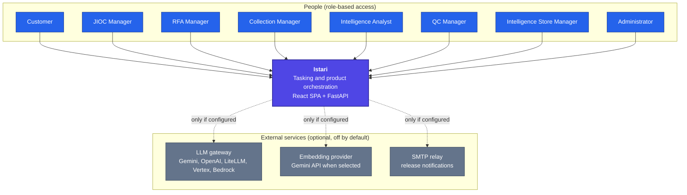
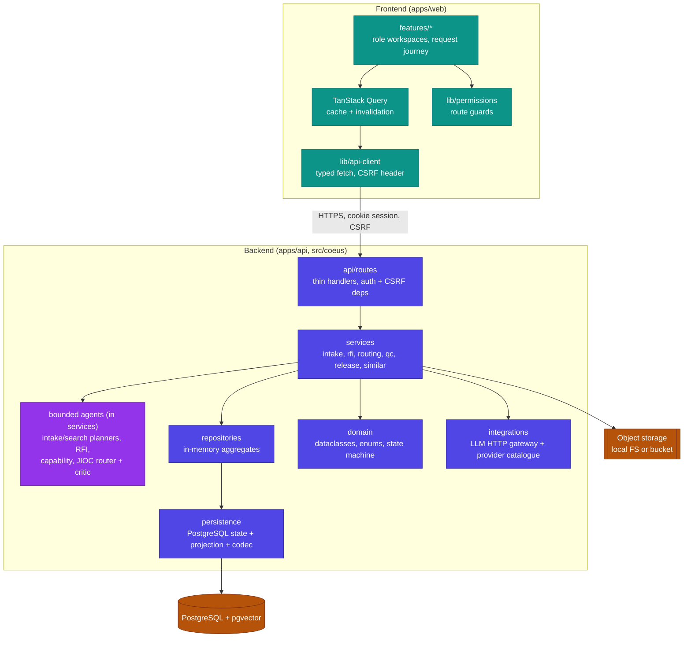
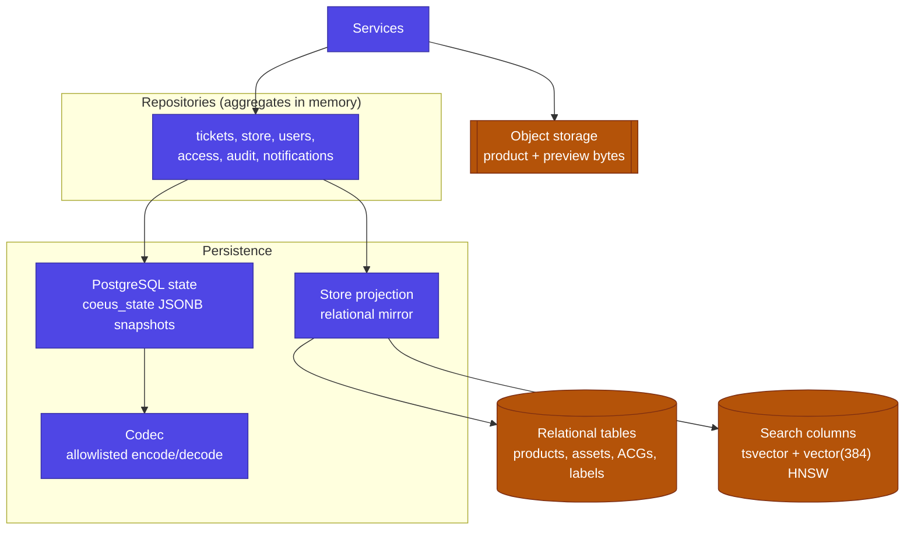
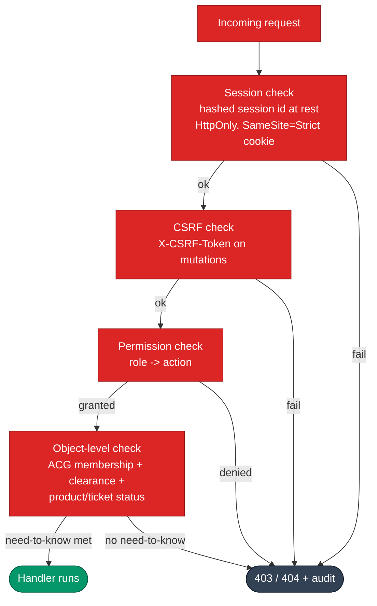

# Istari Architecture

Istari (internal working name `coeus`) is a security-conscious, role-based platform for
intelligence tasking and product orchestration. It routes customer requests,
searches existing intelligence before new work is raised, tasks analysts,
quality-controls products and releases them. Security-sensitive and
workflow-changing actions are audited.

Architecture is documented across three cohesive guides. This one covers the
structure: how the system is composed, how data is stored, and how access is
controlled. Every diagram reflects the shipped code.

| Guide                                                  | Read it for                                                        |
| ------------------------------------------------------ | ------------------------------------------------------------------ |
| **Architecture (this page)**                           | System context, application layers, data and persistence, security |
| [Architecture: Workflow](ARCHITECTURE_WORKFLOW.md)     | The request journey, end-to-end sequence, and the AI agents        |
| [Architecture: Deployment](ARCHITECTURE_DEPLOYMENT.md) | Local runtime, future GCP design, provider matrix, scaling         |

## Design principles

- **Bounded automation, human-governed.** The active deterministic JIOC Agent may
  apply an allowlisted CM or RFA route when evidence is sufficient. People make
  requester, delivery, approval and release decisions. JIOC Managers oversee
  routine routing on the loop and enter the loop for exceptions or intervention.
- **Local-first.** The full application runs on a developer machine with no
  cloud dependency. Cloud is a future option, not a requirement.
- **Controlled by design.** Role-based access, need-to-know access control
  groups (ACGs) and clearance levels are enforced server-side at the object and
  action level. Security-sensitive and workflow-changing actions are audited.
- **Thin edges, rich core.** Route handlers stay thin; business logic lives in
  services, domain modules and repositories.
- **Provider boundaries.** Persistence, object storage, the language model, the
  embedding model and email are selected by configuration. Chat supports mock,
  Gemini API, OpenAI API, LiteLLM Proxy, Vertex AI and Bedrock. Embeddings support mock,
  offline local and Gemini API. GCS object storage is not implemented.

---

## 1. System context

Who uses Istari and what it talks to. Human roles interact through one React
application; the backend optionally calls a language and embedding provider and
an email provider, both of which default to offline stand-ins.

The default local configuration uses deterministic mock language and embedding
providers. Notifications and email-outbox records stay in the configured local
state store, PostgreSQL by default, and the default outbox email provider does
not send them outside the machine.

---

## 2. Layered application architecture

The frontend is a single-page React application. The backend is a layered
FastAPI service: thin routes delegate to services, services own the business
logic and call repositories, repositories hold state and mirror it to the
relational projection. The domain layer holds pure dataclasses, enums and the
ticket state machine.

**Why this shape.** Keeping authorisation and business rules in services (not
routes or components) means the same rule is enforced regardless of entry point,
and the domain layer stays free of framework and I/O concerns so it is trivially
testable. Repositories present a simple aggregate interface while the persistence
layer handles the relational projection and the pgvector index underneath.

---

## 3. Data and persistence

Application state lives in in-memory aggregate repositories that are serialised
through an allow-listed codec into the PostgreSQL `coeus_state` JSONB table and
mirrored into a relational Store projection. The relational projection powers
Store search: full-text via `tsvector` and semantic via a pgvector `vector(384)`
column with an HNSW cosine index. Uploaded and released product bytes live in
object storage.

Embeddings are written on product create, metadata update and QC ingestion, and
are preserved (never overwritten with a null) if the embedding provider is
temporarily unavailable. A backfill routine fills any missing embeddings in
batches. Today the repositories run as a single writer; horizontal scaling is a
documented future step (see the
[Deployment guide](ARCHITECTURE_DEPLOYMENT.md#scaling-and-known-constraints)).

---

## 4. Security and need-to-know

Authorisation is enforced server-side on every request. A session cookie plus a
CSRF header authenticate the actor; the actor's roles, clearance and ACG
memberships then decide, at the object level, what they may see and do.

Every allow and deny that matters is audited. Access to controlled product bytes
uses short-lived, HMAC-signed tokens carried in a request header (not the URL),
so they do not leak into logs or history. Break-glass reads are explicit and
audited. The customer-facing similar-request check discloses only work the
requester already has need-to-know for; overlapping hidden work is surfaced to
managers, not customers.

---

## Where to go next

| To understand                            | Read                                                   |
| ---------------------------------------- | ------------------------------------------------------ |
| The request journey, sequence and agents | [Architecture: Workflow](ARCHITECTURE_WORKFLOW.md)     |
| Local runtime and the future GCP design  | [Architecture: Deployment](ARCHITECTURE_DEPLOYMENT.md) |
| How to run it and sign in                | [Setup Guide](SETUP.md)                                |
| Every role's workspace, with screenshots | [User Guide](USER_GUIDE.md)                            |
| What each agent reads and returns        | [AI Agents](AI_AGENTS.md)                              |
| Why key choices were made                | [Architecture Decision Records](adr/)                  |
| Per-feature threat models                | [Threat Models](threat-model/)                         |
