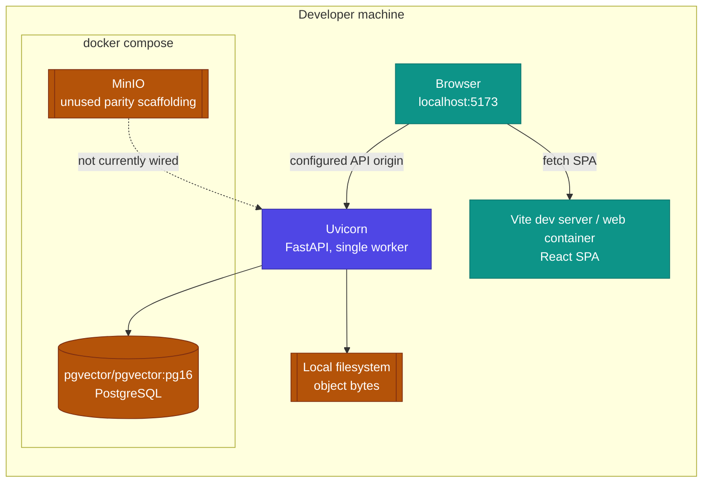
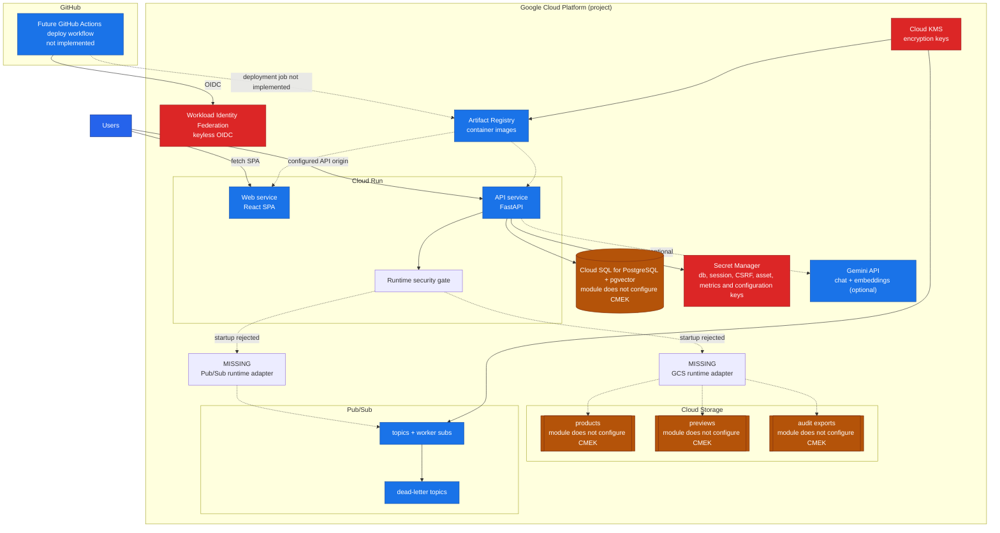

# Istari Architecture: Deployment

How the same application runs on a developer machine today and how it could run
on Google Cloud Platform in future. This is one of three architecture guides;
see [Architecture](ARCHITECTURE.md) for the system structure and
[Architecture: Workflow](ARCHITECTURE_WORKFLOW.md) for the request journey. The
local-first design is retained for any migration. Cloud deployment requires
additional provider adapters and operational controls; it is not a configuration
switch in the current build. See [Deployment and Operations
Atlas](architecture/DEPLOYMENT_AND_OPERATIONS.md) for CI, signals, outbox and
recovery views.

---

## 1. Local runtime (today)

Everything runs on the developer machine. `docker compose` provides PostgreSQL
with pgvector and optional full app containers; MinIO is present as unused
future-parity scaffolding. The API and web app run either in containers or
directly via `uv` and `pnpm`. The default providers keep the system offline.

Default local providers: mock language model, mock embeddings, local filesystem
object storage, Postgres persistence and a retained, non-sending email outbox in
the notification state namespace. See
[Setup](SETUP.md) for the exact commands and seed accounts.

---

## 2. Future: Google Cloud Platform (reference design)

GCP hosting is a reference target, not a requirement, and the Terraform in
`infra/gcp` builds the resource shell without storing secret values in state.
In the target design, the API and web run on Cloud Run, state moves to Cloud SQL (with
pgvector), product bytes move to Cloud Storage buckets, and the language
provider remains an explicit choice among `mock`, `gemini_api`, `openai_api`,
`litellm_proxy`, `vertex_ai` and `bedrock`. Embeddings remain `mock`, `local` or
`gemini_api`.
Deployments authenticate from GitHub Actions through Workload
Identity Federation, with no long-lived keys.

The Terraform modules under `infra/gcp` describe these future pieces: project
services, IAM with Workload Identity Federation and runtime and deployer service
accounts, Artifact Registry, Cloud KMS, Secret Manager placeholders, Cloud
Storage buckets, Pub/Sub topics with worker subscriptions and dead-letter
topics, a Cloud SQL PostgreSQL instance, and the two Cloud Run services. Secret
values are never stored in Terraform state. Every cloud-creating path is blocked
by the ADR 0019 readiness precondition, including targeted plans and applies.
Targeted operations remain prohibited because they are an incomplete review
surface. The current modules attach the customer-managed key to Artifact
Registry and Pub/Sub, not Cloud SQL or the buckets. GitHub Actions has no cloud
deployment step. See the
[GCP Reference Deployment Runbook](runbooks/gcp-dev-deployment.md).

---

## 3. Provider configuration: local vs GCP

The table records the target provider mapping. Only the local column is
currently supported; the GCP column remains a migration contract until its
adapters and readiness gates pass.

| Concern         | Setting                                | Local default                       | GCP reference                   |
| --------------- | -------------------------------------- | ----------------------------------- | ------------------------------- |
| Persistence     | `COEUS_PERSISTENCE_PROVIDER`           | `postgres` (local container)        | `postgres` (Cloud SQL)          |
| Object storage  | `COEUS_OBJECT_STORAGE_PROVIDER`        | `local` (filesystem)                | `gcs` (Cloud Storage)           |
| Language model  | `COEUS_LLM_PROVIDER`                   | `mock`; five external providers optional | Same application gateway        |
| Embeddings      | `COEUS_EMBEDDING_PROVIDER`             | `mock`                              | `mock`, `local` or `gemini_api` |
| Email           | `COEUS_EMAIL_PROVIDER`                 | `outbox` (persisted state)          | `smtp`                          |
| Secrets         | configuration key plus encrypted state | ignored local key file              | Secret Manager                  |
| Deploy identity | n/a                                    | n/a                                 | Workload Identity Federation    |

Provider settings are authoritative: an API key present in the environment never
silently switches the language or embedding provider on; the provider must be
selected explicitly. This keeps a machine configured for offline use offline.
Administrator-entered provider and Realtime voice keys are AES-256-GCM
encrypted in isolated state namespaces and survive restart. The separate
configuration-encryption key is generated outside PostgreSQL for local mode and
must come from Secret Manager in hosted environments.

LiteLLM is a separate operator-managed trust boundary. Istari receives a scoped
virtual key and selects only aliases visible to that key; AWS or GCP workload
identity, upstream model IDs, regions and fallback routing stay in the proxy
deployment. The [LiteLLM Provider Connectivity Runbook](runbooks/litellm-provider-connectivity.md)
defines the supported Bedrock and Vertex route patterns and production gates.

---

## Scaling and known constraints

- **Single-writer state.** Tickets now use versioned per-ticket relational
  aggregates, compare-and-swap and transactional outbox writes. Other mutable
  repositories, including identity, teams, notifications and configuration,
  still load in-memory aggregates and persist bounded whole-namespace JSONB
  snapshots. Local object bytes also require a single writer. Until those
  remaining boundaries are redesigned or formally constrained, the API runs as
  one replica. Terraform rejects a larger Cloud Run API value while its
  single-writer flag is active.
- **Audit log.** Local audit evidence is append-only in memory, JSONL or a
  PostgreSQL event table. The configured limit bounds recent reads, not durable
  retention. A future hosted design must add externally retained audit export.
- **Search scale.** No production corpus-size or latency SLO is claimed. Load
  and recall testing must set HNSW and iterative-scan parameters before hosted
  use; the access pre-filter remains the outer boundary of every retrieval leg.
- **Embeddings.** Store browse retains a 384-dimensional compatibility
  projection. Grounded RFI retrieval uses separate 1,536-dimensional passage
  embeddings keyed by provider, model and index generation. Reindexing keeps
  the prior active generation until its replacement is ready.

## 4. Future: Kubernetes

Kubernetes is not implemented. There are no manifests, Helm charts or deployment
workflows. The existing API and production web images are reusable migration
boundaries, but the current API must stay at one replica and local object bytes
need a single-writer volume for any evaluation deployment. A production cluster
requires shared transactional state, shared object storage, identity operations,
backups, audit export, ingress/TLS and monitoring first. See the [Kubernetes
Migration Guide](runbooks/kubernetes-migration.md).
