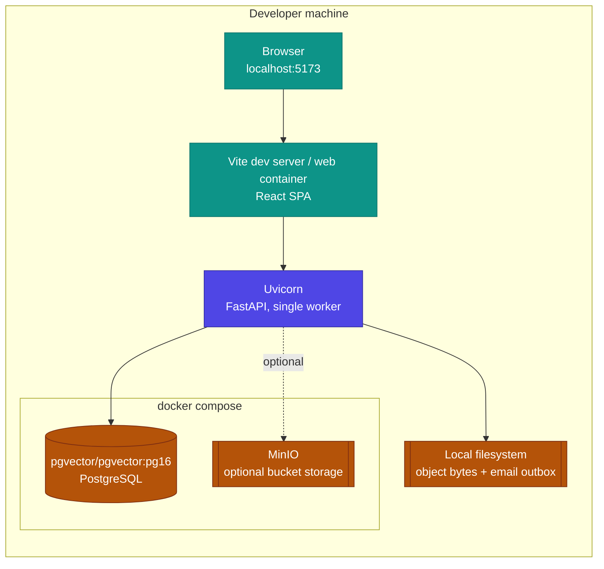
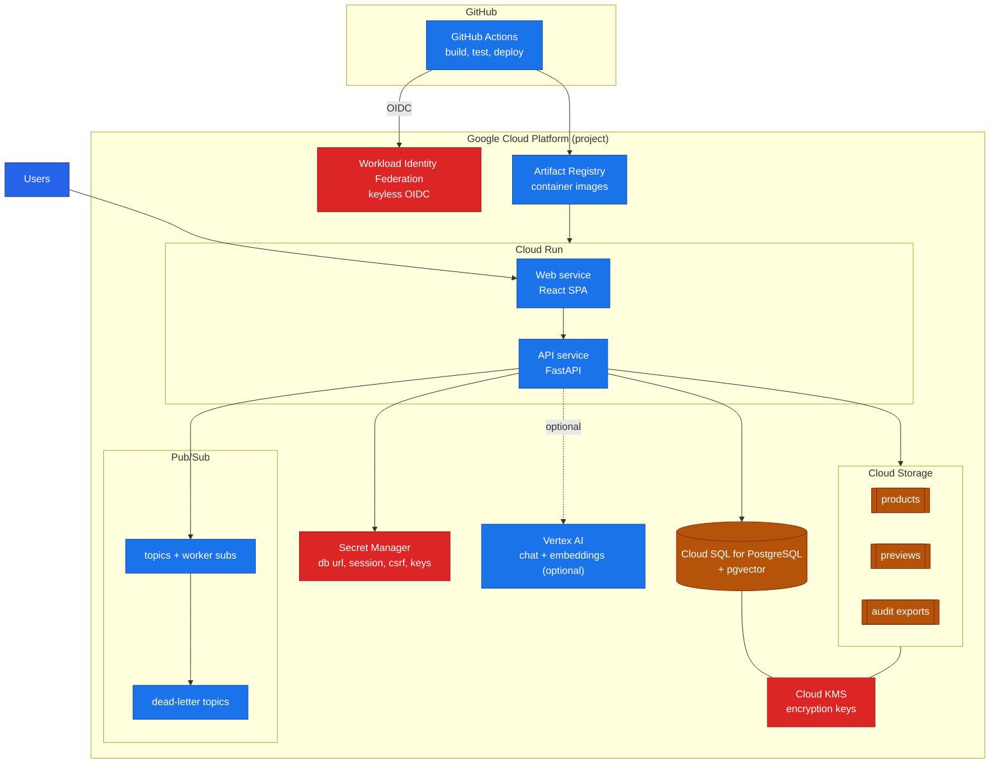

# Istari Architecture: Deployment

How the same application runs on a developer machine today and how it could run
on Google Cloud Platform in future. This is one of three architecture guides;
see [Architecture](ARCHITECTURE.md) for the system structure and
[Architecture: Workflow](ARCHITECTURE_WORKFLOW.md) for the request journey. The
application binary does not change between local and cloud; only the provider
configuration does.

---

## 1. Local runtime (today)

Everything runs on the developer machine. `docker compose` provides PostgreSQL
with pgvector (and MinIO if bucket-style storage is wanted); the API and web app
run either in containers or directly via `uv` and `pnpm`. The default provider
choices keep the system fully offline.

Default local providers: mock language model, mock embeddings, local filesystem
object storage, Postgres persistence and an on-disk email outbox. See
[Setup](SETUP.md) for the exact commands and seed accounts.

---

## 2. Future: Google Cloud Platform (reference design)

GCP hosting is a reference target, not a requirement, and the Terraform in
`infra/gcp` builds the resource shell without storing secret values in state.
The API and web run on Cloud Run, state moves to Cloud SQL for PostgreSQL (with
pgvector), product bytes move to Cloud Storage buckets, and the language and
embedding providers can point at Vertex AI. Deployments authenticate from GitHub
Actions through Workload Identity Federation, with no long-lived keys.

The Terraform modules under `infra/gcp` provision exactly these pieces: project
services, IAM with Workload Identity Federation and runtime and deployer service
accounts, Artifact Registry, Cloud KMS, Secret Manager placeholders, Cloud
Storage buckets, Pub/Sub topics with worker subscriptions and dead-letter
topics, a Cloud SQL PostgreSQL instance, and the two Cloud Run services. Secret
values are never stored in Terraform state. See the
[GCP Reference Deployment Runbook](runbooks/gcp-dev-deployment.md).

---

## 3. Provider configuration: local vs GCP

The same binary runs in both places; these settings select the backing service.

| Concern | Setting | Local default | GCP reference |
| --- | --- | --- | --- |
| Persistence | `COEUS_PERSISTENCE_PROVIDER` | `postgres` (local container) | `postgres` (Cloud SQL) |
| Object storage | `COEUS_OBJECT_STORAGE_PROVIDER` | `local` (filesystem) | `gcs` (Cloud Storage) |
| Language model | `COEUS_LLM_PROVIDER` | `mock` | `mock` or `gemini_api` (Vertex) |
| Embeddings | `COEUS_EMBEDDING_PROVIDER` | `mock` | `mock`, `local` or `gemini_api` |
| Email | `COEUS_EMAIL_PROVIDER` | `outbox` (on disk) | `smtp` |
| Secrets | environment / `.env` | local file | Secret Manager |
| Deploy identity | n/a | n/a | Workload Identity Federation |

Provider settings are authoritative: an API key present in the environment never
silently switches the language or embedding provider on; the provider must be
selected explicitly. This keeps a machine configured for offline use offline.

---

## Scaling and known constraints

- **Single-writer state.** Repositories are in-memory aggregates serialised as
  whole-namespace JSONB snapshots in PostgreSQL and mirrored to the relational
  Store projection. This is correct and simple for one API instance. Running
  multiple writers safely is a planned redesign toward row-level relational
  persistence; until then the API runs as a single writer. The Cloud Run
  reference would pin one writable instance or adopt that redesign before
  scaling out.
- **Audit log.** The audit trail is a bounded ring buffer today; a durable,
  append-only audit store is future work and pairs naturally with the
  persistence redesign. On GCP, audit exports have a dedicated bucket.
- **Search scale.** The pgvector HNSW index and Postgres full text serve the
  expected product volumes comfortably. Very large corpora would tune HNSW
  `ef_search` and consider iterative scan; the access pre-filter stays the outer
  boundary of both retrieval legs regardless of scale.
- **Embeddings.** Written on create, metadata update and QC ingestion, preserved
  across provider outages, and backfillable in batches. The 384-dimension column
  matches both the offline local model and the Gemini embedding output.
