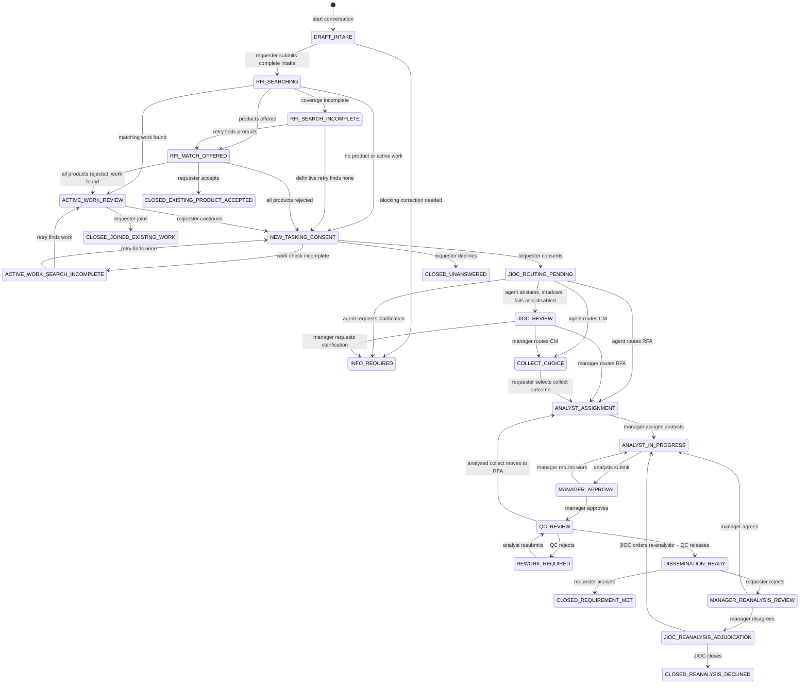
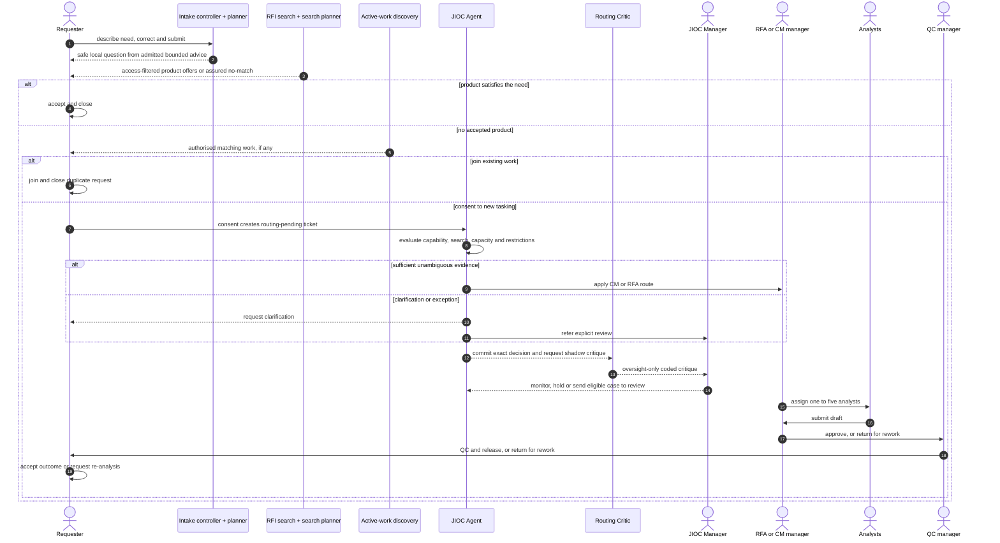
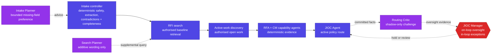

# Istari Architecture: Workflow

How a request moves through Istari, where bounded agents make decisions and
where people are in or on the loop. See [Architecture](ARCHITECTURE.md) for the
system structure and [Architecture: Deployment](ARCHITECTURE_DEPLOYMENT.md) for
runtime and cloud boundaries. Every diagram below describes shipped behaviour.

---

## 1. Authority at a glance

| Stage | Automated authority | Human position |
| --- | --- | --- |
| Intake | Deterministic extraction, safety, completeness and contradiction checks control the permitted next action. A model may only select one already-missing field when admitted. | Requester is in the loop: answers, edits, submits or cancels. |
| Existing-product search | Access filtering, baseline retrieval, ranking, assurance and lifecycle outcome are deterministic. The Search Planner may add bounded search wording only. | Requester is in the loop: accepts or rejects offers. |
| Active-work search | Deterministic, access-filtered matching offers visible existing work. | Requester is in the loop: joins existing work or consents to new tasking. |
| JIOC routing | The active deterministic JIOC Agent may choose CM, RFA, clarification or manager review from versioned evidence. | JIOC Managers are on the loop for routine routes, with metrics, hold, reopen and audited intervention. They enter the loop for explicit review and exceptions. |
| Production and release | Assignment, manager approval, QC preflight and release gates are deterministic controls. | Analysts, delivery managers, QC and the requester are in the loop at their respective decisions. |
| Outcome review | No agent decides whether released work met the requirement. | Requester, responsible manager and, on dispute, an independent JIOC human are in the loop. |

No model can change lifecycle state, access control, policy or release authority.

---

## 2. Request lifecycle

The diagram shows the principal transitions. Cancellation and JIOC intervention
can also occur from the allowlisted states defined by the state machine.

`JIOC_INTERVENTION_HOLD` is an audited pause. A JIOC Manager can place routing or
delivery states on hold and resume the exact previous state. From routing
pending, collect choice or analyst assignment, they can instead refer the case
to `JIOC_REVIEW`.

---

## 3. End-to-end decision flow

The Routing Critic never delays or changes the committed route. Local/test
runtime records its best-effort critique after routing. Hosted runtime writes an
identifier-only outbox request in the same transaction, then a retry-safe worker
loads the exact context, decision and capability reviews before recording the
critique. JIOC Managers see the result as oversight evidence only.

---

## 4. Bounded agents

The Intake Planner does not discover contradictions or ambiguity through model
judgement. Deterministic checks detect reversed or invalid dates, broad
geography, vague dates and compound questions. Those findings override model
output. When the baseline action is to ask for missing information, admitted
model advice may select one field from the controller-supplied missing-field
list. The controller renders all user-facing copy and alone decides readiness.

The Search Planner receives bounded intake fields, never the corpus, results or
authorisation context. Its validated expansions, entities, date-text hints and
alternative terminology may create a separate supplemental retrieval leg. The
original access-filtered baseline query always runs first, and baseline offers
cannot be removed or displaced by planner advice. Planner failure falls back to
the baseline search.

The Routing Critic receives structured facts about the committed route,
disposition, state, search assurance, capability reviews and capacity. It may
return only allowlisted verdict, challenge, missing-evidence, fact-reference and
review-question codes. It cannot propose a route, state, action, disposition or
tool call. Provider advice is merged with deterministic checks so it cannot
erase a locally detected problem.

---

## 5. Hybrid Store and RFI search

Store browse and RFI search share the same retrieval boundary. Access policy
filters by ACG, clearance and product status before ranking. Lexical and semantic
legs run over that scoped set, Reciprocal Rank Fusion combines them, and
deterministic metadata and label signals break ties. Offers must pass the
calibrated threshold and are limited to five.

The embedding provider is selectable: deterministic `mock`, offline `local` or
explicit `gemini_api`. When embeddings are unavailable, the baseline search
degrades to lexical retrieval and records the degraded mode. Search assurance
prevents an incomplete retrieval from being treated as a definitive no-match.

See [AI Agents](AI_AGENTS.md) for each agent's inputs, output schema, fallback,
owner, versioning and egress boundary.
