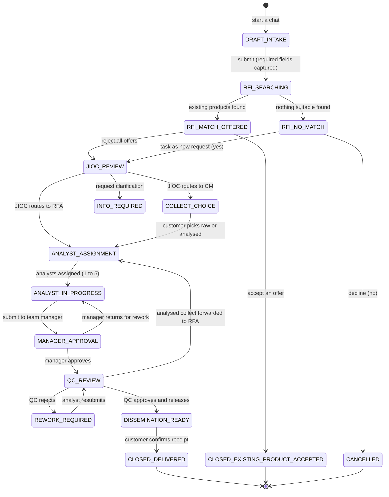
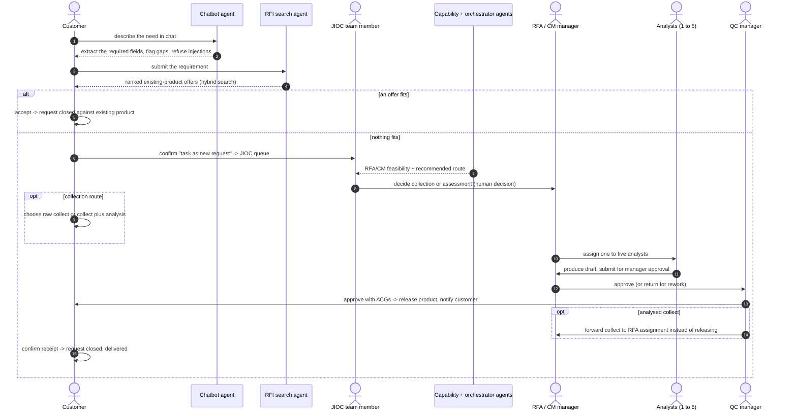
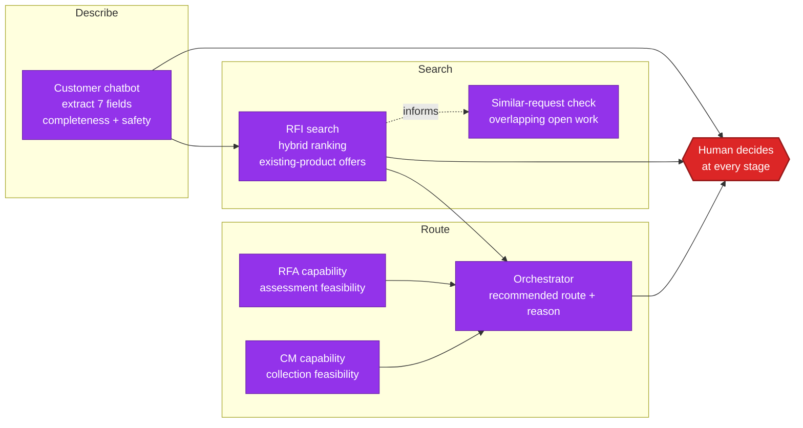
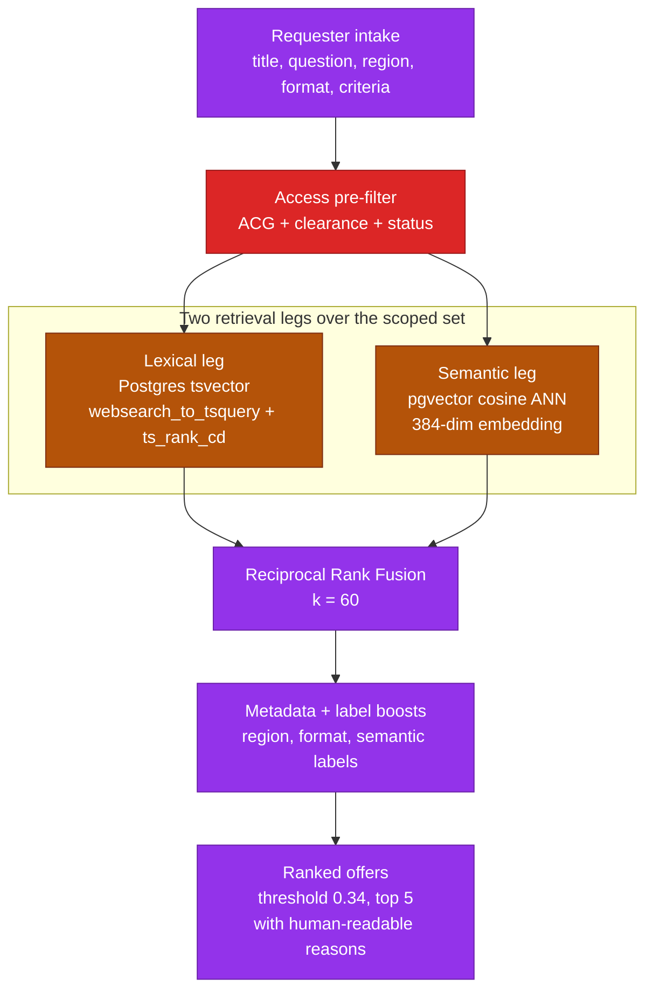

# Istari Architecture: Workflow

How a request moves through Istari from a user's point of view, who does what,
and where the AI agents assist without ever making the decision. This is one of
three architecture guides; see [Architecture](ARCHITECTURE.md) for the system
structure and [Architecture: Deployment](ARCHITECTURE_DEPLOYMENT.md) for runtime
and cloud. Every diagram reflects the shipped code.

---

## 1. The request journey (user perspective)

From a customer's point of view, a request is a conversation that becomes a
tracked item moving through clear stages. This is the ticket state machine; the
only transitions that exist are the ones drawn here, and a person triggers each
state change.

Stops worth calling out: **RFI_NO_MATCH** gives the customer an explicit yes/no
decision instead of silently raising new work; **JIOC_REVIEW** puts a JIOC team
member (not the capability agents) in charge of the collection-or-assessment
decision; **COLLECT_CHOICE** asks the customer whether a collect should be
delivered raw or followed by an RFA analysis; **MANAGER_APPROVAL** has the team
manager review the analysts' work before Quality Control; and QC approval now
performs the final release itself (for an analysed collect it instead forwards
the ticket to RFA assignment with the collect product linked).

The QC queue is shared but detail is assigned. Queue items expose only a safe
reference/state summary until an active QC-team manager atomically claims one.
The assigned reviewer relationship controls full ticket detail and linked-draft
audience, persists through rework, and is effectively revoked on release or
lifecycle exit.

---

## 2. End-to-end flow (who does what)

The same journey as a sequence, showing where each agent assists and where a
human decides. Every agent output is followed by a human action.

---

## 3. AI agents

A small set of focused agents sit behind the workflow. They are deterministic
mocks by default, never execute user instructions, and treat every input as
synthetic. Each agent hands a recommendation to a human. See
[AI Agents](AI_AGENTS.md) for exactly what each reads and returns.

### Hybrid Store and RFI search internals

The Store browse page and the RFI search agent share the same free-text
retrieval boundary. RFI answers "does an existing product already satisfy this?"
before new work is raised; Store browse uses the same engine when a user enters
free text. The candidate set is filtered by the requester's ACG, clearance and
product status **first**, so the engine can never rank a product the requester
has no need-to-know for. Two retrieval legs then run over that scoped set and
are fused.

The embedding provider is selectable (`mock` by default, `local` for an offline
sentence model, `gemini_api` when explicitly enabled). If the provider is
unavailable, search degrades to the lexical leg alone rather than failing, and
the reasons record `retrieval:lexical-only`. The same hybrid scorer also backs
the similar-request check that flags overlapping in-progress work to managers.
