# Istari User Guide

This guide walks through Istari by role, with screenshots of each workspace. All
data shown is synthetic and authenticated workspaces are labelled **MOCK DATA
ONLY**. Desktop is the supported experience. Mobile layouts have not been
designed or validated and must not be presented as supported.

For how to run the app locally see the [Setup Guide](SETUP.md). For the roles and
their permissions see [Roles and User Stories](ROLES_AND_USER_STORIES.md). For
how the agents work see [AI Agents](AI_AGENTS.md).

## Contents

- [Signing in](#signing-in)
- [Requesting access](#requesting-access)
- [The request journey](#the-request-journey)
- [Customer](#customer)
- [Intelligence Store](#intelligence-store)
- [JIOC team members](#jioc-team-members)
- [RFA and Collection managers](#rfa-and-collection-managers)
- [Intelligence analyst](#intelligence-analyst)
- [Quality control](#quality-control)
- [My Team](#my-team)
- [My profile](#my-profile)
- [Access Groups](#access-groups)
- [Administrator](#administrator)
- [Users and account lifecycle](#users-and-account-lifecycle)

---

## Signing in

The sign-in page doubles as a splash that introduces the product. Accounts are
assigned; there is no open self-registration, only a request-access flow.

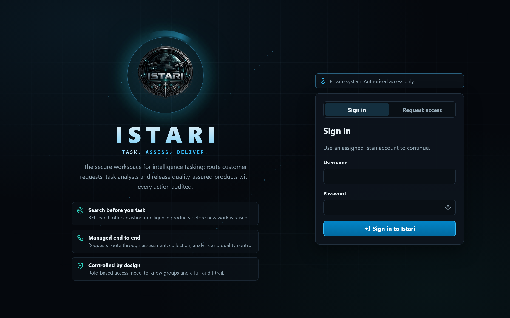

Local seed accounts (see the [Setup Guide](SETUP.md#seed-accounts)) all use the
mock credential `CoeusLocal1!`.

## Requesting access

A prospective user switches to **Request access** and submits their details. The
request is queued for an administrator to approve; the response is deliberately
generic so the page never reveals whether an account already exists.

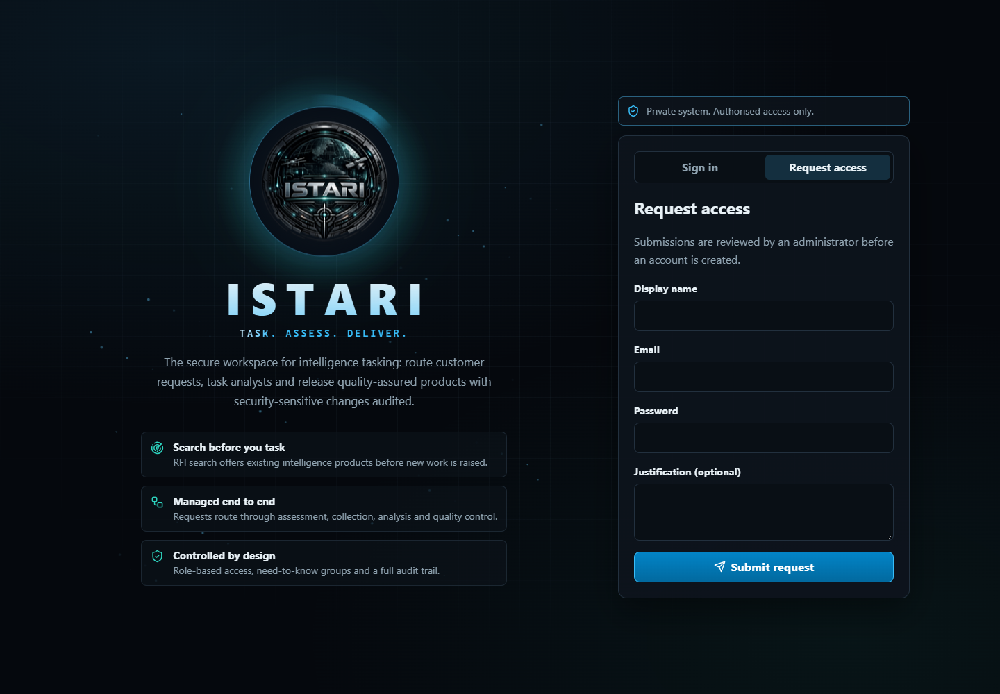

## The request journey

At any time a customer can open **Request journey** to see the seven stages a
request moves through and where theirs currently sits. The popup is transient and
opens automatically the first time a request is submitted.

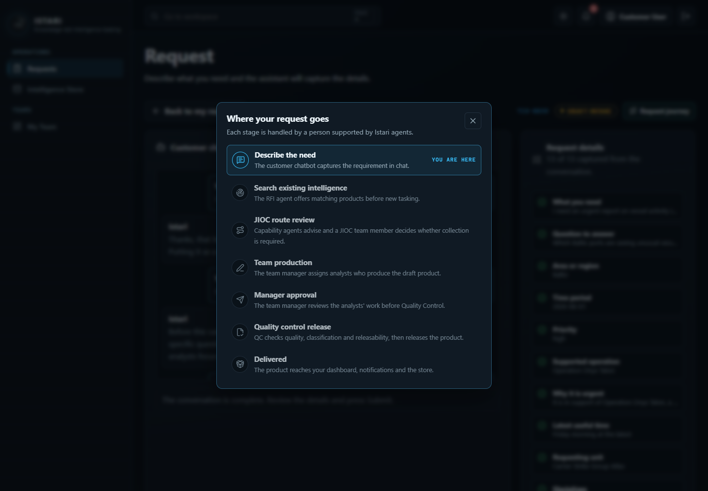

Each stage is handled by a person supported by an Istari agent; the stages map
directly onto the [agent authority matrix](AI_AGENTS.md#authority-matrix).

---

## Customer

Customers get two focused screens. The **dashboard** starts with an aligned
status ledger that emphasises requests needing customer action, then shows a
request register with state, priority, collaborators and the next available
action. One primary action opens a new request.

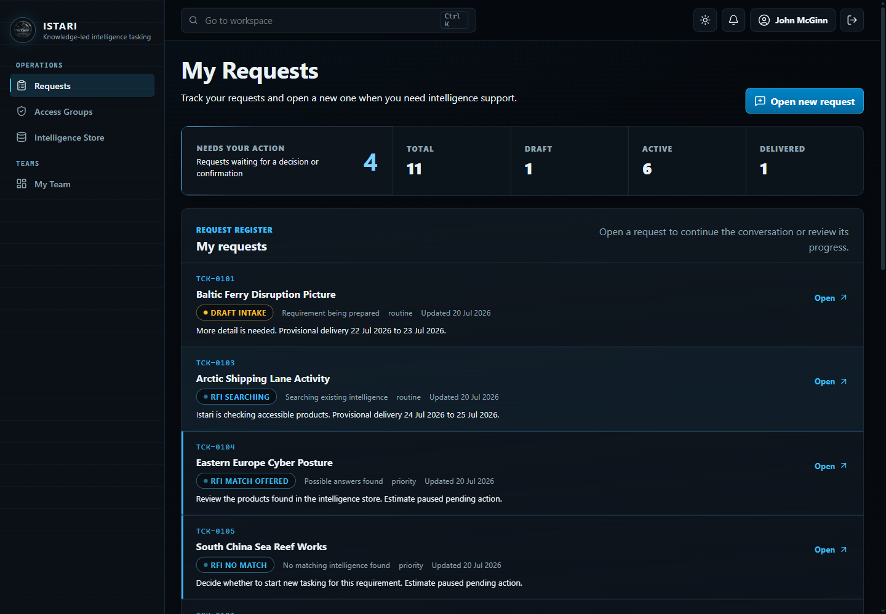

Opening a request shows the **chat-first workspace**. The intake assistant
captures the requirement conversationally without exposing its internal
completeness checklist. Customers can still open the manual edit panel when
they want direct control over the structured fields.

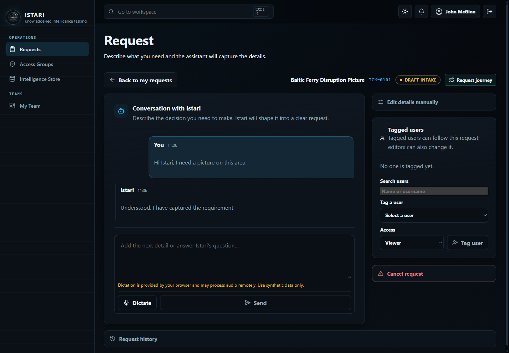

From here a customer can:

- Chat naturally with the intake assistant until it confirms the requirement is
  ready, without needing to manage the assistant's internal checklist.
- Edit any detail directly in "Edit details manually".
- Tag colleagues as editors or viewers.
- Submit the request, then accept or reject any existing-product offers.
- If no existing product matches, choose **Yes, task as new request** to continue
  into route assessment, or **No, cancel request** to stop the ticket with a
  recorded reason.

After submission, Istari also checks open requests for likely overlap. If a
visible similar request is already in progress, the workspace shows its
reference, title, score and reasons with **Join as viewer** and **Continue
request** actions. If overlap exists but the customer has no need-to-know for
the matching ticket, the workspace shows only a neutral note that the assessing
team will check for overlapping work.

## Intelligence Store

The Intelligence Store is a controlled search service. The collapsible
**Search and filters** panel supports full text, product type, region, tag,
source type and coverage dates; results can be sorted by relevance, title or
newest coverage. Filters run **after** access control and classification checks,
so a customer only ever sees products they are entitled to.

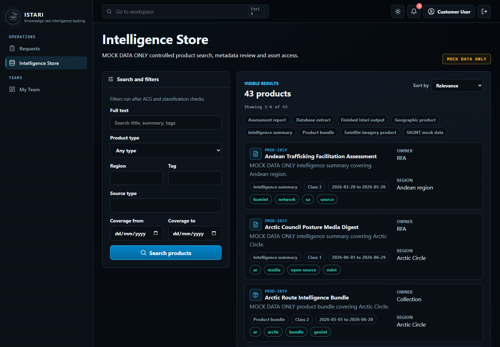

Each result carries rich metadata: reference, owning team, region,
classification, coverage window, tags and format. RFA managers, Collection
managers and Intelligence Store Managers can administer store metadata and
assets. Viewing or downloading product content still depends on ACG membership
and clearance.

---

## JIOC team members

The active JIOC agent invokes the RFA and CM capability agents and automatically
routes clear, eligible requests to RFA or CM. Ambiguous, restricted, stale or
otherwise unsafe cases land in the JIOC queue for a team member to decide.
JIOC members oversee automatic decisions, can hold or refer them for review,
approve an exception with a written override reason, review and link similar
open requests, or query/reject a route with a recorded reason. When a request
is routed to CM, the customer is asked whether they want the **raw
collect only** or the **collect plus an RFA analysis**.

**JIOC Oversight** is the read-only whole-process view. It shows ticket totals
by state and route, active RFA/CM teams, current availability, live analyst task
counts, bounded task ownership and the shadow routing critic's verdict,
challenges and missing-evidence counts. Critic output is advisory evidence only:
it cannot route or change workflow. Managers remain on the loop and use the
separate audited intervention controls when needed. Oversight does not expose
analyst notes, draft bodies or protected product content.

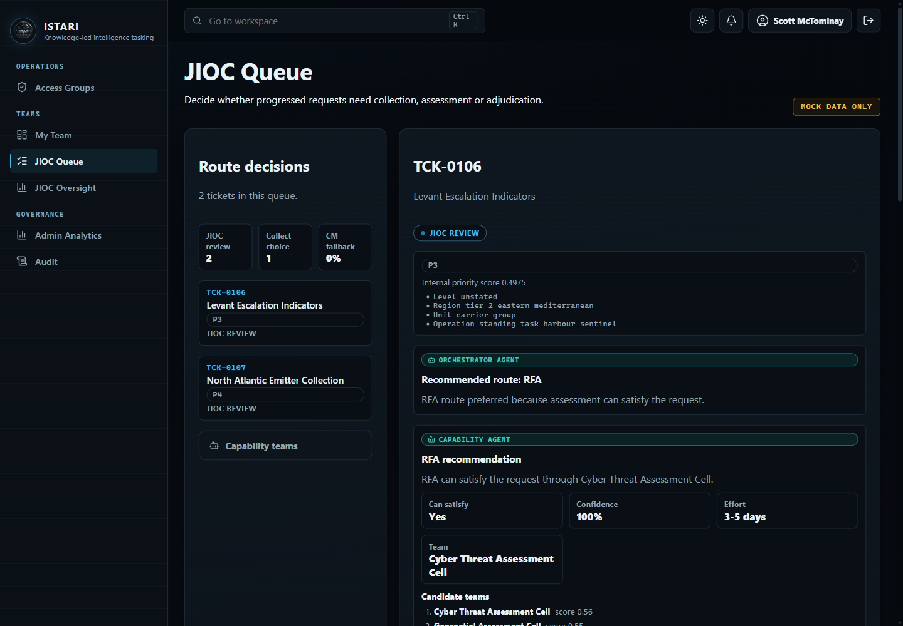

## RFA and Collection managers

Managers work across their whole RFA or CM area:

- **Assign one to five analysts** after selecting any active team in their area
  once the JIOC agent or exception reviewer approves the route. Candidates are scoped
  to that authoritative team, and work packages can be defined for the task.
- **Approve or return analyst work**: submitted drafts stop at manager
  approval, where the manager forwards them to Quality Control or returns
  them with a rework reason. A manager cannot approve work they drafted.
- **Manage the team** on the My Team page: roster, member profiles and the
  availability calendar.

## Intelligence analyst

The analyst workbench lists only the tasks assigned to the signed-in analyst;
a task can be shared by several analysts. Selecting a task shows its context,
work packages, and progressive-disclosure sections for working notes and
linked products, with the draft form and **Submit for manager approval**
action below (QC-requested rework resubmits straight to QC). The collapsed
**Request conversation** section loads the complete customer and Istari history
only when the assigned analyst opens it.

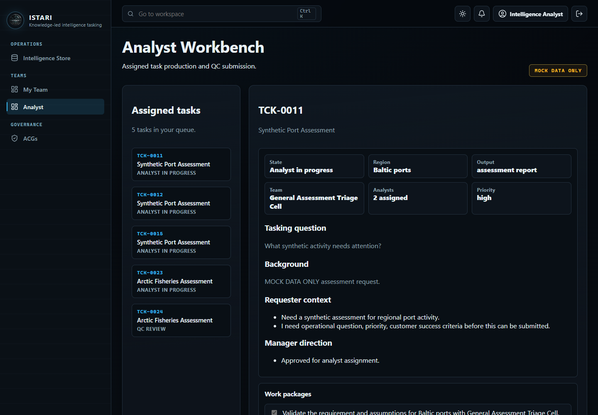

## Quality control

The QC queue shows safe submission summaries. An eligible QC manager selects
**Claim review** before full draft details are shown. Only that assigned
reviewer can approve or reject the item, and **Release claim** returns it to the
shared queue without changing the product. Rejected work returns to the same
reviewer after resubmission. A reviewer cannot claim work they authored or
actively analysed.

The assigned QC manager reviews submitted drafts and approves or rejects them. Approval
now performs the final release: the product is published, disseminated to the
requester with a notification and a recorded email, and a feedback request is
raised. For a collect the customer asked to have analysed, approval instead
forwards the ticket to RFA assignment with the collect linked (the collect
itself is never released). A QC manager cannot approve a draft they authored.

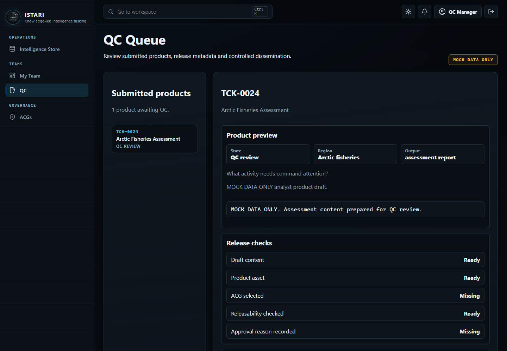

## My Team

Everyone on a team gets the **My Team** page: the roster with each member's
title and specialisms, a two-week availability calendar and today's
availability tile. Members log their own availability; managers can log for
anyone on their team, and add or remove members.

## My profile

Every signed-in user can open **Edit profile** from the account menu. The page
starts in a read-only identity view with the user's account, roles, title,
specialisms and biography. Choose **Edit profile** to enter edit mode, then
**Save changes** or **Cancel**. Profile text is descriptive only and never
changes roles, team membership, ACG access or clearance.

---

## Access Groups

Every signed-in user can open **Access Groups** from the navigation. The page
provides a searchable list of every active need-to-know group and labels each
entry as **Member**, **Not a member** or with its application state. Selecting
an ACG opens one detail view with its purpose and the current active managers.

To apply, select the ACG, enter a concise operational justification and choose
**Submit application**. Your text is retained if submission fails. A pending request can be
withdrawn after confirmation. Membership is granted only after another
authorised person approves the application.

An account delegated as administrator for one or more ACGs sees an additional
review queue on the same page. It contains only pending applications for those
groups. Approval adds membership; rejection requires a reason. You cannot decide
your own application. ACG administration does not make you a member and does not
grant access to the group's protected products.

---

## Administrator

The Admin workspace is the governance control plane. It shows service status,
pending **access requests** to approve or reject with a reason, and the AI model
catalogue. The left navigation exposes operational workspaces, analytics, Users,
ACGs and the audit log according to the administrator's permissions.

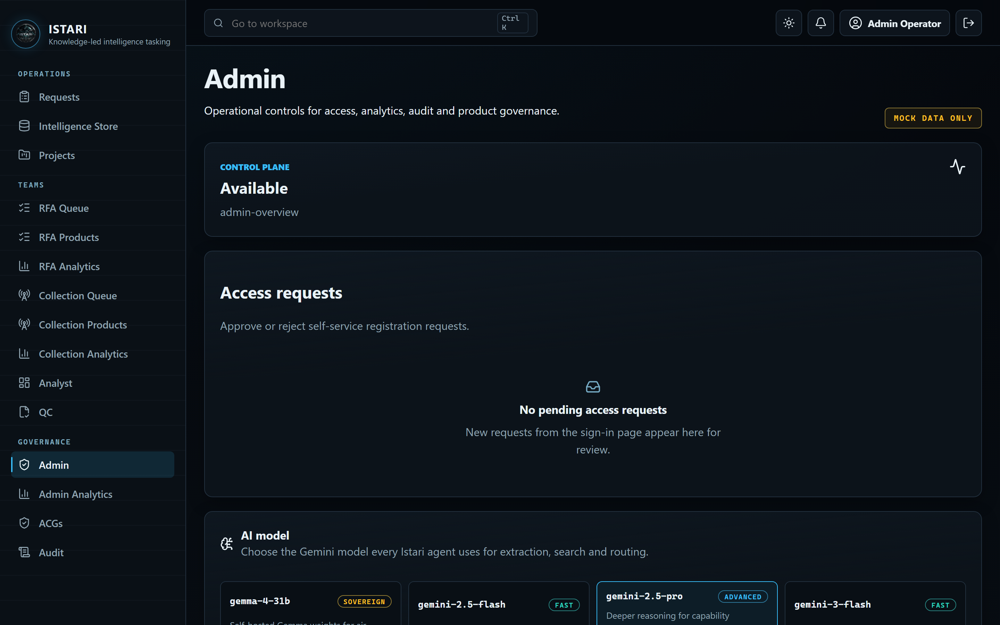

### Choosing the AI model

The **AI model** panel groups models by provider. Gemini, OpenAI, Vertex AI and
Bedrock can each accept a write-only runtime key, test the connection and retain
their own selected model. Activating a provider is a separate warned action that
changes the provider for every user. Runtime keys are not returned to the browser
or persisted and disappear when the API restarts; model choices are persisted.

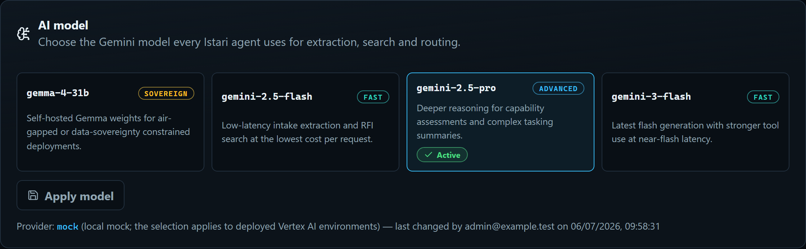

### Access control groups

The governance **ACGs** workspace manages the 43 seeded need-to-know groups,
direct membership and delegated administrators. Each group can have up to eight
active administrators from any role or team. Adding someone as an ACG
administrator does not add them as a member. Application decisions are made
from the universal [Access Groups](#access-groups) workspace. Groups are themed
by region and discipline (for example "European Cyber", "Maritime GEOINT") so
product visibility reflects how teams are actually organised.

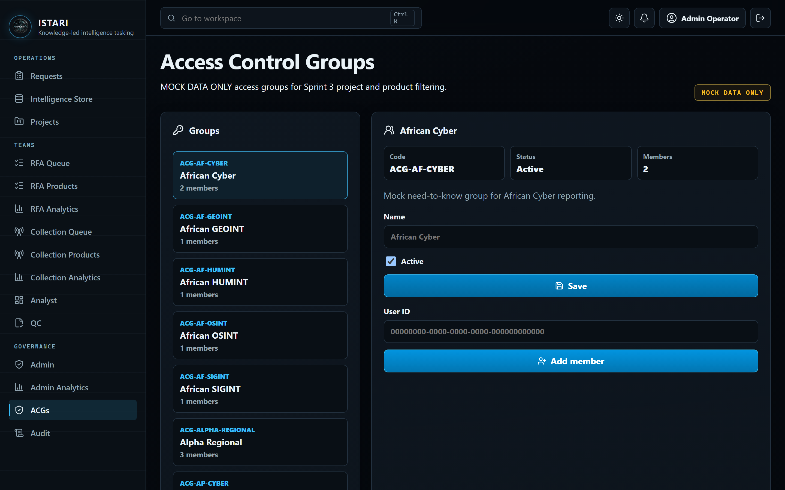

### Users and account lifecycle

The **Users** workspace searches and filters accounts. An administrator can
assign roles, change clearance, activate or deactivate an account, and issue a
temporary credential that is displayed once. The signed-in administrator cannot
change their own protected fields. Role assignment, team membership and ACG
membership are separate controls and should all follow least privilege.

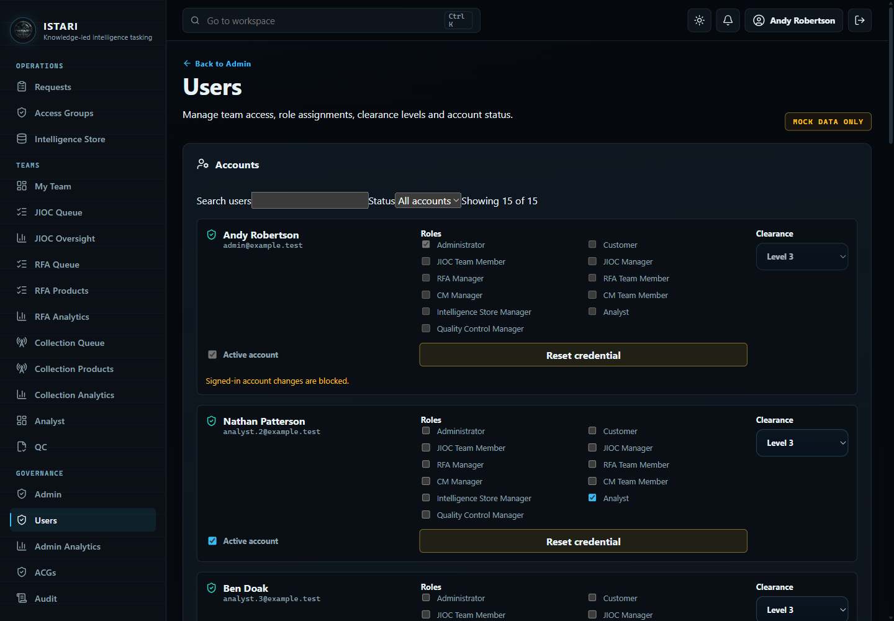

For the full local onboarding and offboarding sequence, including its
single-writer and non-production boundaries, see [Local Multi-User
Operations](runbooks/local-multi-user-operations.md).
