# Istari User Guide

This guide walks through Istari by role, with screenshots of key workspaces. All
data shown is synthetic. Authenticated workspaces carry one persistent
**Synthetic exercise** indicator; handling metadata and generated documents
retain their more specific synthetic markings. The screenshots were refreshed
from the current 1440 x 1000 desktop interface on 2 August 2026. Desktop Chrome
is the browser-acceptance target. Core layouts are designed to remain usable
from 320 pixels, but no native mobile app, mobile browser acceptance suite or
production-device assurance is claimed.

For how to run the app locally see the [Setup Guide](SETUP.md). For the roles and
their permissions see [Roles and User Stories](ROLES_AND_USER_STORIES.md). For
how the agents work see [AI Agents](AI_AGENTS.md). The [User and Workflow
Atlas](architecture/USER_AND_WORKFLOW.md) maps roles, workspaces, visible
customer phases, staff hand-offs and exception loops.
Capture metadata for every image is in the [screenshot
inventory](images/README.md).

## Contents

- [Signing in](#signing-in)
- [Account, navigation and notifications](#account-navigation-and-notifications)
- [Requesting access](#requesting-access)
- [The request journey](#the-request-journey)
- [Customer](#customer)
- [Intelligence Store](#intelligence-store)
- [JIOC routing and oversight](#jioc-routing-and-oversight)
- [RFA and Collection managers](#rfa-and-collection-managers)
- [Intelligence analyst](#intelligence-analyst)
- [Quality control](#quality-control)
- [My Team](#my-team)
- [My profile](#my-profile)
- [Access Groups](#access-groups)
- [Administrator](#administrator)
- [Users and account lifecycle](#users-and-account-lifecycle)

---

## Signing in

The sign-in page doubles as a splash that introduces the product. Accounts are
assigned; there is no open self-registration, only a request-access flow.

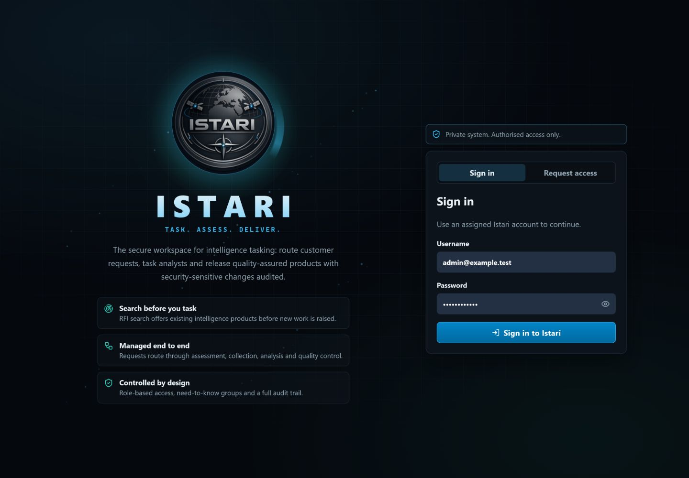

The Docker Compose seed accounts (see the [Setup Guide](SETUP.md#seed-accounts))
use usernames `admin1` through `admin16` and the temporary password `admin`.
Direct host-process development retains the canonical `example.test` usernames
and local-only password `CoeusLocal1!` unless numbered logins are explicitly enabled.

## Account, navigation and notifications

The account menu opens profile and password settings. A temporary credential
forces a password change before the rest of the app is available. The command
bar provides role-filtered navigation, theme controls and a notification
popover. The popover shows the latest eight notifications, preserves read state
and opens the applicable record when a safe destination exists.

## Requesting access

A prospective user switches to **Request access** and submits their details. The
request is queued for an administrator to approve; the response is deliberately
generic so the page never reveals whether an account already exists.

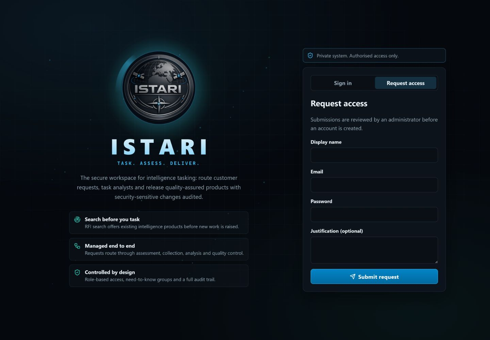

## The request journey

At any time a customer can open **Request journey** to see the stages that apply
to their request and where it currently sits. A direct RFA route or a raw
collection route has six stages. A collection followed by RFA analysis has
seven. Existing-product and joined-work outcomes can finish earlier. The popup
is transient and opens automatically the first time a request is submitted.

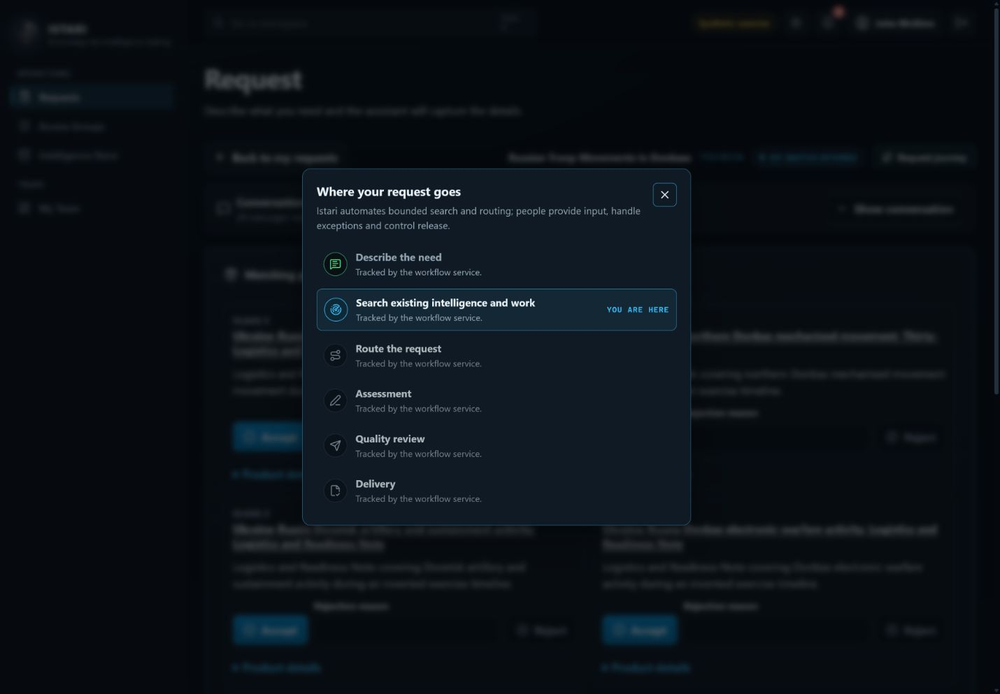

The stages are projected from the server-side workflow. Agents assist intake and
search, and the active JIOC Agent routes clear eligible requests. People remain
responsible for exception routing, production, approval, release and customer
outcome decisions. See the [agent authority matrix](AI_AGENTS.md#authority-matrix).

---

## Customer

Customers get two focused screens. The **dashboard** starts with an aligned
status ledger that emphasises requests needing customer action, then shows a
register of open requests with state, priority, collaborators and the next
available action. Closed and cancelled requests remain available in a separate
**Closed requests** section, which is collapsed by default. One primary action
opens a new request.

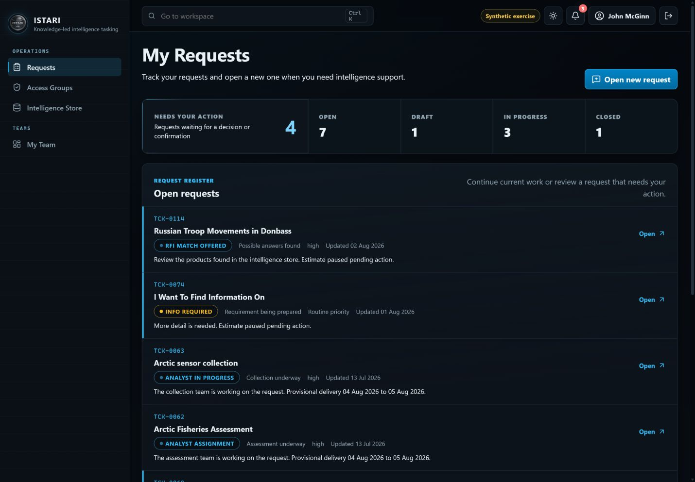

Opening a request shows the **chat-first workspace**. The intake assistant
captures the requirement conversationally without exposing its internal
completeness checklist. Customers can still open the manual edit panel when
they want direct control over the structured fields.

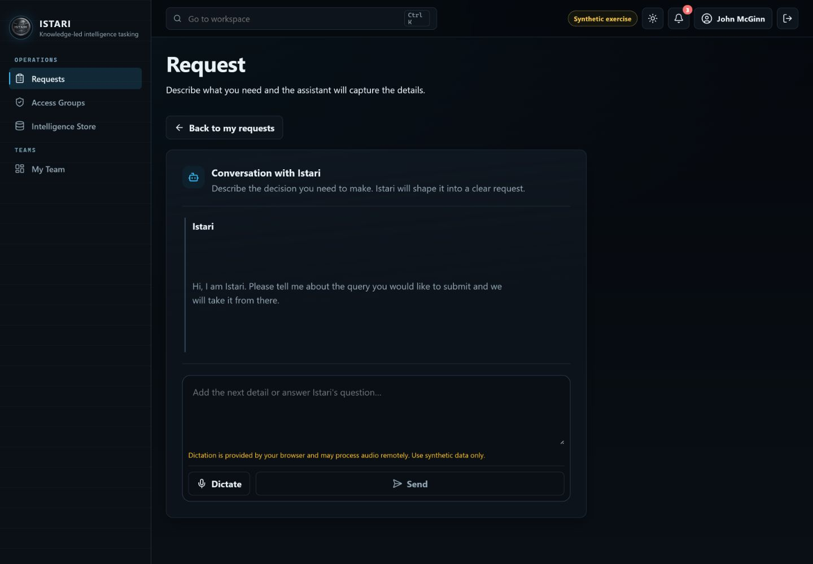

From here a customer can:

- Chat naturally with the intake assistant until it confirms the requirement is
  ready, without needing to manage the assistant's internal checklist.
- Use browser dictation where supported. **Talk with Istari** is a separately
  configured, server-brokered Realtime voice option and is not enabled by
  default.
- Edit any detail directly in "Edit details manually".
- Tag colleagues as editors or viewers.
- Submit the request, then accept or reject any existing-product offers.
- Review the authorised product first; provenance and diagnostics remain
  collapsed. Routine updates do not warn over useful results; partial zero-result searches ask you to retry.
- Accepting closes as **Successfully fulfilled**. Rejecting all reopens Istari
  for brief feedback, then offers **Refine and search again**, **Continue to the
  JIOC Agent**, or **Close as unfulfilled**. An assured no-match offers the latter
  two choices. JIOC alone decides RFA, collection, clarification or human review.
- After a newly produced product is released, confirm whether it meets the
  requirement. A **Yes** closes the request. A **No** requires a reason and can
  identify unmet criteria, then asks the responsible RFA or Collection manager
  to decide whether re-analysis is justified. If that manager disagrees, an
  independent JIOC human makes the final re-analysis decision.
- After the request closes, answer one short product-outcome feedback question
  and optionally explain what was useful or could be improved. Feedback is not
  offered while outcome or re-analysis work remains open. Customers do not
  have a separate analytics dashboard.

After submission, Istari also checks open requests for likely overlap. If a
visible similar request is already in progress, the workspace shows its
reference, title, score and reasons with **Join as viewer** and **Continue
request** actions. If overlap exists but the customer has no need-to-know for
the matching ticket, the workspace shows only a neutral note that the assessing
team will check for overlapping work.

## Intelligence Store

The Intelligence Store is a controlled search service. Search runs across
titles, summaries, tags and semantic labels; **Advanced filters** adds product
type, region, tag, source type and coverage dates. All of it runs **after**
access control and classification checks, so a customer only ever sees products
they are entitled to.

Results can be sorted by relevance, title or newest coverage. Sorting and
paging are applied by the server across the whole matched set, so a sort choice
holds as you page through. The **Refine** rail beside the results lists the
product types, regions and tags you can narrow to; selecting one applies it as a
filter and selecting it again removes it. When you are filtering rather than
searching, each option carries a count of the products you are cleared to see.
Refinement options deliberately ignore the search term so a narrow search still
leaves somewhere to go, so once a term is active the counts are hidden rather
than shown against a different set of results.

The search you have applied is held in the address bar, so a result set can be
shared with a colleague, refreshed, bookmarked, and returned to with the browser
Back button after opening a product.

If a phrase matches no single product, the store broadens the search to the
closest matches and says so, rather than reporting nothing found.

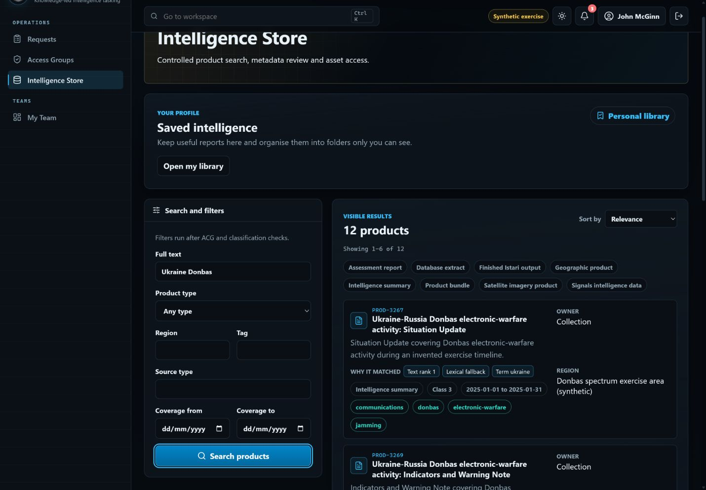

Every user has a private **Saved intelligence** library. A user can save an
authorised product, create personal folders, organise the saved item into one
folder at a time, and later move or remove it. Folder names and saved-product
membership are visible only to that user. Saving a product does not copy it or preserve
access if the underlying ACG, clearance or product-status policy later changes.

Opening a result puts assets and the controlled preview first. **Metadata and
handling** is collapsed by default and contains provenance, semantic labels and
technical handling detail. PDF previews are served through Istari's
authenticated, tokenised preview path rather than a direct object URL. If a
product was opened from an RFI result, a safe return link leads back to that
request; ordinary Store browsing does not create one.

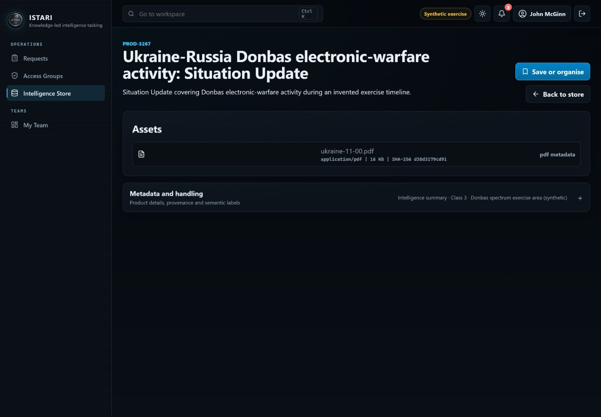

Each result card leads with its classification marking and reference, then the
title, a summary and the facts needed to judge it without opening it: type,
region, owning team, coverage window in plain dates, and what the product
actually contains. Products that are not yet published are badged as such. When
a search term is active, each card states what matched in plain words, with the
underlying retrieval signals shown beneath for anyone diagnosing relevance.

RFA and Collection managers
can register existing products for their own area. Intelligence Store Managers
can register draft or published products for either area, choose their product
ACGs and browse the catalogue without first entering search criteria. These
powers do not grant blanket content access. Viewing or downloading product
content still depends on product status, ACG membership and clearance.

---

## JIOC routing and oversight

The active JIOC agent invokes the RFA and CM capability agents and automatically
routes clear, eligible requests to RFA or CM. Ambiguous, restricted, stale or
otherwise unsafe cases land in the JIOC queue for a JIOC Team Member or JIOC
Manager to decide. An exception reviewer can approve the recommended route,
override it with a written reason, query the requester, reject the route, and
review or link similar open requests. When a request is routed to CM, the
customer is asked whether they want the **raw collect only** or the **collect
plus an RFA analysis**.

JIOC Managers are normally **on the loop**, supervising outcomes rather than
approving every routine route. **JIOC Oversight** defaults to attention items
and shows state, route and Agent-outcome totals, operational capacity, bounded
task ownership and shadow Routing Critic evidence. Each task exposes the Agent
route, policy version and rationale codes; its decimal evidence score is not a
probability. A Manager can open an exception directly in the JIOC queue or use
reasoned controls to hold, resume or send eligible work to review. Critic output
is advisory and cannot change workflow. Oversight exposes neither protected
content nor the raw audit log. See the detailed [JIOC operating
model](architecture/JIOC_OPERATING_MODEL.md).

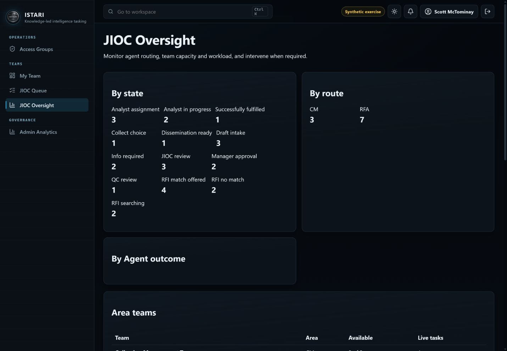

## RFA and Collection managers

Managers work across their whole RFA or CM area:

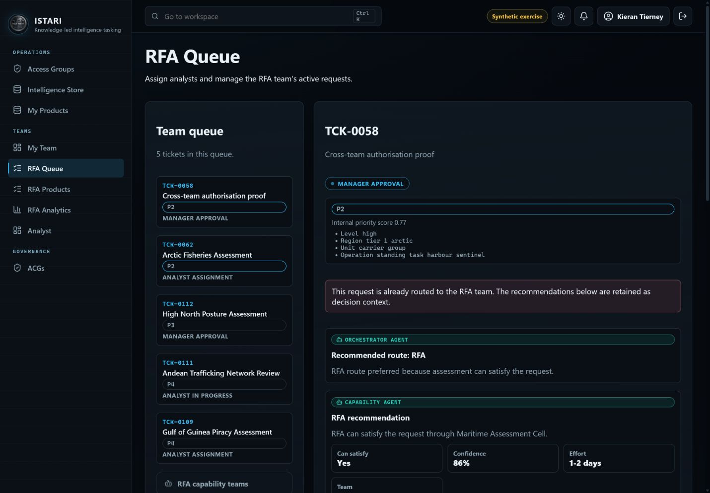

- **Assign one to five analysts** after selecting any active team in their area
  once the JIOC agent or exception reviewer approves the route. Candidates are scoped
  to that authoritative team, and work packages can be defined for the task.
- **Approve or return analyst work**: submitted drafts stop at manager
  approval, where the manager forwards them to Quality Control or returns
  them with a rework reason. A manager cannot approve work they drafted.
- **Review re-analysis requests** after release: agree and return the work to
  analysis, or refer a disagreement to an independent JIOC human. An assigned
  analyst cannot make this decision.
- **Manage the team** on the My Team page: roster, member profiles and the
  availability calendar.
- **View area analytics** for all authorised records and the fixed all-time
  scope; the dashboard does not reveal content outside existing access.

## Intelligence analyst

The analyst workbench lists only the tasks assigned to the signed-in analyst;
a task can be shared by several analysts. Selecting a task shows its context,
work packages, and progressive-disclosure sections for working notes and
linked products. Product submission accepts one controlled PDF, DOCX, PPTX,
PNG, JPEG or WebP file up to the configured 50,000,000-byte local limit. Istari
records an immutable version and SHA-256 digest, then uses a protected preview
or a safe fallback when the browser cannot render the format. **Submit for
manager approval** advances that exact version (QC-requested rework resubmits
straight to QC). The collapsed
**Request conversation** section loads the complete customer and Istari history
only when the assigned analyst opens it.

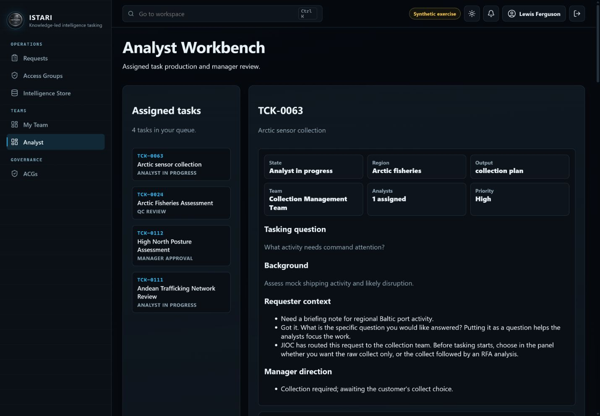

## Quality control

The QC queue shows safe submission summaries. An eligible QC manager selects
**Claim review** before full draft details are shown. Only that assigned
reviewer can approve or reject the item, and **Release claim** returns it to the
shared queue without changing the product. Rejected work returns to the same
reviewer after resubmission. A reviewer cannot claim work they authored or
actively analysed.

The assigned QC manager reviews the exact submitted version. Deterministic QC
preflight checks structure, manifest, evidence readiness and UK-English proofing;
it may block release but never approves it. The human checklist still requires
classification, sources, access and releasability confirmation. Approval
publishes the product and disseminates it to
the requester with a notification and a recorded email, and the requester is
asked whether it meets the requirement. For a collect the customer asked to
have analysed, approval instead forwards the ticket to RFA assignment with the
collect linked (the collect itself is never released). A QC manager cannot
approve a draft they authored.

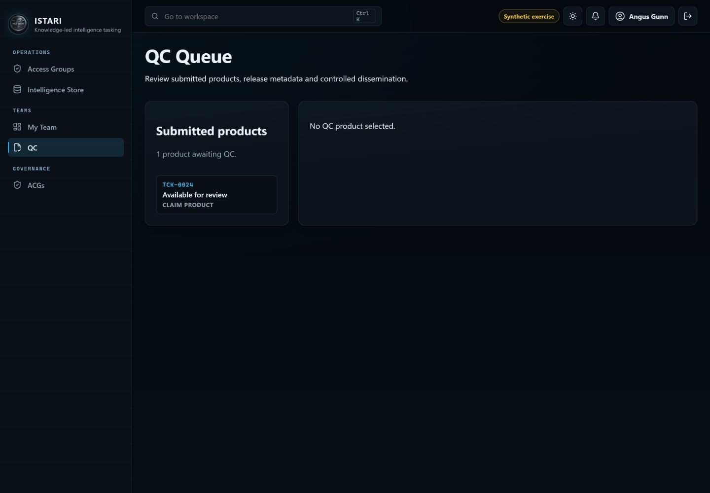

## My Team

Everyone on a team gets the **My Team** page: the roster with each member's
title and specialisms, a two-week availability calendar and today's
availability tile. Members log their own availability; managers can log for
anyone on their team, and add or remove members.

## My profile

Every signed-in user can open **Edit profile** from the account menu. The page
starts in a read-only identity view with the user's account, roles, title,
specialisms and biography. Choose **Edit profile** to enter edit mode, then
**Save changes** or **Cancel**. Profile text is descriptive only and never
changes roles, team membership, ACG access or clearance.

---

## Access Groups

Every signed-in user can open **Access Groups** from the navigation. The page
provides a searchable list of every active need-to-know group and labels each
entry as **Member**, **Not a member** or with its application state. Selecting
an ACG opens one detail view with its purpose and the current active managers.

To apply, select the ACG, enter a concise operational justification and choose
**Submit application**. Your text is retained if submission fails. A pending request can be
withdrawn after confirmation. Membership is granted only after another
authorised person approves the application.

An account delegated as administrator for one or more ACGs sees an additional
review queue on the same page. It contains only pending applications for those
groups. Approval adds membership; rejection requires a reason. You cannot decide
your own application. ACG administration does not make you a member and does not
grant access to the group's protected products.

---

## Administrator

The Admin workspace is the governance control plane. It shows service status,
pending **access requests** to approve or reject with a reason, and separate
controls for text-chat AI, search embeddings and Realtime voice. The left
navigation exposes operational workspaces, analytics, Users, ACGs and the audit
log according to the administrator's permissions.

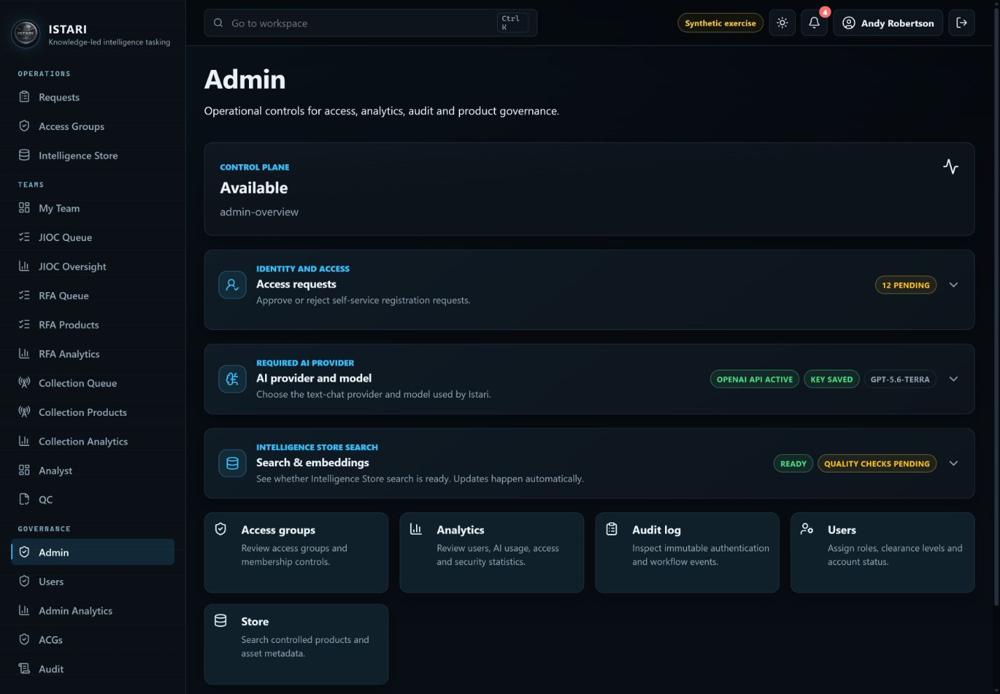

### Choosing the AI model

The **AI provider and model** panel groups models by provider. Gemini, OpenAI,
LiteLLM Proxy, Vertex AI and Bedrock can each accept a write-only key, test the
connection and retain their own selected model. LiteLLM model aliases can be
refreshed from its deployment-managed server address. Use a scoped virtual key,
not the LiteLLM master key. Activating a provider is a separate warned action
that changes the remote text and bounded-advice provider for every user, subject
to agent egress gates and deterministic fallback. Administrator-entered keys are
encrypted at rest, persisted and never returned to the browser.
Environment-managed provider keys take precedence and cannot be replaced in the
workspace. The configuration-encryption key must remain available across
restarts or persisted credentials cannot be decrypted.

The Vertex and Bedrock entries are direct API-key adapters. When either cloud is
routed through LiteLLM instead, cloud IAM, ADC and federated identities stay in
the LiteLLM deployment; only its restricted virtual key is entered here.

For the standard local Docker stack, a LiteLLM Proxy running on the Windows host
is reached at `http://host.docker.internal:4000`. Override
`COEUS_LITELLM_BASE_URL` before starting the stack when the proxy uses another
operator-controlled origin or path prefix. Operators configuring AWS Bedrock or
GCP Vertex AI routes should follow the
[LiteLLM Provider Connectivity Runbook](runbooks/litellm-provider-connectivity.md);
cloud credentials never belong in this workspace.

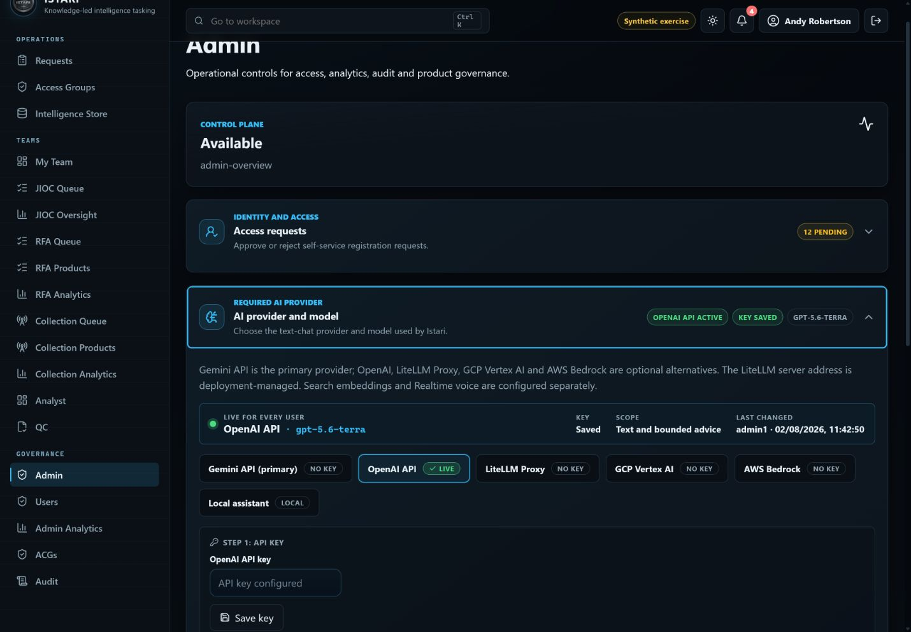

### Search embeddings

**Search & embeddings** is independent of text chat. Its main status says **Ready**, **Updating automatically** or **Needs attention**. New products,
changed files and search-service changes queue an automatic Search library
update. The page follows it without a manual refresh, and you can leave while
it runs. A retry action appears only if an update fails.
Open **Change search service** only when switching between Local search and
Gemini or updating the dedicated encrypted Gemini key. Test the chosen service
and model before applying it. **Quality checks pending** does not mean search is
broken: results remain available, but Istari will not claim a definitive
no-match until the evaluation passes. Counts use plain operational labels;
provider IDs, model IDs, dimensions and generation data are under **Technical
details**. The [Search Embeddings Runbook](runbooks/search-embeddings.md)
explains recovery and security boundaries.

### Realtime voice

**Realtime voice model** is optional and independent of both text chat and
embeddings. It requires a dedicated, encrypted OpenAI Realtime key. Save and test
the key, select the model, then explicitly enable voice for customer request
chat. Disabling voice leaves typed chat available.

### Access control groups

The governance **ACGs** workspace manages the 58 seeded need-to-know groups,
direct membership and delegated administrators. Each group can have up to eight
active administrators from any role or team. Adding someone as an ACG
administrator does not add them as a member. Application decisions are made
from the universal [Access Groups](#access-groups) workspace. Groups are themed
by region and discipline (for example "European Cyber", "Maritime GEOINT") so
product visibility reflects how teams are actually organised.

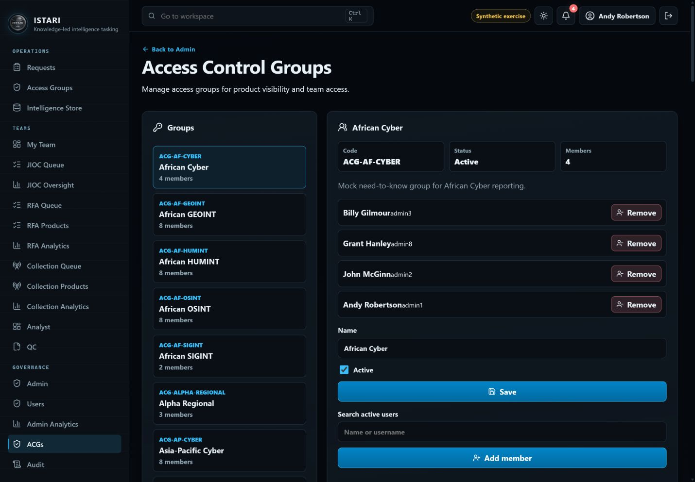

### Users and account lifecycle

The **Users** workspace searches and filters accounts. An administrator can
assign roles, change clearance, activate or deactivate an account, and issue a
temporary credential that is displayed once. The signed-in administrator cannot
change their own protected fields. Role assignment, team membership and ACG
membership are separate controls and should all follow least privilege.

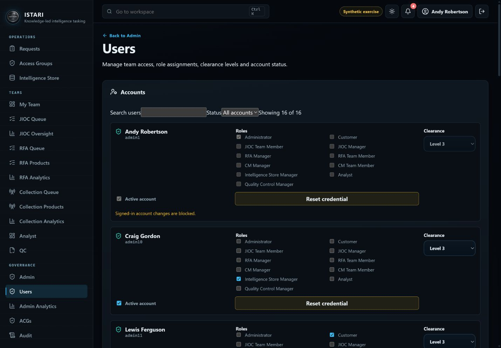

For the full local onboarding and offboarding sequence, including its
single-writer and non-production boundaries, see [Local Multi-User
Operations](runbooks/local-multi-user-operations.md).
