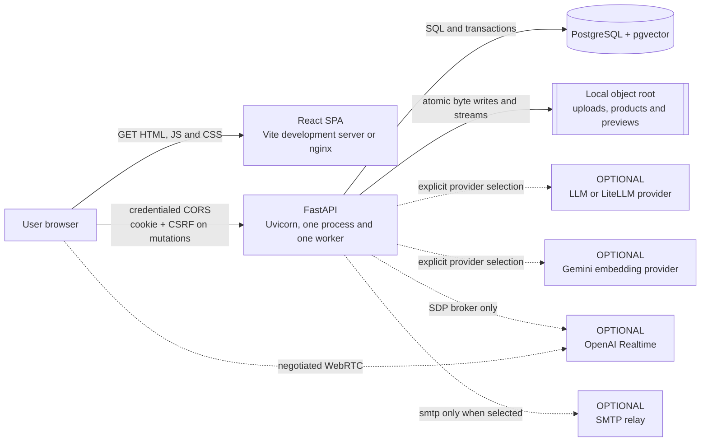
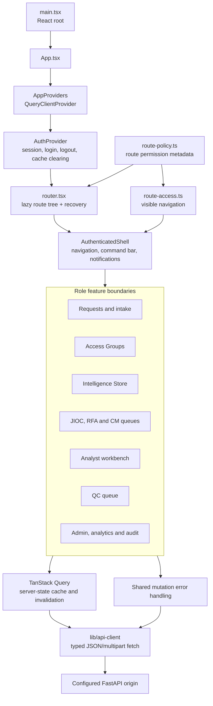
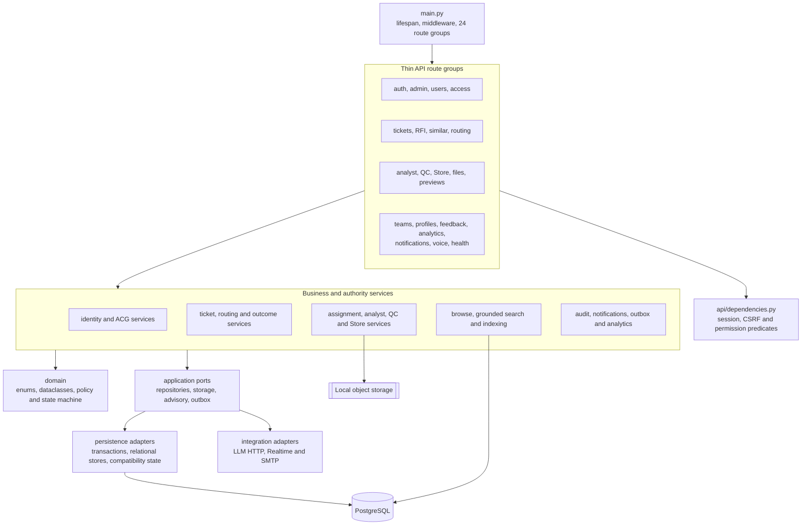
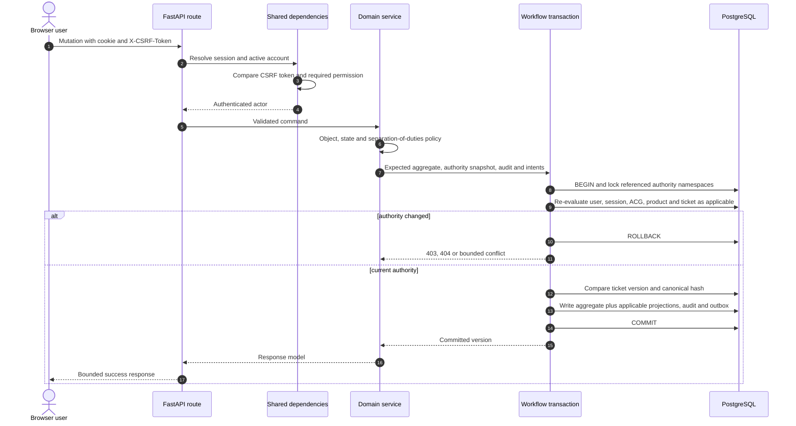
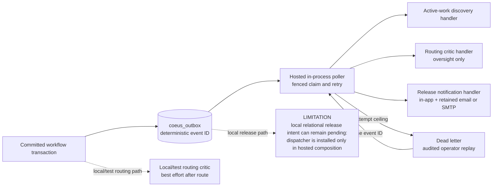

# Application Component Views

Status: **implemented** unless marked otherwise. Verified against `e44b66b6` on
23 July 2026.

This page drills from browser and service containers into frontend and backend
components, then follows one authenticated mutation through the final authority
boundary. See [Security and trust](SECURITY_AND_TRUST.md) for policy detail and
[Data, search and AI](DATA_SEARCH_AND_AI.md) for persistence internals.

## 1. Runtime containers and external calls

The browser fetches the SPA from the web origin and calls the configured API
origin directly. nginx is not an API reverse proxy.

The local default stays offline for text, embeddings and email. Realtime voice
is unavailable until configured.

## 2. Frontend component view

Frontend guards prevent confusing navigation, not unauthorised access. Every
direct link and mutation is re-evaluated by the API.

## 3. Backend component view

Composition is explicit in `composition.py` and focused composition modules.
Services receive repositories and provider ports rather than importing
framework globals.

## 4. Request execution and commit boundary

Read-only requests skip CSRF. Mutations pass the applicable predicates, then the
service repeats object/action checks at the final boundary. This sequence shows
a representative relational workflow mutation; the referenced authority,
projection and intent sets depend on the command.

Compatibility-state services use guarded single-process saves and compensation
rather than the relational workflow transaction. This is one reason the current
deployment remains one API process.

## 5. Background and post-commit effects

The dispatcher is an in-process task, not a separately deployed worker. Handler
idempotency is mandatory because an external effect can complete before the
delivery row is settled.

## Sources and companion records

| Concern                 | Authority                                                                                                                |
| ----------------------- | ------------------------------------------------------------------------------------------------------------------------ |
| Application composition | `apps/api/src/coeus/main.py`, `composition.py`, `identity_composition.py`                                                |
| Frontend routing        | `apps/web/src/app/router.tsx`, `app/route-policy.ts`, `lib/permissions/route-access.ts`                                  |
| Workflow transaction    | `apps/api/src/coeus/persistence/workflow_transaction.py`, `workflow_authority.py`                                        |
| Background dispatch     | `apps/api/src/coeus/services/outbox_dispatcher.py`, `release_notification_handler.py`                                    |
| Developer guidance      | [Backend boundaries](../development/backend-boundaries.md), [Frontend boundaries](../development/frontend-boundaries.md) |
| Operational guidance    | [Workflow and outbox operations](../security/workflow-outbox-operations.md)                                              |
