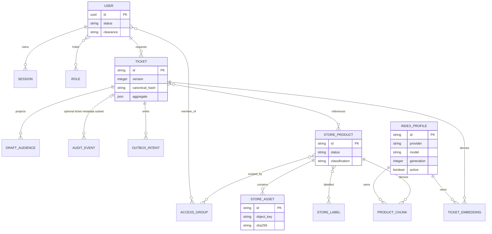
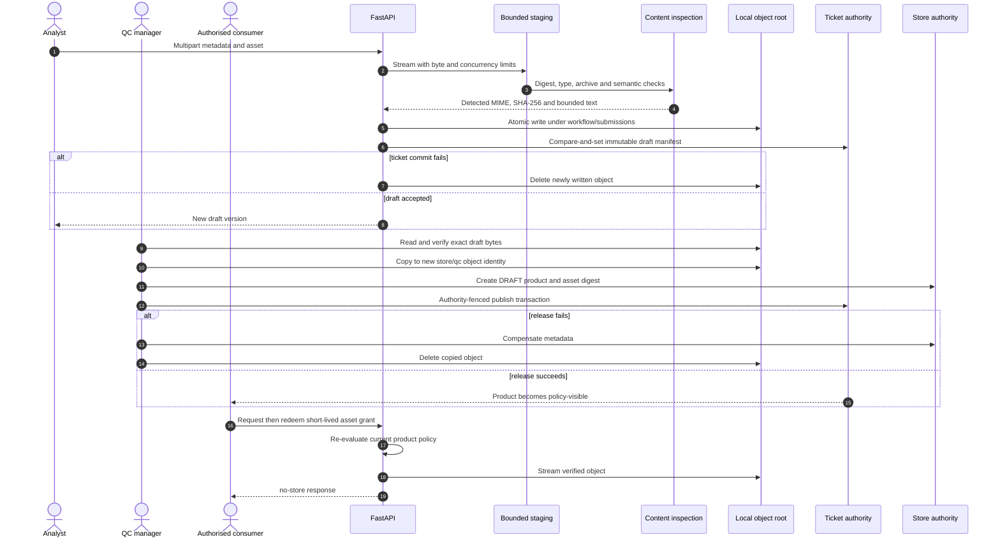
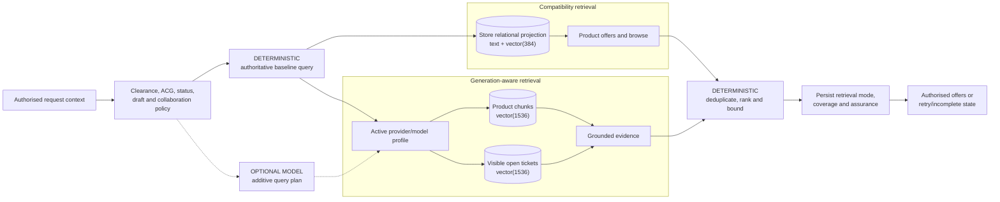
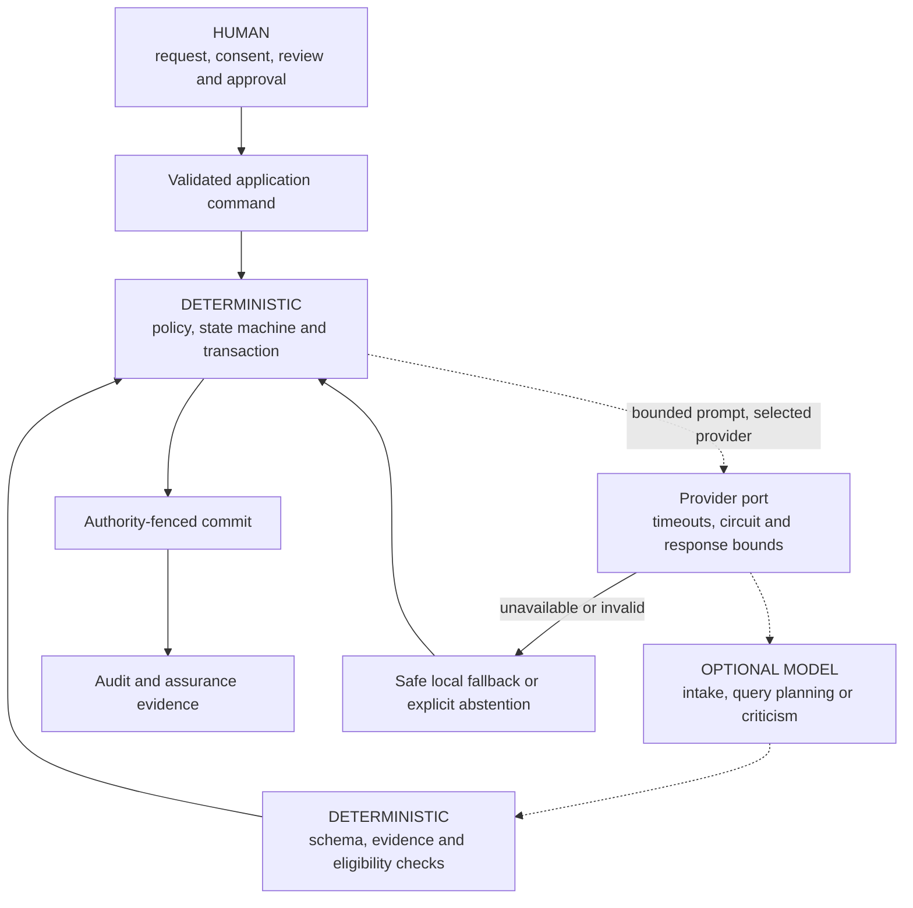

# Data, Search and AI Views

Status: **implemented** unless marked otherwise. Verified against `e44b66b6` on
23 July 2026.

This page distinguishes authoritative records, compatibility projections,
derived indexes and optional model assistance. These distinctions matter during
transactions, degraded search and recovery.

## 1. Data authority and ownership

```mermaid
flowchart TB
    accTitle: Istari data authority and ownership
    accDescr: Application domains map to authoritative relational records, compatibility JSON state, derived indexes, local object bytes and an external configuration key.

    subgraph domains["Application-owned domains"]
        ID["Identity and authority"]
        WF["Versioned workflow"]
        STORE["Intelligence Store"]
        AUD["Audit evidence"]
        CFG["Configuration and notifications"]
        SEARCH["Derived search"]
        CAP["Ephemeral resource admission"]
    end

    subgraph pg["PostgreSQL"]
        STATE[("coeus_state<br/>bounded JSONB namespaces")]
        TICKETS[("coeus_ticket_aggregates<br/>canonical hash + version")]
        OUTBOX[("coeus_outbox<br/>durable effect intents")]
        EVENTS[("coeus_audit_events<br/>application append-only")]
        AUDIENCE[("coeus_draft_audiences<br/>visibility projection")]
        STOREDB[("Relational Store tables")]
        BROWSE[("Store browse projection<br/>vector(384)")]
        PROFILE[("Search index profiles")]
        GROUND[("Grounded generation tables<br/>vector(1536)")]
        LEASES[("coeus_resource_leases")]
    end

    OBJECTS[["Local object root<br/>workflow and Store bytes"]]
    KEY[["Configuration encryption key<br/>outside database and recovery bundle;<br/>backed up separately"]]
    LOCAL["Local/test process-local<br/>resource admission"]

    ID --> STATE
    CFG --> STATE
    CFG -.->|"encrypted values"| KEY
    WF --> TICKETS
    WF --> OUTBOX
    WF --> AUDIENCE
    WF -.->|"counter and compatibility data"| STATE
    STORE --> STOREDB
    STORE --> OBJECTS
    STORE -.->|"compatibility snapshot"| STATE
    AUD --> EVENTS
    STOREDB --> BROWSE
    SEARCH --> PROFILE --> GROUND
    TICKETS --> GROUND
    STOREDB --> GROUND
    OBJECTS --> GROUND
    CAP --> LOCAL
    CAP -.->|"hosted composition only"| LEASES
```

Relational ticket, Store and audit records are authoritative in the default
PostgreSQL composition. `coeus_state` still contains bounded identity,
configuration, notification and compatibility namespaces. Grounded indexes and
resource leases are not business records. Local/test admission is process-local;
the relational lease adapter is selected only in hosted composition.

## 2. Logical relationship view

This is a domain-level ERD, not a complete physical schema.

## 3. Object-byte custody

The direct Store upload path uses the same bounded staging and inspection
controls. Database and filesystem changes use compensation; they are not
presented as one cross-store atomic transaction.

## 4. Two-index retrieval and assurance

The two vector dimensions serve different schemas and cannot be interchanged.
The optional planner may add retrieval legs but cannot remove the deterministic
baseline. Provider failure preserves a bounded, explainable fallback and is
recorded in the assurance result.

## 5. Shadow index generation

```mermaid
stateDiagram-v2
    accTitle: Grounded search index generation lifecycle
    accDescr: Each attempt creates a new profile that fails terminally or becomes the active ready profile; an activation-operation failure restores the previous profile internally, but no operator rollback or retention path exists.

    state "Candidate failed;<br/>previous ready profile reactivated" as CompensatedFailure

    [*] --> Indexing: create new inactive profile UUID
    Indexing --> Indexing: batch products and open tickets
    Indexing --> Failed: provider, validation or coverage failure
    Indexing --> ActiveReady: complete and activate one winner
    ActiveReady --> CompensatedFailure: post-activation configuration persistence fails
    ActiveReady --> InactiveReady: a later distinct profile activates
    Failed --> [*]: this profile remains failed
    CompensatedFailure --> [*]: candidate remains failed
    InactiveReady --> Limitation: no authorised rollback or cleanup path
```

Logical backups exclude these derived generation tables. After restore,
operators must rebuild and verify a generation before relying on complete
grounded-search assurance. Previous ready generations remain in the database,
but no operator rollback command, generation retirement state or cleanup policy
is implemented. `rollback_activation` is narrower: it is internal compensation
within one failed activation operation and reactivates the previous profile.

## 6. Bounded AI authority

The Routing Critic runs after a route is committed and is oversight-only.
Realtime voice is a separate browser-to-provider trust boundary documented in
[Security and trust](SECURITY_AND_TRUST.md#6-external-provider-and-realtime-boundaries).

## Sources and companion records

| Concern                 | Authority                                                                                                                                            |
| ----------------------- | ---------------------------------------------------------------------------------------------------------------------------------------------------- |
| Relational schemas      | `apps/api/src/coeus/persistence/relational_schema.py`, `search_index_schema.py`                                                                      |
| Workflow transactions   | `apps/api/src/coeus/persistence/workflow_transaction.py`, `workflow_authority.py`                                                                    |
| Object lifecycle        | `product_submissions.py`, `qc_ingestion.py`, `qc_release.py`, `object_storage.py`                                                                    |
| Retrieval and assurance | `grounded_search.py`, `rfi_search_retrieval.py`, `rfi_search.py`                                                                                     |
| Index generation        | `search_indexing.py`, `search_index_repository.py`                                                                                                   |
| Feature contracts       | [Hybrid RFI search](../specs/hybrid-rfi-search.md), [Search retrieval and duplicate assurance](../specs/search-retrieval-and-duplicate-assurance.md) |
| Operations              | [Coordinated backup and restore](../runbooks/coordinated-backup-restore.md), including separate key preservation                                     |
