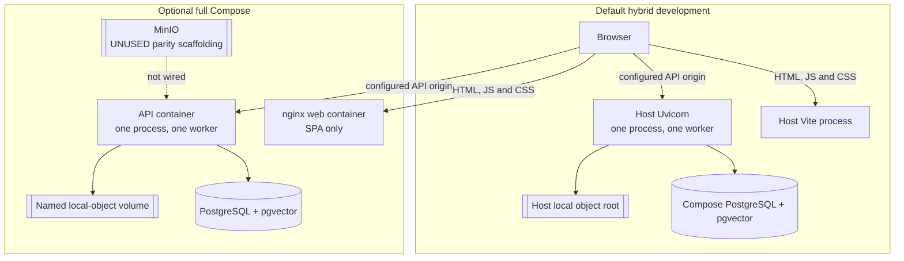
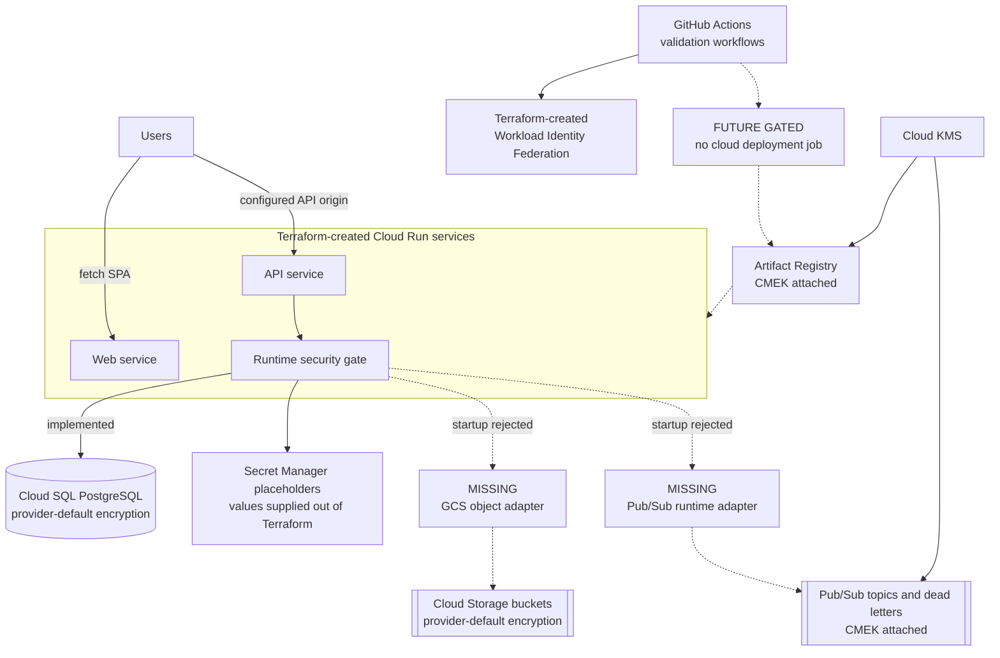
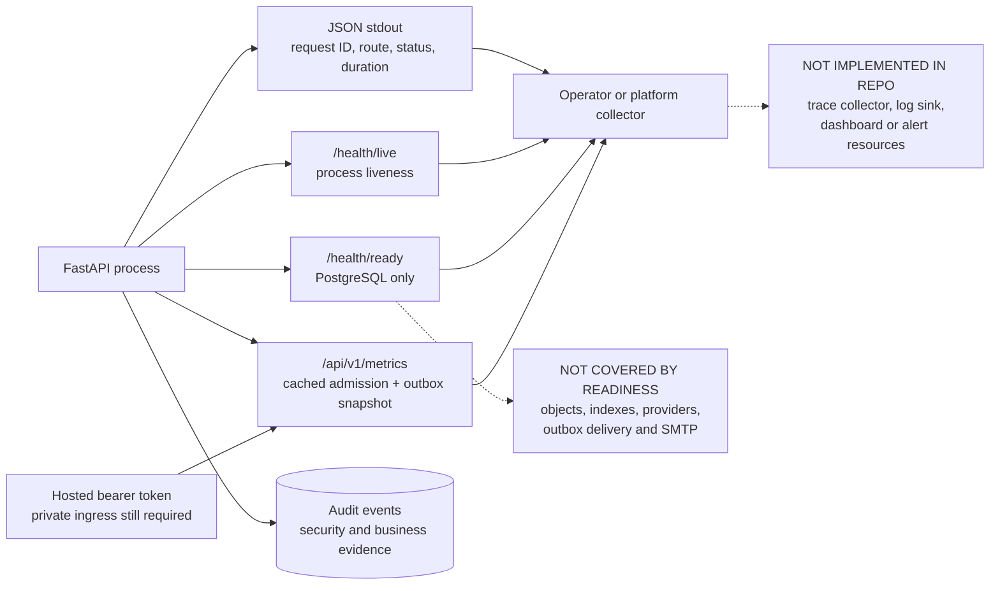
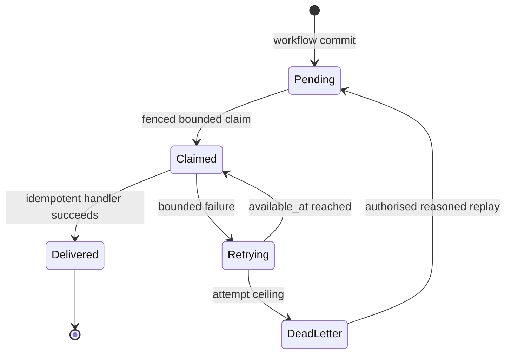
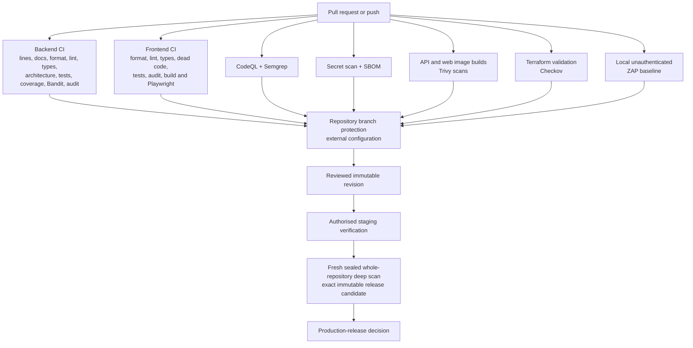
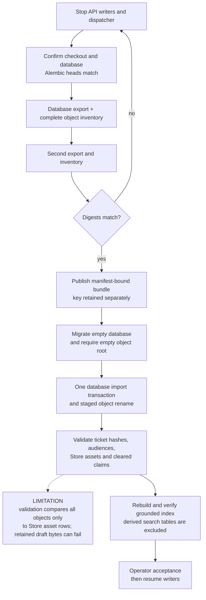

# Deployment and Operations Views

Status: local views are **implemented**. Cloud paths are **future gated** unless
explicitly marked as Terraform-created resources. Verified against `e44b66b6`
on 23 July 2026.

## 1. Supported local modes

The browser always fetches the SPA and calls the configured API origin
separately. nginx does not proxy API traffic.

The supported API topology is one process, one worker and one replica.
Identity, configuration and other bounded JSON namespaces plus local object
bytes still require the single-writer constraint.

## 2. Future GCP resource shell

Terraform can create this resource shell, but the application cannot yet run
with its configured GCS and Pub/Sub paths. Runtime readiness rejects those
unimplemented adapters.

Cloud-creating plans and applies require the ADR 0019 readiness acknowledgement.
Targeted Terraform operations remain prohibited. A future runtime must also
close identity, object storage, backup, audit export, monitoring and
multi-replica boundaries.

## 3. Current operational signals

Audit evidence is not telemetry. Operators must supply retention, dashboards,
alerts and incident routing in the deployment environment. Hosted metrics fail
startup without a strong bearer token, and that route should remain on private
monitoring ingress.

## 4. Durable effect and recovery path

Claims use `FOR UPDATE SKIP LOCKED`, an opaque worker identity and an expiry.
Monitor availability, oldest pending age, retrying and dead-letter counts.
Replay is RBAC-protected and audited. It retains the event ID so handler
idempotency remains meaningful.

There is a current local relational limitation: release-notification intents
are committed, but the dispatcher is installed only in hosted composition.
Those local intents can remain pending. Registration, ACG, assignment and
rework workflows are dashboard-driven and do not promise notifications.

## 5. CI and release assurance

These workflows are independent and branch protection is managed in GitHub,
not in repository code. ZAP is a local unauthenticated baseline. CI success is
not production accreditation.

## 6. Coordinated logical recovery

The drill is application-level recovery evidence, not a replacement for a
managed or physical backup test. Until draft-object validation is broadened,
operators must use the runbook's documented precondition and must not claim
complete recovery of retained `workflow/submissions/...` bytes.

## Sources and companion records

| Concern                   | Authority                                                                          |
| ------------------------- | ---------------------------------------------------------------------------------- |
| Local composition         | `docker-compose.yml`, `scripts/dev.ps1`, `infra/docker/nginx-web.conf`             |
| GCP resource shell        | `infra/gcp`, [ADR 0019](../adr/0019-current-local-runtime-future-gcp-migration.md) |
| Runtime gating            | `apps/api/src/coeus/core/runtime_security.py`, `services/object_storage.py`        |
| Signals and outbox        | `core/logging.py`, `api/routes/health.py`, `services/outbox_dispatcher.py`         |
| CI and security workflows | `.github/workflows`                                                                |
| Recovery                  | [Coordinated backup and restore](../runbooks/coordinated-backup-restore.md)        |
| Deployment guide          | [Concise deployment architecture](../ARCHITECTURE_DEPLOYMENT.md)                   |
