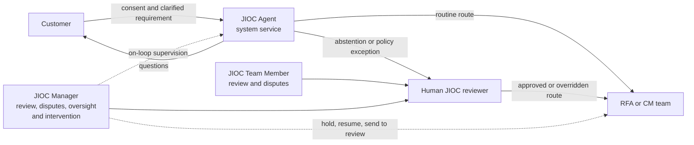
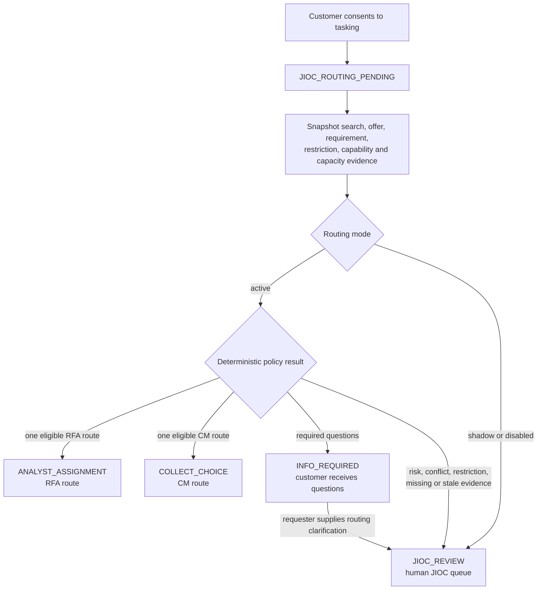
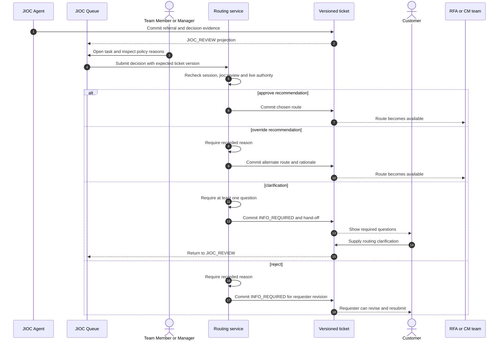
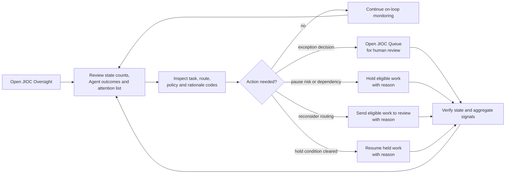
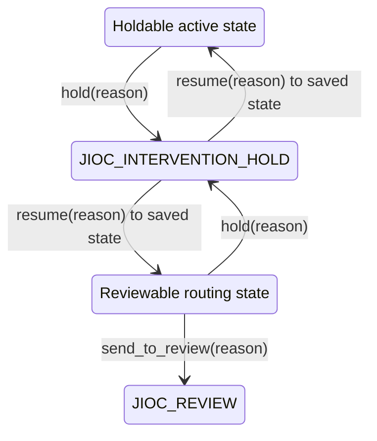
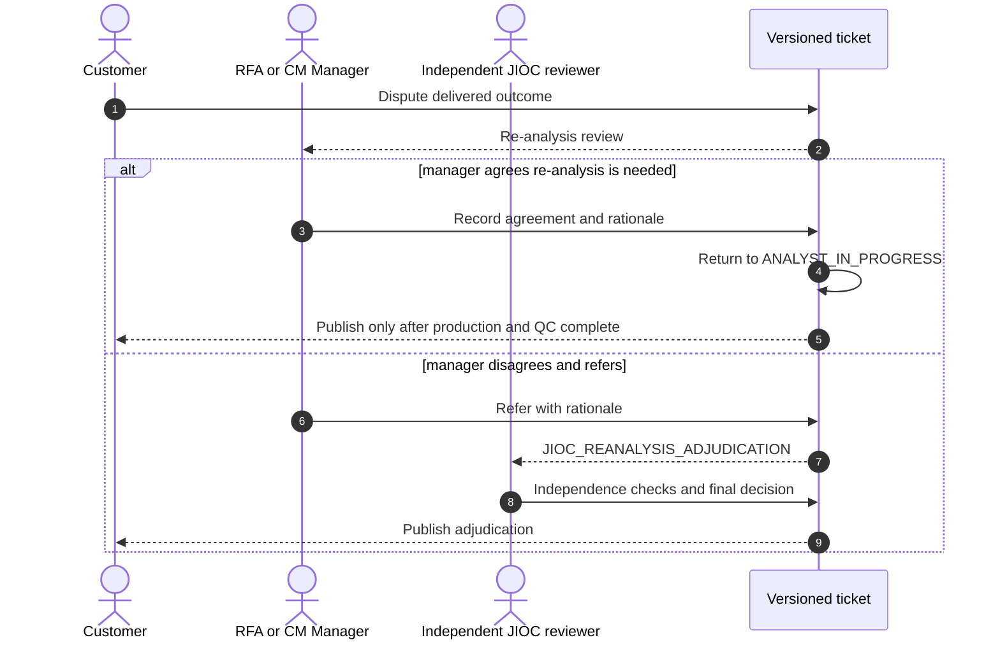

# JIOC Operating Model and Journeys

Status: Current implementation

Last verified: 23 July 2026

Primary owners: JIOC operations and platform engineering

This guide separates the deterministic JIOC Agent service from the two human
JIOC account roles. It is the canonical description of routing responsibility,
exception handling and Manager oversight. State names are defined in the
[workflow state reference](WORKFLOW_STATE_REFERENCE.md).

## Responsibility model

The Agent is a system principal, not a role that can be assigned to a person.
Both human roles can review exceptions and adjudicate referred disputes. The
Manager additionally supervises the whole flow and can intervene.

| Capability | JIOC Agent | JIOC Team Member | JIOC Manager |
| --- | --- | --- | --- |
| Evaluate versioned routing evidence | Runs policy | Inspects evidence | Inspects evidence and trends |
| Apply a routine eligible route | Yes, in active mode | Yes, from review | Yes, from review |
| Request required clarification | Yes, through a customer hand-off | Yes | Yes |
| Decide an exception or override | Refers only | Yes, reason required for an override | Yes, reason required for an override |
| Adjudicate a referred re-analysis dispute | No | Yes, subject to independence checks | Yes, subject to independence checks |
| See whole-flow oversight | No | No | Yes |
| Hold, resume or send eligible work to review | No | No | Yes |
| Read the raw audit log | No | No | No |

## End-to-end routing workflow

Active local and test mode uses `jioc-routing-policy-v2`. Hosted activation is a
separate deployment decision. Shadow mode records evidence but refers the case
to human review. Disabled mode also refers the case.

Every Agent decision records its policy version, disposition, recommended route,
evidence score, rationale codes and creation time. The evidence score is a policy
input, not a calibrated probability. A durable outbox intent triggers a
shadow-only Routing Critic; critic output cannot change the route.

## Human exception journey

The shared queue is the Team Member's default workspace. A Manager can use the
same queue when operational cover or escalation requires it.

Ordinary approval does not require free text. Override, rejection and
clarification do. Optimistic concurrency rejects decisions made against a stale
ticket.

## Manager journey

The Manager starts at JIOC Oversight, not the exception queue. The default
attention view prioritises pending routing, human review and held work. The
Manager can filter all work or Agent-routed work, inspect the exact Agent policy
evidence and open a review case directly in the queue.

Intervention is exceptional and always requires a reason. It is not a second
approval gate for routine Agent routes.

The service enforces the exact eligible-state allowlists. The UI cannot broaden
them. Managers see aggregate operational evidence, but do not have `audit:read`
and cannot browse the raw audit log.

## Re-analysis disputes

Post-release disagreement first returns to the responsible RFA or CM Manager.
That manager may resolve it or refer it to a human JIOC reviewer. The final JIOC
adjudicator must not be the requester, assigned analyst or referring manager.

## Security and operational boundaries

- Route-changing commands re-evaluate live permissions and relevant authority.
- Workflow writes use expected versions and fail closed on conflicts.
- The Agent is deterministic and cannot invoke arbitrary tools or external
  providers.
- Agent and human decision evidence is content-safe and avoids sensitive free
  text in aggregate oversight.
- Manager intervention does not grant raw audit-log access.
- If active execution cannot safely complete, the expected outcome is human
  review. Pending items remain visible to oversight and durable discovery retries.

## Implementation sources

- Roles and permissions: `apps/api/src/coeus/domain/rbac.py`
- Agent orchestration and evidence: `apps/api/src/coeus/services/jioc_routing_agent.py`
- Policy outcomes: `apps/api/src/coeus/services/jioc_routing_policy.py`
- Human review: `apps/api/src/coeus/services/routing.py`
- Manager intervention: `apps/api/src/coeus/services/jioc_intervention.py`
- Oversight projection: `apps/api/src/coeus/services/routing_oversight.py`
- Re-analysis disputes: `apps/api/src/coeus/services/customer_outcomes.py`
- Current decision: [ADR 0043](../adr/0043-jioc-human-review-and-manager-oversight.md)
- Security boundaries: [JIOC workflow threat model](../threat-model/jioc-workflow-restructure.md)
