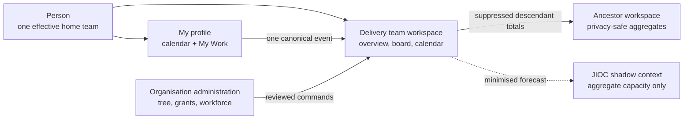
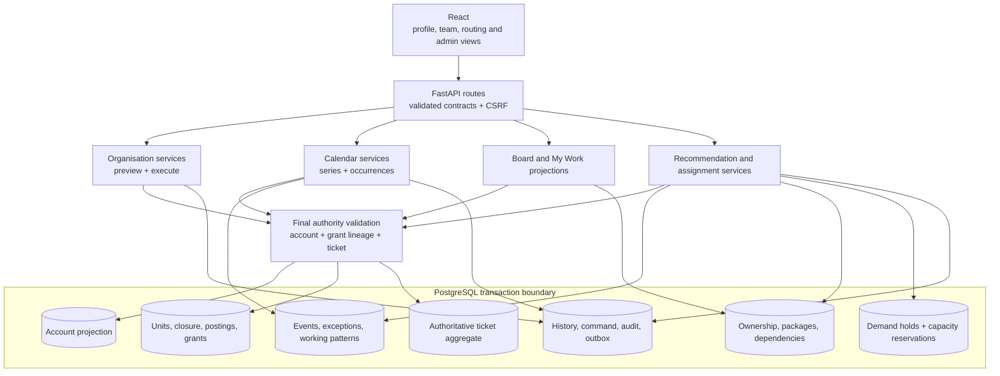
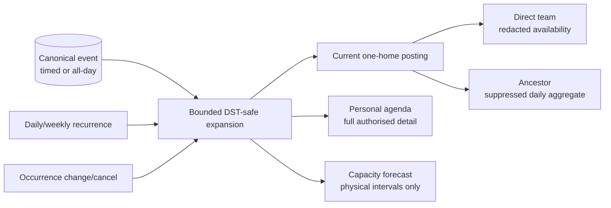
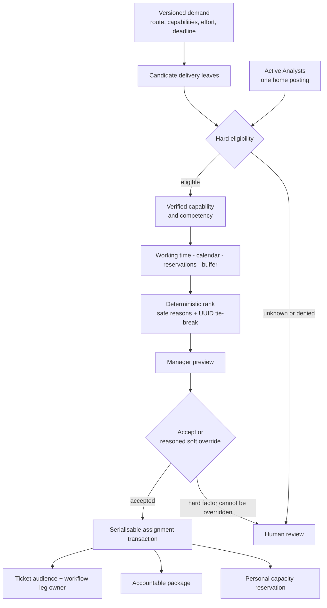
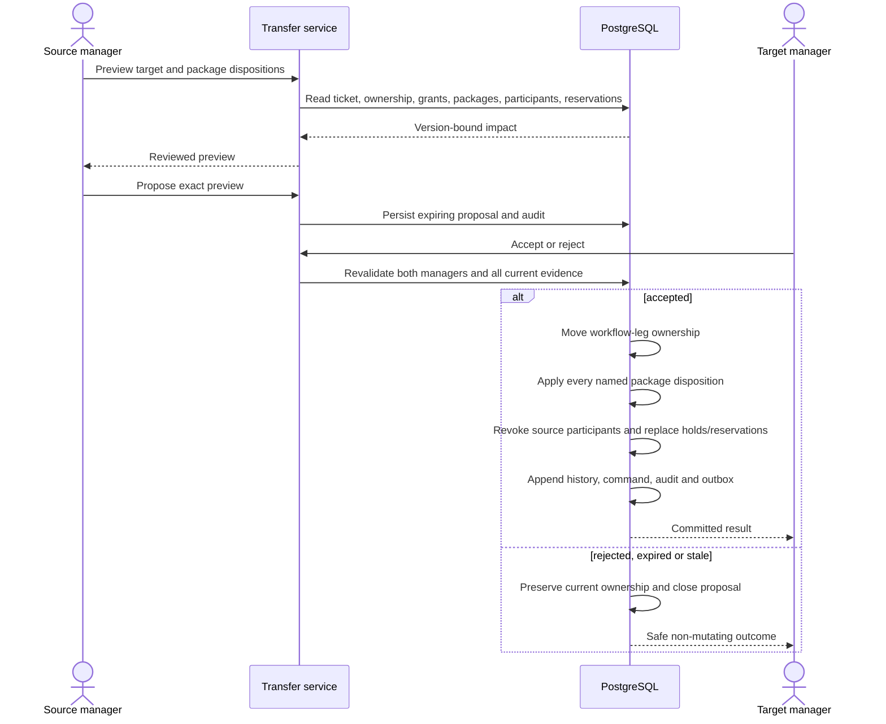
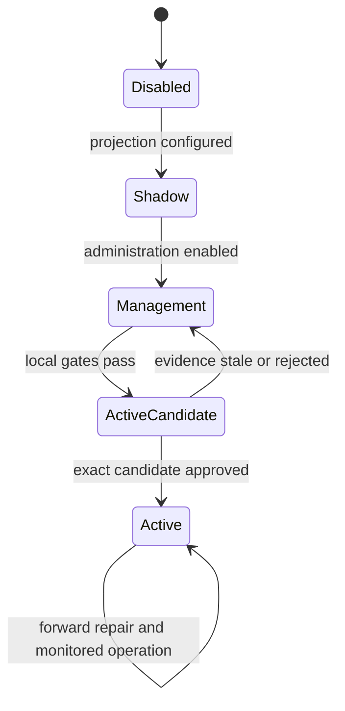

# Organisation, Workforce and Capacity Views

## Canonical calendar projection and commitments

Personal, manager, team, task, external and legacy sources converge as
canonical occurrences at the read boundary. Exact cross-source identities are
collapsed by deterministic precedence while the response retains every source.
A lower-precedence source reappears if the winning record is cancelled. A
conflicting legacy same-interval identity fails unknown instead of changing
capacity speculatively.

Team events carry one unit scope and are read through that scope. Personal and
manager events carry one owner and are projected through the owner's effective
home membership at query time. A posting boundary therefore changes projection
without copying the calendar record. Team writes require `calendar:manage` for
the target unit at preview and serialisable commit time.

Manager-created commitments have a response record distinct from the event.
Subjects acknowledge or dispute a response version; managers or authorised
successors mutate the event version. A manager change increments the response,
returns it to pending and emits a notification. This separation preserves event
authority, subject voice and original-creator provenance simultaneously.

Status: **implemented management/shadow foundation with release-gated active
authority**. These views show how users, hierarchy, calendars, work packages and
capacity fit together. They do not imply that organisation `active` mode has
been approved.

## 1. User and management view

The person is never posted to two teams at once. A parent manager sees a child
only through an action-specific direct or descendant grant. Hierarchy does not
grant access to the child's tickets, products or ACGs.

## 2. Technical component view

Frontend permissions control navigation only. The API service and final
PostgreSQL transaction repeat every material authority check.

## 3. Calendar projection view

Notes and private detail do not enter capacity logic. A posting boundary changes
the projection path without copying or rewriting the event.

## 4. Assignment decision view

JIOC may use aggregate team feasibility for routing, but it does not select a
named person. The accepting manager remains accountable for the decision.

## 5. Work ownership and transfer view

This transfer moves work only. It never creates a second personnel posting and
never expands ticket, ACG, product or asset access.

## 6. Runtime and cutover states

`ActiveCandidate` is a release concept, not a runtime mode. Active composition
must remain unavailable until the immutable evidence record binds the exact
schema, projection hashes, routing evaluation, protected checks and approval.

## 7. Security boundaries

- Account suspension, grant revocation and ticket audience loss take effect at
  the final read or transaction boundary.
- Current policy governs historical views. Restored historical rows never
  restore revoked authority.
- Parent workspaces use aggregates and complementary suppression. They do not
  enumerate sibling personnel or private events.
- Recommendation exclusions are coarse. Calendar notes, biographies,
  clearance details and sensitive failure reasons do not enter prompts or logs.
- Every mutation is actor-scoped, version-bound and idempotent, with immutable
  history, audit and outbox evidence committed atomically.
