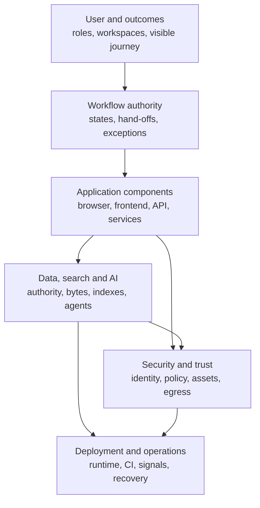

# Istari Architecture Atlas

This atlas expands the three concise architecture guides into smaller,
maintainable views for users, product owners, developers, security reviewers and
operators. It describes the implementation verified on 23 July 2026 against
`e44b66b6`, except where a node is explicitly marked **OPTIONAL**, **LIMITATION**
or **FUTURE GATED**.

Start with [Architecture](../ARCHITECTURE.md) for the short overview. Use this
atlas when you need to trace a role, request, component, data item, trust
boundary or operational control in depth.

## Reading paths

| Audience                      | Recommended path                                                                                                  |
| ----------------------------- | ----------------------------------------------------------------------------------------------------------------- |
| Decision-maker                | [User and workflow](USER_AND_WORKFLOW.md), then [deployment and operations](DEPLOYMENT_AND_OPERATIONS.md)         |
| Product or service owner      | [User and workflow](USER_AND_WORKFLOW.md), then the canonical [workflow state model](../ARCHITECTURE_WORKFLOW.md) |
| Frontend or backend developer | [Application components](APPLICATION_COMPONENTS.md), then [data, search and AI](DATA_SEARCH_AND_AI.md)            |
| Security reviewer             | [Security and trust](SECURITY_AND_TRUST.md), then [data, search and AI](DATA_SEARCH_AND_AI.md)                    |
| Operator                      | [Deployment and operations](DEPLOYMENT_AND_OPERATIONS.md), then the linked runbooks                               |

## View map

| View                                                      | Questions it answers                                                                                                      |
| --------------------------------------------------------- | ------------------------------------------------------------------------------------------------------------------------- |
| [User and workflow](USER_AND_WORKFLOW.md)                 | Who uses Istari, which workspace do they see, who decides, and how does a request feel to the customer?                   |
| [Exhaustive workflow states](WORKFLOW_STATE_REFERENCE.md) | Which state movements are permitted, including cancellation, intervention, retry, compatibility and outcome paths?        |
| [Application components](APPLICATION_COMPONENTS.md)       | Which runtime component receives a request, where do rules live, and how are synchronous and background effects composed? |
| [Data, search and AI](DATA_SEARCH_AND_AI.md)              | Which store is authoritative, how are bytes protected, how do the two indexes work, and where may models advise?          |
| [Security and trust](SECURITY_AND_TRUST.md)               | Where are the trust boundaries, how are sessions and object policy enforced, and what leaves the machine?                 |
| [Deployment and operations](DEPLOYMENT_AND_OPERATIONS.md) | How does local runtime work, what is future-only, which checks protect release, and what can be recovered?                |
| [Glossary](GLOSSARY.md)                                   | What do the product, workflow and architecture terms mean?                                                                |

## Canonical concise guides

- [Architecture](../ARCHITECTURE.md): context, layers, persistence and
  need-to-know.
- [Architecture: Workflow](../ARCHITECTURE_WORKFLOW.md): canonical ticket state
  model and bounded automation.
- [Architecture: Deployment](../ARCHITECTURE_DEPLOYMENT.md): current local
  topology and gated future targets.

## Diagram conventions

- Solid arrows are implemented runtime calls or persisted flows.
- Dashed arrows are optional configured calls, advice or a stated future path.
  The node and edge text gives the exact meaning.
- **HUMAN**, **DETERMINISTIC**, **MODEL ADVISORY**, **OPTIONAL**,
  **LIMITATION** and **FUTURE GATED** labels carry meaning without relying on
  colour.
- A diagram marked “principal” is intentionally readable and links to the
  exhaustive authority beneath it.
- Frontend permission checks guide navigation only. Backend services and
  transactions enforce authority.
- Audit evidence and operational telemetry are separate concerns.

Every diagram has an accessible title and description. The prose and tables are
the text alternative when a renderer cannot display Mermaid.

## Authority and maintenance

Implementation code and configuration are authoritative for current behaviour.
The [documentation maintenance guide](../development/documentation-maintenance.md)
defines change rules. When behaviour changes:

1. update the smallest affected deep view;
2. update a concise guide when the high-level model changes;
3. link the relevant specification, ADR, threat model or runbook;
4. run `pnpm docs:check`, `pnpm mermaid:check` and `pnpm line-limit`; and
5. do not relabel a future reference design as implemented.
