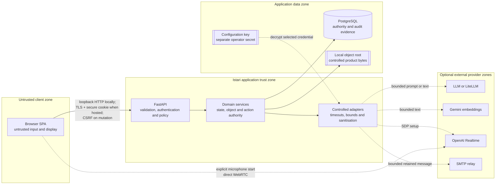
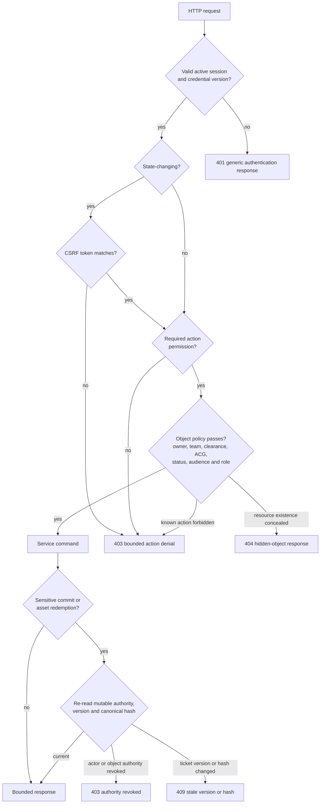
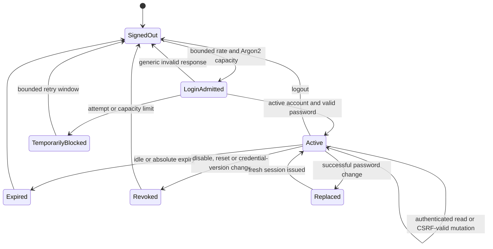
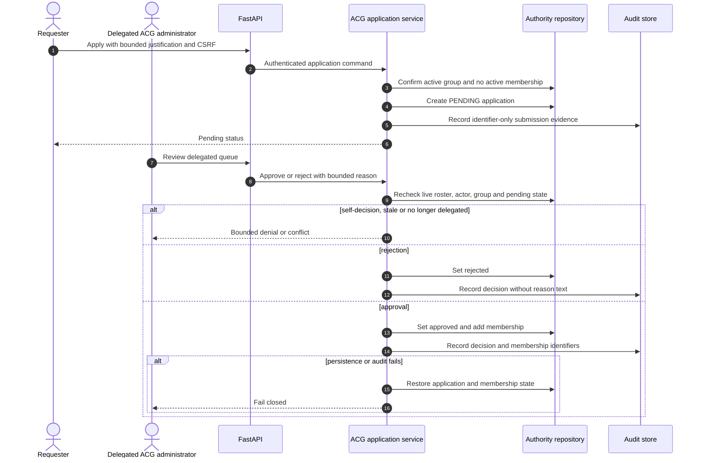
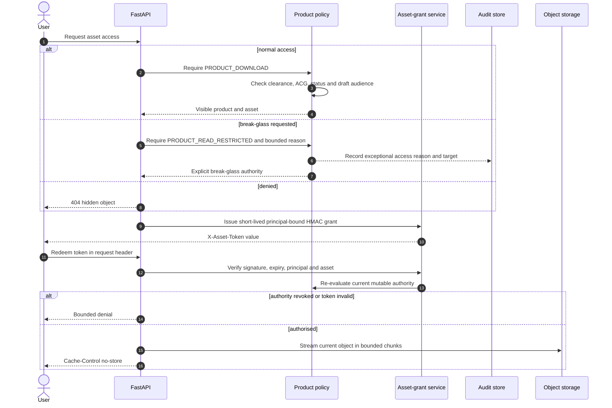
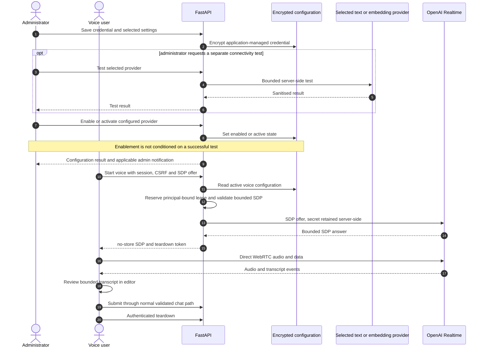

# Security and Trust Views

Status: **implemented** unless marked otherwise. Verified against `e44b66b6` on
23 July 2026.

These views show where identity, policy and human authority are re-evaluated.
They are an orientation aid, not a replacement for the linked threat models.

## 1. Trust zones and data movement

Ordinary runtime egress is off by default and begins when an operator selects an
environment provider or an administrator enables an application-managed
provider. Administrator-requested connectivity tests and model discovery can
contact a configured provider before activation. Text and voice connection
tests are not separately audited; a successful model refresh is. The database
administrator and host operator remain inside the trusted computing boundary.
Audit rows are application-append-only, not database-trigger immutable or WORM
storage.

## 2. Request authentication and need-to-know

Frontend route policy improves navigation but is never an authorisation
boundary. Ordinary denials are not described as audit evidence unless the
governing service explicitly records them.

## 3. Session and credential lifecycle

Session IDs stay in HTTP-only SameSite cookies. CSRF material stays in React
memory, not local storage. Hosted startup requires secure cookies. Session
issue is bounded globally and per user.

## 4. ACG application and delegated review

Delegated administration is a responsibility, not a role or membership.
Review authority never grants product access. This path currently uses a
single-writer authority boundary with compensation, not a multi-replica
transaction.

## 5. Controlled asset grant and redemption

Break-glass deliberately bypasses ordinary product clearance, ACG, status and
draft checks only after restricted-read support authority and a reason are
validated. It is an exceptional, audited path, not an administrator shortcut.

## 6. External-provider and Realtime boundaries

Istari does not retain voice audio or SDP. Direct WebRTC means provider
retention, browser behaviour and the active session after setup remain outside
Istari's hard enforcement boundary. Text providers selected through environment
configuration may also be active at startup; the optional administrator test is
not an activation gate.

## Sources and companion records

| Concern                       | Authority                                                                                                                                                                                                                                                                                    |
| ----------------------------- | -------------------------------------------------------------------------------------------------------------------------------------------------------------------------------------------------------------------------------------------------------------------------------------------- |
| Request dependencies          | [API dependencies](../../apps/api/src/coeus/api/dependencies.py)                                                                                                                                                                                                                             |
| Identity and sessions         | [Auth service](../../apps/api/src/coeus/services/auth.py), [session repository](../../apps/api/src/coeus/repositories/sessions.py), [user administration](../../apps/api/src/coeus/services/user_admin.py)                                                                                   |
| Product policy and grants     | [Store access](../../apps/api/src/coeus/services/store_access.py), [asset redemption](../../apps/api/src/coeus/services/store_asset_redemption.py), [file routes](../../apps/api/src/coeus/api/routes/store_files.py)                                                                        |
| ACG governance                | [Access service](../../apps/api/src/coeus/services/access.py), [ACG applications](../../apps/api/src/coeus/services/acg_applications.py), [ACG catalogue](../../apps/api/src/coeus/services/acg_catalogue.py)                                                                                |
| External integration controls | [AI models](../../apps/api/src/coeus/services/ai_models.py), [voice models](../../apps/api/src/coeus/services/voice_models.py), [Realtime adapter](../../apps/api/src/coeus/integrations/openai_realtime.py), [browser voice hook](../../apps/web/src/features/requests/useRealtimeVoice.ts) |
| Threat models                 | [Auth and sessions](../threat-model/auth-rbac-sessions.md), [ACG and product access](../threat-model/acg-product-access.md), [Realtime voice](../threat-model/realtime-voice.md)                                                                                                             |
