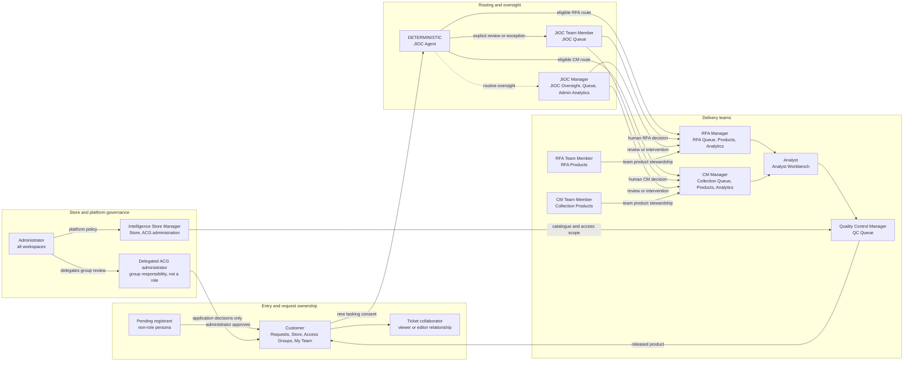
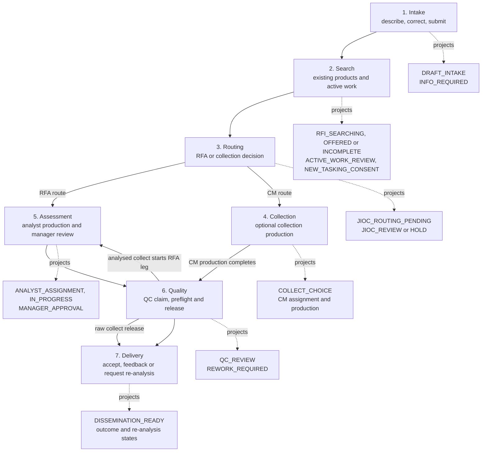
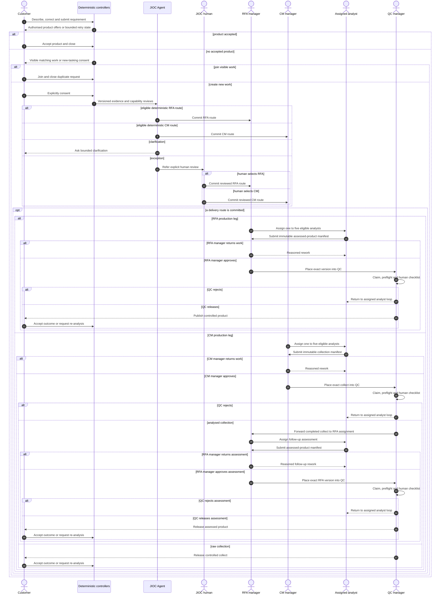
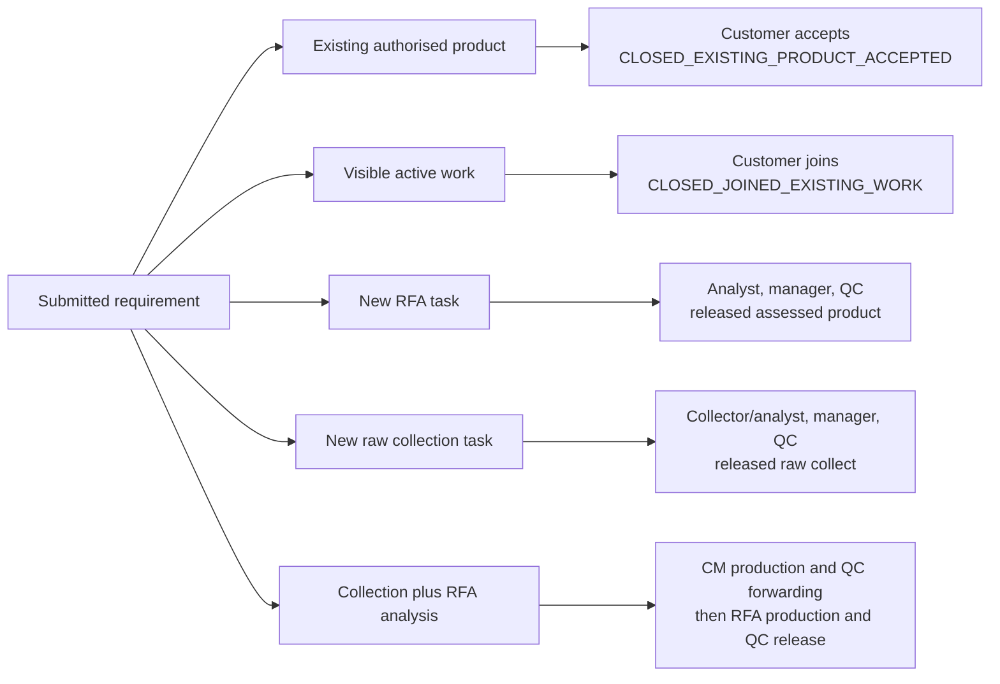
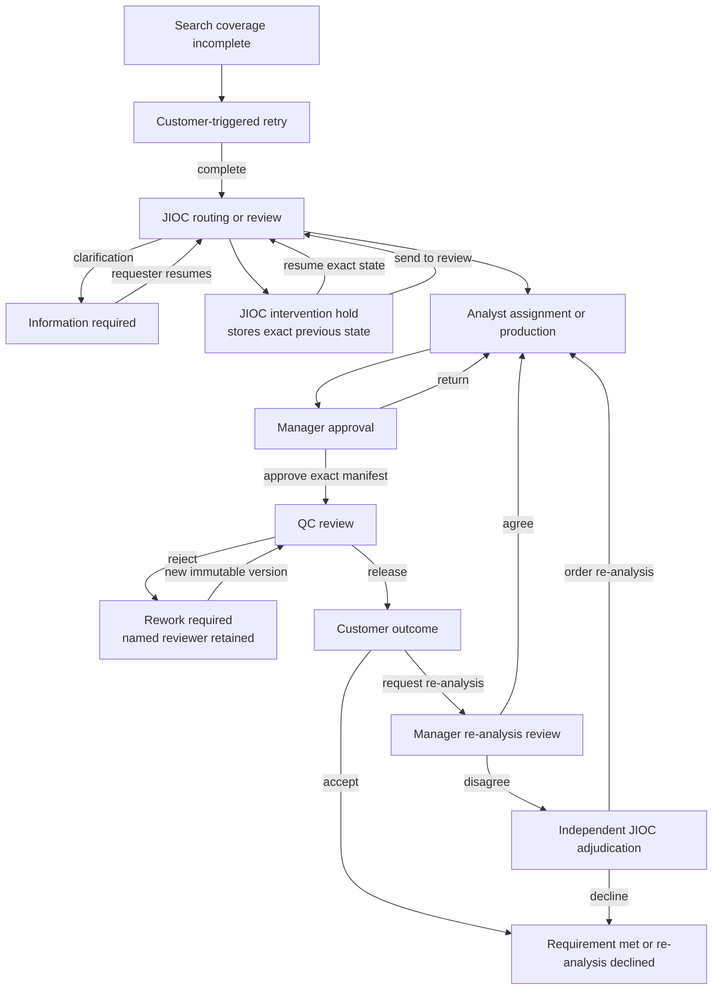

# User and Workflow Views

Status: **implemented**, except where a limitation is called out. Verified
against `e44b66b6` on 23 July 2026.

This page shows Istari from the perspective of people and outcomes. The
[canonical workflow guide](../ARCHITECTURE_WORKFLOW.md) remains authoritative
for ticket states; this page explains how those states are projected to users
and how authority moves between roles. The [Exhaustive Workflow State
Reference](WORKFLOW_STATE_REFERENCE.md) includes every allowlisted transition.

## 1. People, responsibilities and workspaces

Eleven account roles exist. Pending registrant, requester, collaborator and
delegated ACG administrator are relationships or responsibilities, not extra
roles. Accounts may hold several roles; permissions are unioned, but live
separation-of-duties checks still apply.

Delegated ACG administration alone grants no content access. Store browse-all
removes the search-first presentation constraint, not clearance, ACG, status or
draft-audience policy.

## 2. Role-to-workspace summary

| Role                       | Default workspace   | Primary authority                                            |
| -------------------------- | ------------------- | ------------------------------------------------------------ |
| Administrator              | Admin               | Accounts, roles, configuration, all platform permissions     |
| Customer                   | Requests            | Own request, product decisions, new-tasking consent, outcome |
| JIOC Team Member           | JIOC Queue          | Exception routing and dispute adjudication                   |
| JIOC Manager               | JIOC Oversight      | Oversight, hold/resume/intervention and global aggregates    |
| RFA Manager                | RFA Queue           | RFA assignment, manager approval, team and analytics         |
| RFA Team Member            | RFA Products        | Scoped team product stewardship                              |
| CM Manager                 | Collection Queue    | Collection assignment, manager approval, team and analytics  |
| CM Team Member             | Collection Products | Scoped team product stewardship                              |
| Intelligence Store Manager | Store               | Catalogue, product and ACG membership administration         |
| Analyst                    | Analyst Workbench   | Assigned work packages and immutable draft versions          |
| Quality Control Manager    | QC Queue            | QC claim, human checklist, release or rejection              |

The frontend uses permission-based navigation. Backend services, object policy
and commit-time authority are the enforcement boundaries.

## 3. Customer-visible journey and internal projection

The customer sees a small stable journey rather than raw enum names. Several
operational states map to one visible phase.

Closed outcomes include accepted existing product, joined existing work,
unanswered/declined tasking, requirement met, re-analysis declined, delivered
compatibility closure and cancellation.

## 4. Principal authority hand-offs

This is an authority narrative, not an HTTP trace. The technical request and
transaction sequence is in
[Application components](APPLICATION_COMPONENTS.md#4-request-execution-and-commit-boundary).

The Routing Critic is advisory after a route is committed. It never delays or
changes the route. A JIOC Manager is on the loop for routine automation and in
the loop for holds, intervention and exceptions.

## 5. Outcome variants

## 6. Holds, rework and re-analysis

Cancellation is permitted only from the allowlisted non-terminal states in
`domain/state_machine.py`. The canonical state diagram intentionally shows the
principal flow; code remains authoritative for exhaustive transitions.

## Sources and companion records

| Concern                      | Authority                                                                                                  |
| ---------------------------- | ---------------------------------------------------------------------------------------------------------- |
| Roles and default workspaces | `apps/api/src/coeus/domain/auth.py`, `domain/rbac.py`, `apps/web/src/app/route-policy.ts`                  |
| Ticket transitions           | `apps/api/src/coeus/domain/state_machine.py`                                                               |
| Exhaustive transition views  | [Workflow State Reference](WORKFLOW_STATE_REFERENCE.md)                                                    |
| Customer projection          | `apps/api/src/coeus/services/customer_status.py`                                                           |
| Assignment and approval      | `analyst_assignment_service.py`, `manager_approval.py`, `quality_control.py`, `customer_outcomes.py`       |
| User guidance                | [Roles and User Stories](../ROLES_AND_USER_STORIES.md), [User Guide](../USER_GUIDE.md)                     |
| Feature contract             | [External product and customer acceptance](../specs/external-product-ingestion-and-customer-acceptance.md) |
