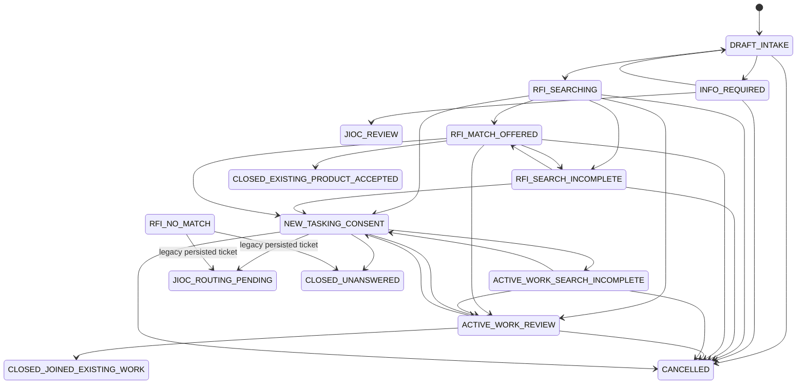
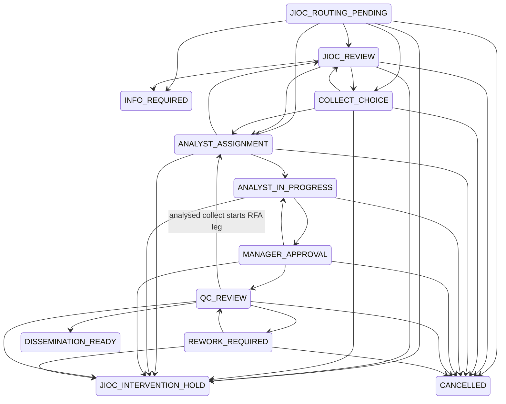

# Exhaustive Workflow State Reference

Status: **implemented**. Reconciled with
`apps/api/src/coeus/domain/state_machine.py` at `e44b66b6` on 23 July 2026.

The canonical workflow guide deliberately shows the principal journey. These
three slices include every edge in `ALLOWED_TRANSITIONS`, including legacy,
cancellation and intervention paths. They describe permitted state movement,
not which actor or predicate is sufficient to invoke it. Service policy remains
authoritative for that decision.

## 1. Intake, search and consent transitions

`RFI_NO_MATCH` is decode and transition compatibility for older persisted
tickets. Current no-match work uses `NEW_TASKING_CONSENT`.

## 2. Routing, production and quality transitions

An allowed transition is still subject to live role, assignment,
separation-of-duties, claim, exact-version and object-policy checks.

## 3. Intervention and outcome transitions

```mermaid
stateDiagram-v2
    accTitle: Exhaustive intervention and customer outcome transitions
    accDescr: A JIOC hold may resume only to its allowlisted operational states or cancellation; released work closes or enters a manager and independent JIOC re-analysis decision.

    JIOC_INTERVENTION_HOLD --> JIOC_ROUTING_PENDING
    JIOC_INTERVENTION_HOLD --> JIOC_REVIEW
    JIOC_INTERVENTION_HOLD --> COLLECT_CHOICE
    JIOC_INTERVENTION_HOLD --> ANALYST_ASSIGNMENT
    JIOC_INTERVENTION_HOLD --> ANALYST_IN_PROGRESS
    JIOC_INTERVENTION_HOLD --> MANAGER_APPROVAL
    JIOC_INTERVENTION_HOLD --> QC_REVIEW
    JIOC_INTERVENTION_HOLD --> REWORK_REQUIRED
    JIOC_INTERVENTION_HOLD --> CANCELLED

    DISSEMINATION_READY --> CLOSED_DELIVERED
    DISSEMINATION_READY --> CLOSED_REQUIREMENT_MET
    DISSEMINATION_READY --> MANAGER_REANALYSIS_REVIEW
    MANAGER_REANALYSIS_REVIEW --> ANALYST_IN_PROGRESS
    MANAGER_REANALYSIS_REVIEW --> JIOC_REANALYSIS_ADJUDICATION
    JIOC_REANALYSIS_ADJUDICATION --> ANALYST_IN_PROGRESS
    JIOC_REANALYSIS_ADJUDICATION --> CLOSED_REANALYSIS_DECLINED

    CLOSED_DELIVERED --> [*]
    CLOSED_REQUIREMENT_MET --> [*]
    CLOSED_REANALYSIS_DECLINED --> [*]
    CLOSED_EXISTING_PRODUCT_ACCEPTED --> [*]
    CLOSED_UNANSWERED --> [*]
    CLOSED_JOINED_EXISTING_WORK --> [*]
    CANCELLED --> [*]
```

The hold record stores the exact previous state. The service restricts ordinary
resume to that value; the broader state-machine edge set also supports the
explicit send-to-review intervention from eligible stages.

## State families

| Family                   | States                                                                            | Meaning                                                            |
| ------------------------ | --------------------------------------------------------------------------------- | ------------------------------------------------------------------ |
| Intake and clarification | `DRAFT_INTAKE`, `INFO_REQUIRED`                                                   | Editable requirement or bounded correction                         |
| Discovery                | `RFI_*`, `ACTIVE_WORK_*`, `NEW_TASKING_CONSENT`                                   | Product-first and duplicate-work decisions with explicit assurance |
| Routing                  | `JIOC_ROUTING_PENDING`, `JIOC_REVIEW`, `JIOC_INTERVENTION_HOLD`                   | Deterministic route, human exception or controlled pause           |
| Delivery                 | `COLLECT_CHOICE`, `ANALYST_*`, `MANAGER_APPROVAL`, `QC_REVIEW`, `REWORK_REQUIRED` | Assignment, production, approval and release gates                 |
| Outcome                  | `DISSEMINATION_READY`, re-analysis states and `CLOSED_*`                          | Customer decision and separated dispute handling                   |
| Compatibility            | `RFI_NO_MATCH`, `CLOSED_DELIVERED`                                                | Retained old-ticket or compatibility closure path                  |
| Cancellation             | `CANCELLED`                                                                       | Terminal cancellation from the explicit allowlist only             |

## Companion views

- [User and Workflow Views](USER_AND_WORKFLOW.md) explain the customer
  projection, human hand-offs and exception loops.
- [Application Component Views](APPLICATION_COMPONENTS.md) show the
  authority-fenced request and commit boundary.
- [Canonical Workflow Guide](../ARCHITECTURE_WORKFLOW.md) provides the readable
  principal lifecycle and bounded-agent model.
