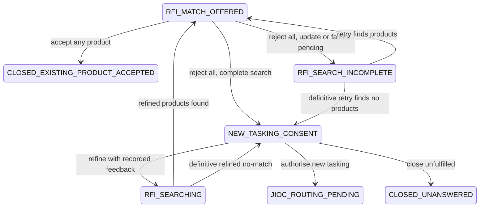

# Customer search recovery and outcomes

## Status

Implementation specification for the automatic retrieval recovery and customer
decision changes introduced in August 2026.

## Problem

Adding an Intelligence Store product temporarily changes the corpus identity
before the automatic shadow generation is ready. Customer searches can therefore
persist correct historical update provenance but show it indefinitely as a live,
technical degraded-hybrid warning, even after the replacement generation becomes
ready.

When a customer rejects every offered product, the current workflow skips from
individual rejection reasons to a generic new-tasking question. It does not give
Istari a short follow-up conversation, let the customer refine and search again,
or make the successful and unsuccessful closure outcomes sufficiently explicit.

## Customer contract

- Store changes queue and complete semantic preparation automatically.
- Routine corpus preparation is not presented as a technical degraded-search
  failure when authorised products were returned. A genuine provider,
  extraction or index failure remains visible in plain language and cannot
  authorise a definitive no-match.
- A zero-result search made during routine corpus preparation remains incomplete
  and offers a plain-language retry. Historical provenance remains available in
  the collapsed search details.
- Accepting any offered product closes the request as successfully fulfilled by
  an existing product.
- Rejecting every offered product opens a short Istari follow-up. The requester
  records what was missing before choosing to:
  - refine and search again;
  - authorise new tasking, after which the JIOC Agent selects RFA, CM,
    clarification or human review; or
  - close the request as unfulfilled.
- The customer never selects RFA or CM directly.

## Workflow

## Security and integrity

- Follow-up feedback, refined search and consent are requester-only and CSRF
  protected.
- Feedback is length bounded, chat-history bounded, persisted and audited.
- Customer projections expose only fixed workflow markers, never the recorded
  feedback body. A feedback response can start at most one refined search.
- Refined retrieval uses recorded feedback as an additive query term. It does
  not silently overwrite the confirmed structured requirement.
- Provider or model failures remain incomplete. They are never converted into a
  definitive no-match or silently routed as new tasking. Refined-search failure
  returns the request to a retryable incomplete state.
- JIOC routing remains the sole authority for choosing RFA or CM.

## Acceptance criteria

- Adding or changing a product queues one debounced shadow rebuild.
- Customer product offers do not show the technical degraded-hybrid sentence
  during routine automatic preparation.
- Non-routine search failures use plain-language recovery copy and remain
  blocked from definitive no-match.
- Reject-all feedback is required before refined search or new-tasking consent.
- Partial-search rejection keeps that requirement active across later retries,
  even when the retry returns no products.
- Refined search includes the recorded feedback and creates a new search metric.
- Accept closes as `CLOSED_EXISTING_PRODUCT_ACCEPTED`.
- Decline closes as `CLOSED_UNANSWERED` and is labelled unfulfilled.
- Consent enters `JIOC_ROUTING_PENDING`; it does not grant the customer a route
  choice.
- Backend and frontend tests cover ownership, CSRF integration, feedback bounds,
  recovery selection, retry, acceptance, decline and JIOC hand-off.
