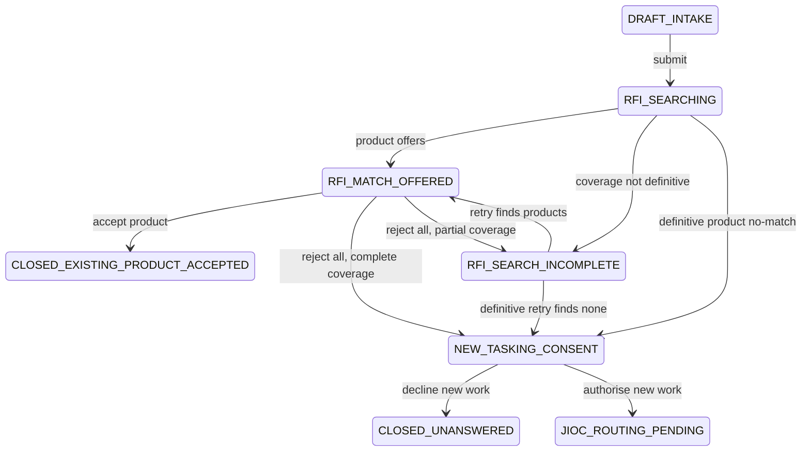

# Customer Search And Routing Orchestration

## Status

Approved implementation specification. This specification supersedes the routing
parts of `no-match-consent.md` while retaining its owner-only and audit controls.

## Problem

Submitting a request currently queues RFI search but requires a separate manual
search action. A healthy zero-result search and rejection of the last product can
also route work without one consistent customer decision. Search degradation is
not a first-class workflow state, and active RFI, RFA and collection work is not
offered as a durable alternative to duplicate tasking.

## Customer Contract

Submission starts discovery automatically. The customer receives exactly one of
these outcomes:

1. authorised Intelligence Store products to review;
2. a visible incomplete-search state with a retry action; or
3. after a definitive product no-match, authorised in-progress work to join or a
   decision to create new tasking.

The customer decides whether found products answer the requirement. Retrieval
relevance is never presented as analytic confidence. Rejecting all products does
not itself authorise new work.

## Search Assurance

Every persisted run records separate outcome, assurance and coverage values:

| Outcome | Assurance | Meaning |
| --- | --- | --- |
| `offers` | `assisted` | Customer-reviewed candidates were found. |
| `no_match` | `definitive` | The complete, current and authorised product corpus was evaluated. |
| `incomplete` | `assisted` | Search was stale, partial, unavailable or degraded. |

A definitive no-match requires a ready product index, current corpus identity,
complete extraction and embedding coverage, successful access filtering and no
provider degradation. Metadata or lexical fallback may produce offers, but it
cannot produce a definitive no-match.

## Workflow

Before the consent prompt, active-work discovery offers authorised matching RFIs,
RFAs and collection requirements. Joining work creates a durable subscription,
closes the source request as joined and makes the canonical work item the source
of safe customer progress updates. Declining every active-work option proceeds to
the same new-tasking consent prompt.

## JIOC Routing

The JIOC Routing Agent receives the confirmed requirement, product-search run,
product decisions, active-work decisions, safe related-work facts, current
capability and workload facts, and deterministic policy constraints. Its allowed
outputs are `RFA`, `CM`, `CLARIFICATION` and `MANUAL_REVIEW` with structured
reason codes and cited input facts.

Deterministic validation enforces required intake, route eligibility, legal state
transitions, access boundaries and escalation thresholds. Low confidence,
conflicting evidence, stale context, policy exceptions and provider failure route
to manual review. The JIOC Manager is on the loop through an oversight queue,
analytics and an audited intervention action, not a mandatory approval gate.

## Collection, Analysis And QC

Work is represented as explicit legs. A collection leg can feed an RFA analysis
leg without overwriting the original route. Each hand-off uses a versioned,
immutable context packet. QC performs a deterministic structural and evidence
readiness preflight; a human QC officer remains the release authority.

## Customer Tracking

Customer status is a safe projection, never the raw operational timeline. It
shows the current public stage, last meaningful update, expected next step and an
ETA range with its basis and confidence. Internal agent prompts, hidden matches,
staff identities, workload details and protected collection information are not
exposed.

## Acceptance Criteria

- Submission automatically attempts discovery and never remains silently queued.
- Product offers are access filtered, grounded and individually accepted or
  rejected by the owner.
- A zero-result degraded search cannot advance to consent or routing.
- All-offer rejection always reaches incomplete search or explicit consent.
- Decline closes as `CLOSED_UNANSWERED`, with the unanswered outcome recorded.
- New-tasking consent is owner-only, CSRF protected, deterministic and audited.
- Active-work joins are durable, idempotent, authorised and customer-trackable.
- JIOC agent output is schema validated and policy checked before transition.
- Human QC is mandatory before release.
- Search evaluation passes the release gates in this specification's test plan.

## Search Release Gates

- access leakage: `0`
- Precision@5: at least `0.95`
- Recall@5: at least `0.95`
- nDCG@5: at least `0.90`
- false definitive no-match rate: at most `0.01`
- false-offer rate: at most `0.02`
- degraded-search detection: `1.00`
- temporal constraint violations: `0`
- citation identity correctness: `1.00`
- offered passage support: at least `0.95`

## Rollout

Ship automatic discovery, active-work offers and JIOC agent decisions behind
independent flags. Provider and embedding-model activation remains blocked by
the release-gate evaluation and an explicit deployment allowlist. Start in shadow
mode where applicable, compare against existing decisions, then canary and roll
back on any access, assurance or state-integrity breach. Deterministic QC
preflight is a mandatory safety control, not an optional rollout path.
