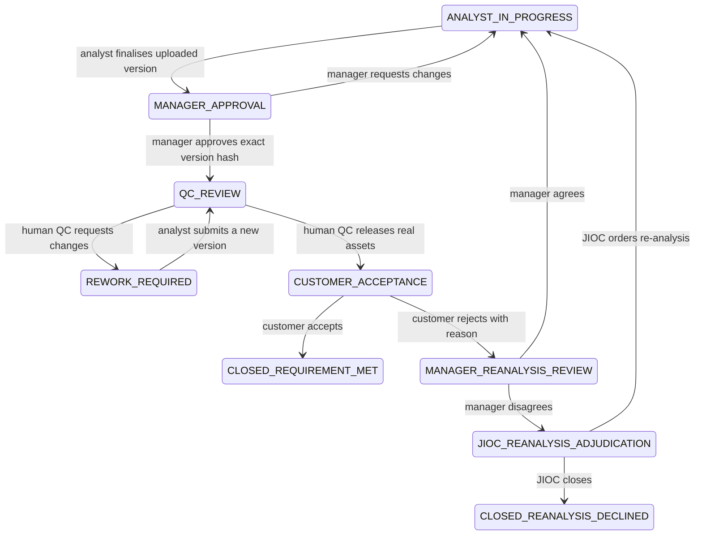

# External Product Ingestion And Customer Acceptance

## Status

Implemented and verified for the supported synthetic local/test boundary on
18 July 2026. Hosted and production release remain subject to the repository's
current release gates.

Related records: [ADR 0037](../adr/0037-ticket-scoped-external-product-lifecycle.md)
and the [external-product threat model](../threat-model/external-product-ingestion.md).

## Problem

Before this feature, analysts normally authored intelligence products in
Microsoft Word, PowerPoint, PDF or image tooling while Istari retained only
asset metadata and generated placeholder bytes during QC ingestion. The
implemented workflow now retains, reviews and releases the analyst's exact
versioned product.

The earlier released-product workflow also closed on receipt rather than asking
whether the product met the customer's requirement. The implemented workflow
now provides a controlled satisfaction and re-analysis decision.

## Outcomes

- An assigned analyst uploads the real product against the active ticket.
- Each submission is immutable and includes release metadata proposed by the
  analyst: title, summary, description, type, source, owner, region, dates,
  tags, classification, releasability, caveats and one or more ACGs.
- Original bytes are retained in protected workflow storage and promoted into
  the Intelligence Store only after manager approval and human QC release.
- Safe preview renditions and extracted text are available to authorised
  analysts, managers, QC reviewers and customers.
- A QC agent reports structured spelling and deterministic readiness findings.
  It cannot approve, edit or release a product.
- Human QC sees the rendered product and findings side by side, and records the
  disposition of material findings before release.
- Release creates a searchable Store product and returns that exact product to
  the customer.
- The customer explicitly accepts or rejects whether it meets the requirement.
- Rejection requires a reason and returns to the owning RFA or CM manager.
- A manager can agree to re-analysis or disagree and refer the dispute to a
  JIOC human. The JIOC human makes the final re-analyse or close decision.

## Workflow

For compatibility, `DISSEMINATION_READY` represents customer acceptance until
all persisted records have been migrated to the explicit name. New terminal
states must describe the outcome rather than merely confirming receipt.

## Submission Contract

A product submission version contains:

- server-generated version and asset identifiers;
- ticket, analyst and active assignment provenance;
- immutable metadata and a canonical submission hash;
- proposed ACG and release controls;
- original asset name, detected type, size, SHA-256 and protected object key;
- extracted text and extraction limitations;
- preview kind, processing status and derived rendition provenance;
- creation and finalisation timestamps.

The submission endpoint accepts DOCX, PPTX, PDF, PNG, JPEG and WebP. File
signatures, not browser MIME declarations, determine the accepted type. Macro
enabled Office formats, encrypted documents and active content are rejected.

## Preview And Extraction

- Raw Office files are never embedded in the application origin.
- PDF and safe raster images may be rendered inline with a short-lived,
  actor-bound access grant.
- DOCX and PPTX text is extracted with bounded ZIP/XML processing. A production
  rendition worker converts those formats into a sanitised PDF or page images.
- If a rendition is unavailable, the UI shows extracted text and an explicit
  limitation alongside a controlled original-file download.
- Derived artefacts carry the source SHA-256 and renderer version. They never
  replace the authoritative original.

## QC Agent

The agent consumes only the immutable finalised submission and ticket
requirement. Document text is delimited as untrusted evidence. Its structured
output contains:

- category, severity and blocking status;
- original text and suggested correction;
- asset and paragraph, page or slide anchor when available;
- explanation, confidence and rule or model version;
- human disposition: pending, accepted, waived or returned for rework.

The initial implementation performs deterministic UK-English spelling,
required-field, file-integrity and synthetic-data checks. Language-model proofing
may augment these findings only after a fixed evaluation gate. Deterministic
policy controls remain authoritative.

The initial implementation does not perform OCR on words embedded in raster
images. It creates an explicit proofing-coverage finding for each image without
extracted text, so human QC cannot mistake an unscanned image for a clean
spelling result. OCR requires a separately evaluated, locally hosted rendition
worker before it can be treated as a release control.

## Customer And Escalation Decisions

Every decision references the exact released product and submission version.

- Acceptance closes the ticket as `CLOSED_REQUIREMENT_MET`.
- Rejection requires a reason and optional unmet-criteria codes. It does not
  remove or mutate the published product.
- Manager agreement creates a new analysis cycle and requires a newer immutable
  submission before another release.
- Manager disagreement requires rationale and transfers the complete decision
  context to JIOC.
- JIOC re-analysis returns the ticket to the owning route and team. JIOC closure
  records a customer-visible rationale as `CLOSED_REANALYSIS_DECLINED`.

Concurrent decisions use optimistic ticket compare-and-swap so only one wins.

## Access And Audit

- Upload requires an active assignment on the exact ticket and analyst submit
  permission. It does not grant general Store publication permission.
- Manager and JIOC actions require route-scoped permissions and separation of
  duties. Customer decisions are owner-only.
- Preview and download re-authorise the actor against the live ticket or Store
  policy and use no-store, short-lived, actor-bound grants.
- Upload, finalisation, manager approval, QC runs, finding dispositions,
  release, customer decision, manager decision and JIOC adjudication are audited.

## Acceptance Criteria

1. Uploaded source bytes survive release unchanged and download with the same
   SHA-256.
2. No analyst can publish directly or access another analyst's ticket upload.
3. The manager and QC approve the same immutable submission hash that is
   released.
4. QC displays a safe preview or declared fallback and structured findings.
5. Human QC remains mandatory and unresolved blocking findings prevent release.
6. The customer can accept or reject the exact released version.
7. Both manager and JIOC branches are deterministic, audited and concurrency-safe.
8. Store search indexes extracted product text after release without weakening
   ACG, clearance or status predicates.
9. Backend and frontend line and branch coverage remain at least 95 per cent.
