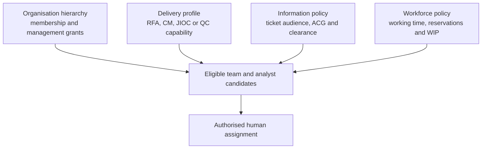
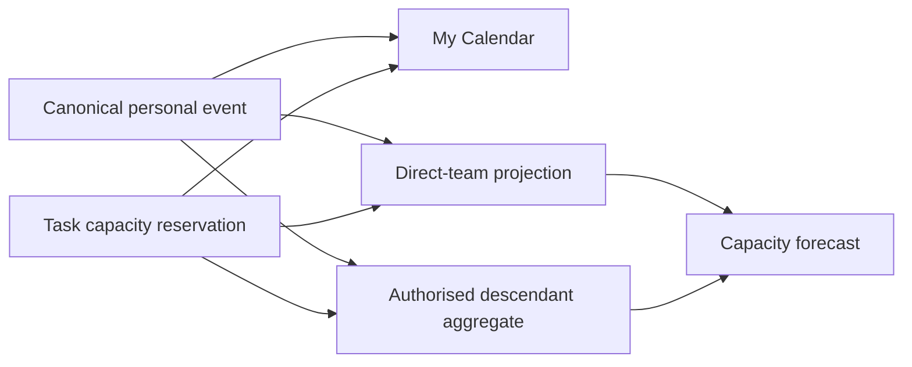
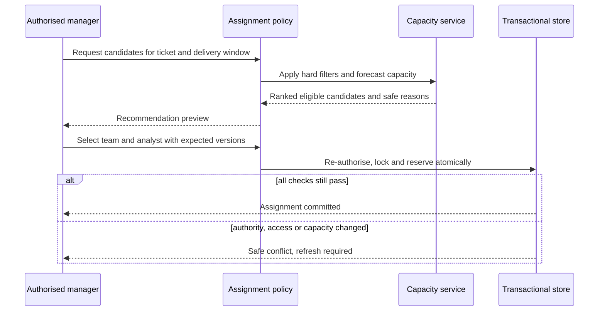
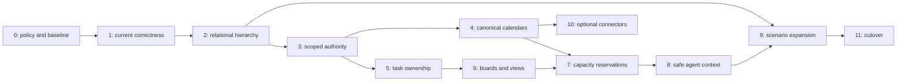

# Hierarchical Teams, Workforce Calendars and Task Boards

## Status

Approved for phased implementation on 3 August 2026. Phases 1 to 9 and the
local Phase 11 implementation are present through Alembic revision
`20260804_0045`. This document remains the acceptance contract for the
organisational-workforce milestone. Implementation does not itself activate
target-state authority.

`disabled`, `shadow` and `management` remain the normal safe modes. Active
composition is implemented as a fail-closed boundary, but it accepts only the
exact candidate hash and source revision recorded by a fully approved cutover
release. No such external approval or active deployment is claimed here.
Protected CI, independent routing approval, independent security review and an
explicit deployment decision remain release gates.

Phase 10's external calendar connector is omitted from the first release under
ADR 0049. The canonical internal calendar is complete without a provider, so
the omission is non-blocking. A future connector must pass its own credential,
consent, egress, replay and deletion controls before it can be enabled.

## Objective

Turn Istari's existing flat teams, team calendars, route queues and analyst
assignment into a coherent workforce operating model that supports:

- every currently posted person belonging to one effective home organisational
  unit, with pre-join users having none and each posted analyst assigned to
  exactly one RFA or CM delivery team;
- variable-depth parent, child and descendant structures, initially limited to
  12 levels;
- explicit, auditable manager authority over a direct team or selected
  descendants;
- one personal activity calendar projected into the home-team view and
  authorised ancestor views;
- team, descendant and personal workload views without copying calendar data;
- team Kanban boards derived from the authoritative ticket workflow;
- individually owned, estimated and scheduled work packages;
- deterministic, capacity-aware team and analyst recommendations;
- bounded use of agent advice without giving a model roster, calendar,
  assignment or workflow authority; and
- a realistic, public-repository-safe synthetic workforce with enough RFA and
  CM analysts to demonstrate load, absence, specialism and handover decisions.

The milestone must preserve the existing RFI, JIOC, RFA, CM, analyst, manager,
QC, dissemination, feedback and re-analysis workflows.

## Current-State Findings

The following statements describe the implementation on 3 August 2026.

### What already works

- Legacy data can make a user a manager or member of more than one flat
  `OrgTeam`. The My Team interface displays a switcher when more than one team
  is visible. This is a current behaviour to migrate, not a target personnel
  model.
- Each team has an internal month calendar. Members write their own entries;
  eligible managers can write for team members.
- Calendar statuses include available, on task, leave, course, duty,
  appointment and other, including bounded multi-day entries.
- Team availability combines calendar blocks with active ticket assignments.
- RFA and CM managers select a route-compatible team and one to five active
  users with the Intelligence Analyst role.
- Assignment history retains route, team, manager and active/inactive records.
- The analyst workbench supports assigned tickets, notes, linked products,
  work-package completion, drafts and submission.
- JIOC routing records a point-in-time capability and team-capacity snapshot.
- JIOC oversight exposes aggregate team capacity, analyst task counts and task
  progress.

### What does not exist

- Teams have no parent, descendants, path, depth, delegated management scope,
  effective membership dates or sole-home-unit concept.
- Parent managers cannot receive bounded descendant visibility.
- The manager, analyst and QC experiences are prioritised lists with detail
  panels. There is no Kanban board.
- Work packages are ticket-level pending/complete checklist items. They have no
  individual owner, estimate, due date, dependency, blocked state or remaining
  effort.
- Profile pages do not show a personal calendar or workload snapshot.
- A calendar entry belongs to one team. Legacy data that places one person in
  several teams requires duplicate absence records, and the copies can
  disagree.
- External calendar synchronisation, recurring events, partial-day capacity,
  working patterns and time zones are not modelled.
- Descriptive profile specialisms are not verified assignment competencies and
  do not inform routing or analyst selection.
- There is no capacity reservation, so two managers can independently assign
  the same nominally free analyst.

### Correctness and policy gaps that precede expansion

1. `TeamAvailabilityService` counts every rostered manager and member without
   requiring an active account or the Analyst role. Its `free` value can
   therefore exceed genuinely assignable analyst capacity.
2. Capacity is a same-day headcount and the JIOC policy treats it as a binary
   available/unavailable gate. It does not consider hours, effort, deadlines,
   live WIP, skills, caveats, continuity or reservations.
3. A person with overlapping legacy team memberships can be counted once in
   each matching team when the routing context sums capacity. The target model
   prohibits those overlapping memberships rather than attempting to split the
   person's capacity.
4. The assignment interface shows a team-level free count but still offers
   every active analyst in the team, including analysts who are unavailable or
   fully loaded.
5. RFA and CM managers currently have route-area authority. Code and current
   user stories allow them to select any active team of the matching kind. The
   earlier teams specification describes a narrower own-team boundary. The
   policy and documentation are inconsistent and must be reconciled before
   more teams are created.
6. JIOC capability matching uses a single optional string soft link from an
   organisational team to a catalogue team. It cannot represent several
   capabilities, proficiency, effective dates or historical mappings.
7. The current local seed has four active generic analysts. All four are in the
   RFA team; only two are also in CM. CM has no CM-only generic analyst. This is
   insufficient for realistic capacity, leave, overload or specialist-team
   demonstrations.
8. Live assignments are treated as a whole-person busy flag on every queried
   date. They have no planned interval or effort, and a person rostered in both
   RFA and CM can reduce both teams' apparent availability even though that
   simultaneous membership must be removed in the target model.
9. Calendar manager writes are hard-coded to RFA and CM manager role/team-kind
   pairs. JIOC, QC and administrator behaviour is inconsistent with the
   frontend's simpler `isManager` check.
10. Candidate directory search returns up to 20 profiles even though the
    security documentation specifies ten. Hierarchy would magnify this
    enumeration surface.
11. All canonical seed accounts currently share clearance level 3. Three of
    the four analyst personas have no seeded ACG membership, so they may appear
    assignable while being unable to work with the holdings needed for a
    realistic ticket. Lewis Ferguson is the only analyst with useful seeded
    ACG breadth.
12. The running local dataset inspected on 3 August 2026 has drifted from the
    canonical seed: it contains eight teams, including four active duplicate
    Foreign RFA teams; Kieran Tierney has acquired the Analyst role; the CM
    roster has fallen to Lewis Ferguson alone; five of seven active assignments
    have no team identifier; and the workload is concentrated at five tasks on
    Lewis, one on Nathan Patterson and one on Che Adams. Seed expansion must
    therefore include a non-destructive reconciliation report, not merely more
    startup inserts.

### Current staffing and work-management evidence

| Canonical team | Total seeded roster | Active generic analysts | Limitation                                                                                            |
| -------------- | ------------------: | ----------------------: | ----------------------------------------------------------------------------------------------------- |
| RFA            |                   6 |                       4 | Manager and coordinator inflate roster availability unless eligibility is applied                     |
| CM             |                   4 |                       2 | Both analysts also appear in RFA; the legacy overlap must be resolved and CM has no exclusive analyst |
| JIOC           |                   2 |                       0 | Correctly a routing/oversight team, not analyst capacity                                              |
| QC             |                   1 |                       0 | One reviewer cannot demonstrate claim concurrency, leave or rework load                               |

The four canonical analyst personas are Lewis Ferguson, Nathan Patterson, Ben
Doak and Che Adams. Lewis and Ben currently have conflicting simultaneous RFA
and CM memberships; Nathan and Che appear only in RFA. The dataset has no
CM-only analyst, no capability-aligned leaf team, no working-pattern capacity
model and no realistic resilience when a specialist is absent. Lewis has
useful seeded ACG breadth; the other three have no seeded ACG memberships. The
migration must resolve each conflict to one home delivery team before the
person can receive new work.

| Surface           | Current tracking model                         | Missing team-work capability                                                 |
| ----------------- | ---------------------------------------------- | ---------------------------------------------------------------------------- |
| JIOC routing      | Prioritised queue and ticket detail            | No receiving leaf-team board or individual capacity decision                 |
| RFA/CM manager    | Route-area queue, detail and manual assignment | No scoped team board, reservations, package planning or descendant roll-up   |
| Analyst workbench | Flat list of assigned tickets                  | No personal Kanban, scheduled effort, dependencies or personal capacity view |
| QC                | Queue and claim action                         | No reviewer load board or planned review capacity                            |
| Work packages     | Pending/complete ticket checklist              | No owner, contributor, estimate, due date, blocked state or remaining effort |

The answer to whether Istari currently has team Kanban is therefore no. The
answer to whether analyst numbers meaningfully inform assignment is also no:
the JIOC policy discards the numeric headcount after reducing it to a binary
available/unavailable signal, while managers choose named analysts manually.

## Design Principles

1. Organisational position is not information access. Parent-team authority
   must never imply ACG membership, clearance, product, ticket or asset access.
2. The ticket state machine remains authoritative. A board is a projection and
   cannot invent workflow states or bypass existing commands.
3. Calendar events have one canonical source. Team and parent calendars are
   projections, not synchronised copies.
4. Eligibility and capacity are deterministic. A model may explain or
   challenge an eligible recommendation, but it cannot make a person eligible.
5. Descendant visibility is an explicit management grant, not an accidental
   consequence of sharing a role.
6. Every person has at most one effective home organisational unit at a time.
   A pre-join user may have none. Managers receive descendant authority through
   grants, not duplicate memberships, and production analysts can be eligible
   for only their home delivery team.
7. Aggregate visibility and named-person visibility are separate permissions.
8. Historical assignments retain the team and hierarchy context that existed
   when the decision was made.
9. Reparenting, merging, splitting and deactivating units are audited lifecycle
   operations. Teams and memberships are not hard-deleted when referenced.
10. Synthetic seed updates are idempotent and never overwrite local edits or
    remove locally created users, teams, events or tasks.
11. Local development must continue to work without cloud or external calendar
    access.
12. Sprint 24 remains a single-tenant organisational model. Multi-tenant
    isolation is a separate future architecture decision and must not be
    implied by a dormant column or name.

## Target Operating Model

The target separates reporting structure, operational delivery and
information access. They intersect for a decision, but none is a substitute
for another:

### Organisation units and delivery teams

Replace the four-value `TeamKind` assumption with an organisational unit that
may optionally perform one operational delivery function.

An organisation unit can be a command, branch, customer team, delivery team,
governance team or other configured unit. A leaf delivery profile adds exactly
one of RFA, CM, JIOC or QC plus capability mappings to a unit. An
assignment-bearing analyst leaf is RFA or CM, never both. Ancestors may
aggregate differently routed descendants but cannot accept production task
ownership merely because they are ancestors. This prevents names such as a
headquarters or customer unit being incorrectly treated as an assignable RFA
or CM production team.

The hierarchy uses a single parent per unit plus a closure table for bounded,
efficient ancestor and descendant queries. The service must reject cycles,
self-parenting, excessive depth and a move that would place an ancestor under
its descendant. Initial maximum depth: 12. Sprint 24 has one organisational
tenant; users, teams and work cannot be placed into a second tenant until a
separate end-to-end tenancy ADR is accepted.

### Memberships

Membership is an explicit effective-dated history record rather than arrays on
the team:

- user and organisation unit;
- membership type: member, manager, deputy or coordinator;
- assignment eligibility for that delivery team;
- effective start and optional end date;
- active, suspended and ended lifecycle states;
- provenance, creating actor and reason; and
- optimistic version.

A user may have historic and current membership records plus a pending
scheduled-transfer command, but no two memberships may be effective at the same
instant. A PostgreSQL exclusion constraint over the user's half-open membership
intervals enforces one effective home unit. At the scheduled boundary, one
transaction revalidates the transfer, ends the old membership and activates the
new one. If validation fails, the old membership remains effective and the
pending transfer becomes blocked, avoiding both overlap and an unintended gap.
Managers use explicit grants for descendant scope instead of additional
memberships.

Successful boundary activation advances the affected authority epoch in the
same transaction and invalidates roster, calendar, task and capacity caches.
Any cache entry spanning a scheduled membership or grant boundary expires no
later than that boundary.

Personnel transfer requires `roster:transfer` over both the source and target
units. Its preview must disposition active assignments, package ownership and
contributions, participant links, future reservations and team-scoped calendar
commitments before commit; unresolved work blocks the move. A pending target
membership grants no early roster, task, calendar or capacity access.

A production analyst is assignment-eligible only for their one effective home
delivery team. Planning may record that demand exceeds a person's capacity,
but it cannot manufacture more physical capacity. Capacity exceptions may
reduce availability only.

### Management grants

Management authority is separate from membership and global application roles.
Each grant names:

- the manager;
- the root organisation unit;
- whether it covers only that unit or includes descendants;
- one or more allowed actions from the exhaustive vocabulary below;
- effective dates and optional temporary-cover expiry; and
- the actor and reason that created or revoked it.

All descendant access, including aggregates, requires a persisted grant. A
seed or administrator may create an aggregate-only grant as an explicit
default for a named role-holder, but parentage alone grants nothing. Named
roster, calendar details, assignment and approval require narrower explicit
actions. Delegation cannot grant more authority than the delegating actor
possesses.

Overlapping grants combine only their still-effective actions. Revoking one
grant leaves an independently sourced grant intact. Every delegated grant
stores its source grant, grantor, lineage and depth; initial delegation depth
is two. Revoking or expiring a source, suspending its grantor, or moving the
root outside the source scope disables the dependent grant immediately.
Delegation cycles are rejected.

The exhaustive action vocabulary is:

| Action                        | Allows                                                                 |
| ----------------------------- | ---------------------------------------------------------------------- |
| `organisation:view`           | Non-sensitive unit metadata, path and direct children                  |
| `organisation:view_aggregate` | Coarse direct or descendant capacity and work counts                   |
| `roster:view`                 | Named roster and effective membership fields                           |
| `roster:manage`               | Add, change, suspend or end memberships within scope                   |
| `roster:transfer`             | Preview and commit one non-overlapping source-to-target personnel move |
| `calendar:view_availability`  | Privacy-safe availability projection                                   |
| `calendar:view_detail`        | Authorised named category/detail projection                            |
| `calendar:manage`             | Create or change permitted manager-owned events                        |
| `task:view`                   | Ticket-leg or package cards, still subject to ticket policy            |
| `task:assign`                 | Preview and commit team/person assignments                             |
| `task:approve`                | Invoke the matching manager approval command                           |
| `task:transfer`               | Request, accept, reject or cancel a team transfer                      |
| `recommendation:view`         | View capacity evidence and safe exclusion codes                        |
| `recommendation:override`     | Override soft ranking with a recorded reason                           |
| `workspace:view`              | Open authorised saved views, templates, search and analytics           |
| `workspace:configure`         | Manage permitted team templates and shared saved views                 |
| `workspace:export`            | Create and download a bounded handling-marked export                   |
| `work_update:view`            | Read, acknowledge and configure the actor's work updates               |
| `capability:manage`           | Change delivery profiles or capability coverage                        |
| `organisation:create`         | Create a child within the granted root                                 |
| `organisation:edit`           | Rename or edit non-structural unit metadata                            |
| `organisation:reparent`       | Preview and execute a move                                             |
| `organisation:restructure`    | Preview and execute merge, split or deactivation                       |
| `grant:manage`                | Create, amend or revoke grants within an administrator's current scope |
| `grant:delegate`              | Create a bounded child grant no broader than the source                |

Every endpoint and command maps to exactly one primary action plus its
independent object-access checks. Application roles may qualify a person to
receive a grant, but never replace the persisted grant.

`grant:manage` may confer only actions present in the actor's current
grantable-action ceiling for the same or narrower root/scope; it is not a
superuser wildcard. Effective intervals use the PostgreSQL transaction clock in
UTC and half-open semantics `[valid_from, valid_until)`. Client time never
activates or prolongs authority.

An empty installation has one audited bootstrap ceremony. Only while no
organisation root or management grant exists, an authenticated and
reauthenticated platform administrator may use a single-use setup nonce to
create the first root and root `grant:manage` ceiling in one serialisable
transaction. Success permanently disables the bootstrap path; hosted setup
requires deployment-controlled nonce delivery. A second attempt fails closed
and is audited.

### Capability coverage

Replace `capability_team_id` with versioned many-to-many coverage:

- delivery team and capability catalogue entry;
- supported route or workflow leg;
- proficiency or service level;
- effective dates;
- capacity policy and WIP limit;
- handling restrictions or prerequisite access policy reference; and
- approval provenance.

Capability changes apply prospectively. Historic routing contexts retain the
mapping version used for their decision.

### Organisation lifecycle commands

Rename, reparent, merge, split and deactivate are versioned commands with a
read-only impact preview followed by an idempotent transactional execute. A
preview lists affected descendants, memberships, grants, capability mappings,
active task legs, reservations, team-scoped calendar events, pending transfers
and saved views. Execution requires the same preview revision and fails with a
safe conflict when anything material has changed.

- **Rename** preserves identity and history; display paths are recalculated.
- **Reparent** creates a topology revision and current closure in one
  serialisable transaction. It does not silently transfer task ownership or
  broaden a management grant.
- **Merge** creates or nominates an explicit successor. Source units are
  end-dated, not deleted. The operator supplies a disposition for every active
  membership, grant, capability, task, reservation and team-scoped event;
  grants never union automatically.
- **Split** creates successor children and requires an explicit mapping for
  members, capabilities and active work. Unmapped or ambiguous records block
  execution.
- **Deactivate** is blocked while active work, reservations, memberships,
  grants, capability coverage or transfers remain, unless the same command
  includes a valid target/end disposition for each item.

Personal calendar events stay with their owner. Team-scoped events are moved,
ended or retained against an inactive historical unit according to the
approved disposition. Every failure rolls back the complete command; no
partial merge or split is visible.

## Target Data Model

Dedicated PostgreSQL tables replace the generic JSON team namespaces for this
bounded context. In-memory adapters remain available for fast unit tests.
The supported Sprint 24 runtime therefore requires the local PostgreSQL stack,
not cloud access. `persistence_provider=file` may continue to run the legacy
flat-team application during migration, but Sprint 24 feature activation with
file persistence fails closed at startup. File mode is deprecated for the
completed hierarchical workforce runtime and is not presented as compatible.

### Core organisation tables

- `organisation_units`: identity, name, short name, category, current parent,
  active state, effective dates, time zone, description, version and audit
  timestamps.
- `organisation_unit_closure`: ancestor, descendant and depth, maintained in
  the same transaction as create or reparent operations.
- `organisation_topology_revisions`: immutable revision, unit, parent, path,
  effective interval, change command and actor. Current closure supports live
  queries; revisions reconstruct the lineage used by a historical decision.
- `team_delivery_profiles`: unit, one supported route function, WIP policy,
  working-week defaults and active state.
- `team_capability_coverage`: delivery profile, capability, proficiency,
  route, effective period and policy version.
- `team_memberships`: the membership attributes defined above, with a
  database-enforced non-overlap constraint per user.
- `team_management_grants`: the descendant scope and action mask defined above.
- `effective_authority_epochs`: principal and affected-scope monotonic epochs,
  advanced transactionally for account, grant, membership, ACG, clearance,
  ticket-audience and privacy-policy changes.

### Workforce tables

- `assignment_competencies`: user, controlled competency, proficiency,
  verified-by actor, verified date, optional expiry and evidence reference.
- `working_patterns`: user, time zone, weekly hours, working days and effective
  period.
- `capacity_exceptions`: temporary percentage or hours reduction with reason.
- `capacity_reservations`: required user, ticket, workflow leg, work package,
  interval, reserved effort, state, expiry, command idempotency key and
  optimistic version.
- `team_demand_holds`: required owning team or triage pool, demand estimate,
  workflow leg, interval, aggregate effort, state, expiry and version. It never
  pretends an unnamed team hold belongs to a user.
- `task_demand_estimates`: ticket, candidate workflow leg, required interval,
  estimated-hours range, controlled competencies, uncertainty, provenance,
  author and version. This gives pre-routing capacity a bounded demand input
  before work packages exist.

Automatic route feasibility uses the approved upper bound of the hours range,
including the policy buffer. If capacity covers only the lower bound or the
range/uncertainty is unbounded, the service may show an advisory team ranking
but must abstain to human review. A human may accept the risk for receiving-team
planning with a reason, but named reservations still require a refined estimate
that fits actual conserved capacity.

- `recommendation_decision_records`: immutable input snapshot/hash, policy and
  topology versions, candidates, safe factors, exclusions, freshness, result
  and final human decision for deterministic replay.

Profile title, biography and self-described interests remain descriptive and
cannot create an assignment competency, permission, clearance or membership.

### Calendar tables

- `calendar_events`: owner, source, activity category, start/end instants or
  all-day dates, time zone, availability effect, privacy level, recurrence
  metadata, note, version and lifecycle.
- `calendar_event_scopes`: global-to-user, user-within-current-home-unit or
  explicit team-event participant scope.
- `calendar_event_exceptions`: changed or cancelled recurrence occurrences.
- `external_calendar_connections` and `external_calendar_sync_state`: reserved
  for the optional connector phase, with encrypted tokens and bounded sync
  cursors.

### Task and board records

The ticket aggregate remains the workflow authority. Add or project:

- the versioned `coeus_ticket_aggregates` ticket record remains the sole
  authority for requester, collaborator, analyst-assignment and QC audience
  relationships. Package projections do not invent parallel clearance, ACG,
  caveat or audience records;
- `team_task_ownership`: ticket, workflow leg, owning delivery team, manager,
  accepted time, target date, state, topology revision, capability version,
  version and history reference;
- enhanced work packages with individual owners/contributors, estimate,
  remaining effort, due date, dependency, blocked reason and lifecycle. Every
  active owner or contributor must have their sole effective home membership in
  the package's owning leaf team;
- capacity reservations linked to active ownership and work packages; and
- a rebuildable `team_board_cards` read model derived from ticket state,
  ownership, assignments and work packages.
- `assignment_commands`: actor, ticket, workflow leg, idempotency key, canonical
  request hash, expected versions, result identifiers and status, with a
  uniqueness constraint that makes a lost-response retry return the original
  result.
- `task_resource_links`: task/package and Store project/product reference,
  created only after both objects pass current access policy. A link grants no
  visibility and every projection reauthorises both sides.
- `team_saved_views`, `work_update_events`, `work_update_preferences` and
  `team_work_templates`: owner/scope, bounded configuration, lifecycle and
  versions for the integrated workspace features.
- `workspace_export_jobs`: actor, authorised scope, canonical query hash,
  handling label, bounded result metadata, expiry and status. Download repeats
  current row-level policy and never relies only on creation-time authority.

CM collection and the later RFA analysis leg must have distinct workflow-leg
identities so history, capacity and board ownership do not become ambiguous.
Before named analysts are assigned, routing must record either an authorised
receiving delivery team or an explicit parent triage pool. A route-wide queue
cannot be safely filtered to leaf managers when the ticket has no owning team.

Individual capacity reservations are the sole personal capacity ledger. A
separate team-demand hold constrains aggregate team headroom while work is in a
triage pool or awaiting package planning. Creating named package reservations
must release/replace the corresponding hold atomically; the same hour cannot be
represented at both team and person level.

Historical topology and decision snapshots are evidence only. Current
authorisation is always recalculated from the live account, grant, membership,
ACG, clearance, ticket and workflow state; former lineage never restores
access.

Package handover is permitted only between analysts who already have an active
authoritative assignment for the same route and owning team. The transaction
locks and rechecks the ticket aggregate version and canonical hash. Ending,
moving or suspending that assignment through the normal ticket writer therefore
invalidates an earlier preview. Handover never creates ticket or content access,
and customer collaboration never qualifies a package owner.

Contributor addition can include an optional version-bound capacity plan. The
participant and reservation are created atomically after account, single-home
posting, package, ownership and manager authority are revalidated. Ending a
contributor releases that person's active or held reservations for the package.

A predecessor package cannot be cancelled while direct dependants remain unless
the manager explicitly dispositions every dependant as cancel, unlink or replace.
All named packages and replacement versions are reviewed, the complete bounded
workflow-leg graph is rechecked for cycles, and the mutation commits atomically.

Lifecycle reconciliation is monotonic. Package or ticket termination releases
capacity and ends participation; hold retains but marks capacity held; rework
releases future reservations; reassignment removes superseded participants.
Account suspension, membership end and team deactivation immediately revoke
participation and reservations. Estimate, deadline, calendar, competency and
capability changes create an explicit reforecast or review conflict. They never
silently resize a reservation. A startup scan handles eligibility expiry that
occurred while the application was offline.

## Canonical Calendar Behaviour

### Personal calendar

The profile shows a compact seven-day snapshot containing only the signed-in
user's authorised events, task commitments and free-capacity summary. A user
can add, edit or remove their own internal event from the profile or full
calendar page.

### Team calendar

A team calendar queries canonical events for current direct members, plus
read-only task commitments derived from individual capacity reservations. It
does not store a copy per team. An unassigned team-owned ticket consumes no
personal capacity. A user's global absence therefore appears in their one
current direct-team view immediately and follows an effective-dated transfer
without being copied.

Team-specific meetings or duties are scoped to the subject's effective home
membership and appear in that team view while still appearing in the user's
personal calendar. A transfer preview must disposition future team-owned events
that extend beyond the transfer boundary.

### Parent and descendant calendars

Parent managers with the applicable explicit grant receive:

- aggregate daily and weekly capacity across authorised descendants;
- drill-down by child unit where granted;
- named entries only where calendar-detail authority exists; and
- private-event placeholders rather than notes when detail is not permitted.

Parent aggregation counts a user through their sole effective home unit. If
corrupt or unmigrated data contains overlapping memberships, the person
contributes unknown rather than additive capacity and a reconciliation finding
is raised.

### Calendar rules and scenarios

- all-day and partial-day events;
- per-user time zones and daylight-saving transitions;
- recurring working patterns and recurring activity with bounded expansion;
- overlap handling: union leave/unavailable intervals, task reservations and
  other commitments without double subtraction;
- private notes separated from availability effect;
- future-dated team joins and departures;
- inactive or suspended users excluded from assignable capacity;
- task cancellation, reassignment, hold and closure releasing derived
  reservations;
- manager-created events retaining creator provenance;
- recurrence edit-this, edit-future and edit-series actions; and
- an explicit conflict state when external and internal sources disagree.

Calendar mutations use an expected version and creation idempotency key. A
stale update/delete or concurrent series change returns `409 Conflict` with the
current safe metadata. Cancellation writes a tombstone so a delayed connector
or retry cannot resurrect the event.

| Event source               | Subject action                                     | Manager action                                           | Authoritative mutation path                       |
| -------------------------- | -------------------------------------------------- | -------------------------------------------------------- | ------------------------------------------------- |
| Personal self-created      | Full view, edit and cancel                         | Availability view only; no edit of private event         | Owner calendar command                            |
| Manager-created commitment | View, acknowledge or dispute; no silent edit       | Creating manager or authorised successor may edit/cancel | Manager calendar command with current grant       |
| Team meeting/duty          | View according to privacy and membership           | Authorised calendar manager may edit/cancel              | Team event command                                |
| Task reservation           | View if independently authorised; no calendar edit | No direct calendar edit                                  | Ticket/package assignment and reservation command |
| External imported event    | Change Istari privacy/capacity mapping only        | No provider-event edit                                   | Connector sync; provider remains source of truth  |

Manager-created events notify the subject and expose creator provenance. A
manager cannot edit an employee's private event merely because its
availability effect is visible. Disputes create a bounded review item rather
than overwriting either actor's record.

`Available` is the absence of a deduction inside the working pattern, not a
magic higher-priority event. Capacity is restored by an authorised versioned
edit or cancellation of the specific blocking event. A standalone `available`
record cannot defeat leave, a manager commitment or a task reservation. A
legacy available override becomes an exception linked to the exact legacy
event it corrected; an ambiguous one enters migration triage.

External Outlook, Google or other calendar connection is a later optional
phase. Internal calendars must be complete without it. Imported event titles
and notes are not sent to an AI provider and are not required for capacity.

## Team Task Boards

### Board views

Provide four projections:

1. My Work: work packages and tickets assigned to the signed-in analyst.
2. Team Board: direct work owned by one delivery team.
3. Management Board: selected direct and descendant teams within the actor's
   management grant.
4. JIOC/QC Board: existing oversight or QC scope expressed as operational
   columns without weakening their authority boundaries.

### Default columns

Columns are mappings from existing workflow and work-package state, not new
ticket states:

- Awaiting team acceptance or analyst assignment;
- Ready;
- In progress;
- Blocked;
- Manager review;
- QC review;
- Rework;
- On hold; and
- Completed recently, collapsed by default.

Closed work is not loaded into the active board unless requested. Filters cover
team, descendant, analyst, route, priority, due date, capability, blocked age,
work package and customer deadline.

### Card identity and state mapping

The Team and Management Boards use one delivery-leg card keyed by
`ticket_id:workflow_leg_id`. CM collection and later RFA analysis therefore
produce different cards and histories. My Work and the optional Package view
use one card per `ticket_id:workflow_leg_id:work_package_id`; an assigned leg
without packages receives a single explicit fallback card, which disappears
atomically when packages are created.

| Authoritative condition                                                           | Delivery-leg column         | Board command surface                                                          |
| --------------------------------------------------------------------------------- | --------------------------- | ------------------------------------------------------------------------------ |
| Routing has explicit triage-pool ownership                                        | Awaiting team acceptance    | Propose/accept receiving team or send to authorised review                     |
| `ANALYST_ASSIGNMENT`, no active named assignment                                  | Awaiting analyst assignment | Commit assignment; current workflow moves immediately to `ANALYST_IN_PROGRESS` |
| `ANALYST_IN_PROGRESS`, assigned packages exist but none has started               | Ready                       | Start an owned package; no new ticket transition is invented                   |
| `ANALYST_IN_PROGRESS`, any package/activity has started and work remains feasible | In progress                 | Existing notes, package and submit commands                                    |
| `ANALYST_IN_PROGRESS`, leg explicitly blocked or every incomplete package blocked | Blocked                     | Record/resolve blocked reason or authorised transfer                           |
| `MANAGER_APPROVAL`                                                                | Manager review              | Existing manager return/approve commands                                       |
| `QC_REVIEW`                                                                       | QC review                   | Existing claim, reject or approve commands                                     |
| `REWORK_REQUIRED`                                                                 | Rework                      | Existing rework and resubmit commands                                          |
| `JIOC_INTERVENTION_HOLD`                                                          | On hold                     | Existing allowlisted resume/cancel commands                                    |
| Released, closed or cancelled terminal state                                      | Completed recently          | Read-only history actions                                                      |

Pre-delivery intake/search states do not appear on a delivery-team board. A
partially blocked package adds a blocked badge but does not move the whole leg;
the leg enters Blocked only through the rule above. Ticket review/QC/hold states
take precedence over package state. Package cards map pending to Ready,
in-progress to In progress, blocked to Blocked, complete to Completed and
cancelled to history.

A transfer-pending card stays on the source board with a transfer badge. The
target sees a separately authorised incoming-transfer projection, not duplicate
ownership. Acceptance atomically changes team ownership, topology snapshot and
  team-demand holds. It ends every active source-team named assignment, updates
  the authoritative ticket audience in the same transaction, releases future source-person
reservations and applies an explicit disposition to every incomplete package:
target-team owner/contributors with new reservations, target-team unassigned
with a demand hold, or cancellation. Completed package history retains its
original owners. Acceptance is blocked if any named work lacks a disposition;
rejection, expiry or cancellation leaves the source authoritative.

Projection events carry source aggregate and event versions. Consumers are
idempotent, ignore older out-of-order versions and provide read-your-writes on
the committing response. On the local reference profile, asynchronous board
updates must appear within five seconds at p95. A stale or failed projection is
labelled with its source version and the board UI disables its mutation controls
until refreshed. This is a client safety measure, not command authority:
command services never trust the read model and independently validate current
aggregate versions. A full rebuild must produce the same card keys, columns and
visibility hash as event replay.

### Board actions

A card move is permitted only when it maps to an existing authorised command.
Every action supplies the expected ticket or work-package version and uses the
transactional audit/outbox boundary. The UI must also provide keyboard and
menu actions, so drag and drop is never the only interaction.

Hierarchy scope alone is insufficient to reveal a card. Every card and update
also passes the ticket audience, ACG, clearance, role and workflow-object
policy. Aggregate-only managers receive redacted counts rather than hidden
ticket titles, references or searchable facets.

The first board release should make unsafe or ambiguous moves unavailable
rather than asking the server to infer intent. Cross-team transfer is a
dedicated command requiring target-team eligibility, capacity reservation,
reason and acceptance by an authorised target manager.

### Work packages

Enhance work packages to support:

- one accountable owner and optional contributors;
- estimated and remaining hours;
- target date and priority inherited or overridden with reason;
- pending, ready, in-progress, blocked, complete and cancelled states;
- dependency links within the ticket;
- structured blocked reason and review reminder;
- per-package notes and product/source links under the ticket access policy;
- reassignment history; and
- completion evidence without requiring productivity surveillance.

Several analysts assigned to one ticket should not automatically receive
authority to mutate every package. Package ownership and ticket collaboration
are checked separately.

Accountable-owner handover inside the current owning leaf is a dedicated,
previewed command. It requires exact current `task:assign` authority and binds
the package, workflow-leg ownership, active participants, live reservations
and dependency edges. Every held or active reservation of the source owner
must be named for release or like-for-like replacement for the eligible target
owner. Commit changes the accountable owner and participant, releases source
reservations, creates any capacity-safe replacements, and appends immutable
history, audit and outbox evidence in one serialisable transaction. A changed
participant, reservation or dependency inventory invalidates the preview. This
command cannot change team ownership or attach a person from another leaf;
cross-team transfer remains the separate accepted-transfer workflow.

Cross-team workflow-leg transfer is that separate two-manager workflow. A
source manager with current `task:transfer` authority previews and proposes a
target leaf and target analyst. The proposal names every package in the leg and
gives it exactly one disposition: transfer, complete, cancel, or retain. Retain
is valid only for terminal packages, and complete is valid only when no work
remains. Every transferred package includes a target personal-capacity plan.
The proposal expires within 30 days and cannot itself change ownership.

An independently authorised target manager may accept or reject it. Acceptance
also requires that manager's current `task:assign` grant because it creates the
target accountable participant and reservation. The source
manager may cancel it, and may record its expiry only after the deadline.
Acceptance rechecks the source proposal grant, target-manager grant, ticket
aggregate version and hash, ownership version, complete package inventory,
target human Analyst account and target single-home membership. It then updates
the authoritative ticket assignment, workflow-leg ownership and transferred
packages, revokes source participants, releases source reservations, and creates
the target accountable participant, team hold and personal reservation in one
serialisable transaction. Completed-owner history is retained. No membership or
personnel row is moved or copied: the work moves, the people do not.

Command identifiers and idempotency keys are actor-scoped. Proposal package and
command evidence is immutable. The proposal reason and all proposal-bound
identifiers remain immutable across the one permitted transition to a terminal
state; a separate decision reason records the outcome. Any authorised command
that touches an overdue proposal settles it as expired. Current grants are
rechecked even when replaying a previously completed command. Audit and outbox
evidence is committed in the same transaction, and migration downgrade refuses
to remove a schema that contains transfer evidence. Unauthorised source, target
or transfer identifiers return the same generic unavailable response.

Handover requires the target to remain an active analyst assignment on the
authoritative ticket aggregate for the same route and team, while the ticket is
in an active analyst-work state. The preview binds its version and canonical
hash; execute locks and decodes the aggregate before package rows, so normal
reassignment or revocation invalidates the operation transactionally. The
handover creates no audience, clearance or ACG authority. All live package reservations are bound into
the preview, but only source-owner reservations are dispositioned; contributor
reservations remain authoritative and any drift invalidates review.

Dependencies form an acyclic graph within one ticket/workflow leg. Self-links,
cross-ticket links and cycles are rejected transactionally, including concurrent
edge inserts under a per-ticket lock. A package cannot complete while a required
predecessor is incomplete. Cancelling a predecessor never silently cascades:
the command must explicitly cancel, unlink or replace each dependent package,
and the preview shows the impact.

## Capacity and Assignment Engine

### Pre-routing demand estimate

Capacity is meaningful only against demand. Before a receiving team is
proposed, application-owned rules or an authorised JIOC user records a
versioned estimate containing the delivery window, hours range, controlled
competencies, route candidates, uncertainty and provenance. A bounded model may
suggest fields, but an admitted schema plus deterministic policy owns the
record. If effort, dates or required skills are unknown, team capacity remains
`unknown` and cannot support automatic route application.

Once a team accepts the work, package planning refines the estimate and
atomically replaces any aggregate team-demand hold. Actual effort updates
forecasting prospectively; it does not rewrite the evidence used for the
original routing decision.

### Capacity calculation

Replace same-day free headcount with a deterministic capacity forecast over the
ticket's required interval:

`assignable hours = working-pattern hours - unavailable-event hours - active-reservation hours - policy buffer`

Calculate in 15-minute slices in the user's working time zone:

1. intersect the working pattern and local holiday calendar to obtain physical
   working minutes;
2. union overlapping global unavailable intervals and subtract them once;
3. attribute the remaining physical minutes to the user's one effective home
   delivery team; zero or overlapping effective memberships produce unknown
   assignable capacity and a reconciliation finding;
4. subtract the union of commitments scoped to that home team;
5. subtract active named reservations and the policy buffer; and
6. clamp every person and team result to the interval from zero to the original
   physical working minutes.

One canonical interval consumes physical time once. A team commitment can
consume capacity only from a current member of that team. A command attempting
to scope one person's commitment to a second simultaneous delivery team is
rejected.

For example, an RFA analyst with an eight-hour working day and a two-hour global
absence has six physical hours left. A one-hour RFA duty leaves five hours. A
two-hour RFA package reservation leaves three. Overlapping absence blocks are
unioned, not subtracted twice. Cancelling the one-hour duty with its expected
version restores capacity from three to four hours; adding an unrelated
`available` event restores nothing.

Membership transfers apply at an exact effective boundary. The old team owns
capacity before the boundary and the new team owns it afterwards, never both.
DST gaps/overlaps, part-time patterns, holidays, partial-day events,
contributors and team-hold-to-package replacement use the same conservation
rule. The calculation uses only active assignment-eligible analysts with one
valid home team. It returns team totals and per-candidate facts, including data
freshness, demand uncertainty and reasons for unknown capacity.

Team forecast headroom is the sum of conserved individual headroom minus active
`team_demand_holds`. Holds never reduce a named person's capacity and are
excluded as they are atomically converted into personal reservations.

### Hard eligibility filters

An analyst is eligible only when all applicable checks pass:

- active account and current Analyst role;
- effective assignment-eligible membership in the selected delivery team;
- the selected team is the owning leaf for the workflow leg and is its one RFA
  or CM route; a person cannot be assigned or added as a contributor from
  another team;
- actor has task-assignment authority for that team;
- required workflow route and delivery capability are supported;
- an active assignment on the authoritative ticket aggregate already names the
  person for the same route and owning team. Product clearance and ACG checks
  remain live object-level gates and are not copied into the package ledger;
- verified competencies satisfy mandatory requirements;
- sufficient working capacity exists before the deadline;
- leave, suspension, conflict-of-interest and separation-of-duties rules pass;
- WIP and team policy limits pass; and
- no conflicting reservation was committed concurrently.

The service returns generic exclusion categories to ordinary managers and
reserves sensitive details for specifically authorised administrators.
Ordinary-manager output is limited to `not_currently_eligible`,
`capacity_unavailable` and `data_unknown`; it never distinguishes clearance,
ACG, caveat, health, conduct, account or personnel causes. Aggregate exclusion
breakdowns obey the same `<5` suppression rule.

Assignment does not grant an ACG or clearance. Product services recheck those
object-level policies whenever protected content is read. The active
`AnalystAssignment` on the authoritative ticket aggregate is the workflow
audience; the normal versioned assignment writer creates, replaces and revokes
it transactionally. Customer collaboration is independent and cannot qualify a
package owner. Preview does not expose ticket content to the candidate.

### Deterministic ranking

Rank eligible teams and people using versioned, explainable policy inputs:

- capability and competency fit;
- feasible capacity before the deadline;
- active and forecast WIP;
- continuity with a prior workflow leg or related product;
- balanced distribution and recent assignment load;
- team priority and service-level policy; and
- cost of workflow-leg handover or a future effective-dated team transfer.

Do not use protected characteristics, biography text, inferred performance,
calendar note content or opaque model scores. A manager sees the score factors,
data freshness and override path. After every business factor and fairness
factor ties, the final stable ordering is the candidate's immutable UUID; names
and database insertion order are never tie-breakers.

### Atomic reservation

Assignment commits team ownership, ticket participation, individual assignment,
capacity reservation, audit event and outbox record in one protected operation.
The command requires an idempotency key unique to its actor, operation and
ticket leg. Reusing the key with the same canonical request hash returns the
original committed result; reusing it with a different team, analyst, effort or
expected version returns `409 Conflict` without mutation. Competing assignments
run in a serialisable transaction, lock the ticket leg and candidate capacity
rows in canonical UUID order, and retry a bounded three times on serialisation
failure. Optimistic versions protect all previewed inputs. Reservations are reconciled on
reassignment, return, rework, hold, cancellation, completion, user suspension
and team deactivation. A repair job reports rather than silently deleting
orphaned reservations.

The commit reloads and revalidates the session, actor permissions, management
grant, team lineage/version, analyst account, effective membership, ticket
audience, ACG/clearance policy and capacity rows inside the same transaction.
A pre-flight recommendation is never commit authority.

Changes after reservation follow an explicit lifecycle:

| Changed input                                   | Required response                                                                                                            |
| ----------------------------------------------- | ---------------------------------------------------------------------------------------------------------------------------- |
| Account suspension or clearance/ACG loss        | Revoke access monotonically, hold affected work and require authorised reassignment; audit failure must never restore access |
| Membership end or team deactivation             | Block new work; review and transfer active work before the effective end                                                     |
| Working-pattern reduction or scheduled transfer | Reforecast, disposition future work and request a plan; never cancel work silently                                           |
| Competency expiry or capability removal         | Block new assignment and review future reservations; retain historical evidence                                              |
| Calendar absence or deadline/estimate change    | Reforecast and create a manager/analyst conflict item; resize only through an authorised versioned command                   |
| Rework, return, hold or transfer                | Preserve completed effort, release or move only future reservation slices and retain history                                 |

Revocation and privacy restriction are monotonic. They commit with the audit
outbox, or remain effective while audit delivery retries; generic compensation
must not reinstate a revoked grant, account, ACG or ticket relationship.

## Agent Integration

### Current limit

The current JIOC policy only checks whether summed free headcount for a
capability is above zero. Managers still choose teams and analysts manually.

### Target behaviour

1. A deterministic service produces authorised eligible team candidates,
   forecast capacity, capability fit, freshness and policy reasons.
2. The JIOC routing context stores a versioned, minimised snapshot with no
   calendar notes, biographies or unnecessary user identity.
3. The evaluated JIOC policy may auto-apply only the RFA-versus-CM route when
   the demand estimate and fresh eligible-team feasibility evidence pass. It
   does not select a receiving team or person.
4. The deterministic service proposes receiving teams. In Sprint 24 an
   authorised human accepts the receiving team; team recommendation runs in
   shadow/advisory mode even when route selection is active.
5. Named analyst and package recommendations remain proposals until the leaf
   manager accepts them. Sprint 24 never autonomously assigns a person.
6. An optional bounded model may explain trade-offs or propose work-package
   decomposition from already authorised ticket context. Deterministic policy
   revalidates every output.
7. Every run records context schema, capacity policy, capability mapping,
   model/provider where used, bounded admitted fields/output hash, validation
   and final human decision. Raw provider replies are not retained.

| Decision                                                   | Sprint 24 authority                                                                                        |
| ---------------------------------------------------------- | ---------------------------------------------------------------------------------------------------------- |
| Interpret/confirm customer requirement and demand estimate | Customer plus authorised JIOC human for corrections; model suggestion is non-authoritative                 |
| Select RFA versus CM route                                 | Existing evaluated JIOC policy may auto-apply; JIOC manager may intervene through current audited controls |
| Rank eligible receiving teams                              | Deterministic policy only; optional model explanation has no mutation authority                            |
| Accept receiving team ownership                            | Authorised JIOC manager or route triage manager, human only                                                |
| Accept work into leaf-team plan                            | Leaf manager                                                                                               |
| Assign named analyst and reserve capacity                  | Leaf manager with `task:assign`                                                                            |
| Own/decompose packages                                     | Assigned lead and manager within existing task policy; model may suggest structure                         |
| Override soft ranking                                      | Human with `recommendation:override` and reason                                                            |
| Bypass access, eligibility, separation or capacity floor   | Nobody                                                                                                     |

Evaluation sets must cover missing data, stale calendars, no eligible team,
several equally suitable teams, urgent deadlines, attempted overlapping
memberships, exact-boundary transfers, conflicting caveats, overloaded
specialists, CM-to-RFA handover and manager override. The capacity snapshot
retains the current five-minute maximum age.
The new evaluation release contains at least 48 versioned human-labelled cases
and requires:

- zero unauthorised or hard-policy-violating candidates;
- 100 per cent expected abstention for missing, stale, conflicting or unknown
  mandatory evidence;
- 100 per cent route and conflict accuracy for the deterministic safety suite,
  retaining the current zero false-positive/false-negative gate;
- deterministic replay equality for all recorded inputs;
- an eligible human-approved team within the top three on at least 95 per cent
  of non-abstaining advisory cases; and
- zero private calendar, biography, sensitive exclusion or unnecessary named
  identity fields in provider contexts or retained run records.

The JIOC service owner and an independent security reviewer approve the pinned
dataset, policy and release. Any access breach, hard-policy violation, stale
auto-route, schema regression or threshold failure immediately returns the new
context to shadow mode through the existing kill switch. Provider use also
inherits the bounded-advisory admission, region/classification allowlist,
retention, circuit-breaker and disable controls.

The relational-capacity and deterministic-replay suite uses the distinct
release `jioc-routing-policy-v2:jioc-routing-relational-capacity-replay-eval-v1`.
It is not in the default approved-release set. Passing all 48 cases records
metric readiness only; `active_ready` also requires that exact release to be
independently approved. Approval of the established v2 release cannot approve
this new evidence accidentally.

## Synthetic Organisation and Workforce

### Organisation labels

The local dataset may include the user-requested labels Defence Intelligence,
DI Joint User, DI NCGIA, MIS, UKSF, SAS, SBS, SRR, 18SR, 14SR, PAGC and
4 RANGERS. Their parentage must come from an explicit synthetic seed template,
not from assumptions embedded in code. The template is an exercise construct
and makes no claim about a real command structure.

One useful demonstration path is a synthetic Defence Intelligence root with a
DI Joint User child and DI NCGIA and MIS descendants, allowing a root manager
to demonstrate aggregate descendant visibility. The remaining labels should
be placed only after the intended exercise tree is approved. The interface does
not need to repeat a synthetic-data warning on every row.

### Minimum staffing target

Create a canonical cohort of 53 fictional personas. This is large enough to
exercise hierarchy, route choice, absence, specialism, transfer and manager
oversight without crowding every user profile.

| Cohort                                        |  Count | Purpose                                                  |
| --------------------------------------------- | -----: | -------------------------------------------------------- |
| Platform administrators                       |      2 | Configuration, audit and continuity scenarios            |
| Customer users across three user units        |      7 | Request, search, subscription and access-scope scenarios |
| JIOC manager and agents                       |      3 | Routing, intervention and oversight                      |
| RFA area managers, team leads and coordinator |      6 | Direct and descendant RFA management                     |
| CM area managers, team leads and coordinator  |      6 | Direct and descendant CM management                      |
| Production analyst personas                   |     24 | RFA and CM delivery across several capabilities          |
| QC reviewers                                  |      3 | Claim, review, rework and release separation             |
| Intelligence Store manager and curator        |      2 | Product governance without task capacity                 |
| **Total unique personas**                     | **53** |                                                          |

The 24 analyst personas comprise 14 assigned solely to RFA and ten assigned
solely to CM. No person holds simultaneous memberships in two delivery teams or
both routes. At the baseline date, 12 RFA and nine CM analysts are active and
assignment-eligible. The remaining three are one future RFA joiner, one
suspended CM analyst and one inactive former RFA analyst. This gives exactly
three active, assignment-eligible analysts in every seeded delivery leaf.
Managers, coordinators, customers, JIOC personnel, QC reviewers and Store staff
do not contribute analyst capacity in the Sprint 24 cohort. A later authorised
role change must end the old membership before activating one analyst home
membership; it cannot create a second posting.

Use four RFA delivery leaves and three CM delivery leaves so every route has a
real choice without diluting the population. The seed template uses controlled
functional labels, which administrators may attach beneath approved exercise
organisation units:

| Route | Delivery leaf                            | Minimum active eligible analysts |
| ----- | ---------------------------------------- | -------------------------------: |
| RFA   | All-source and land assessment           |                                3 |
| RFA   | Maritime and geospatial assessment       |                                3 |
| RFA   | Cyber and technical assessment           |                                3 |
| RFA   | Regional and open-source assessment      |                                3 |
| CM    | Open-source collection                   |                                3 |
| CM    | Geospatial collection                    |                                3 |
| CM    | Collection requirements and coordination |                                3 |

The RFA management cohort contains one area manager, four leaf leads and one
coordinator. The CM cohort contains one area manager, three leaf leads, one
deputy and one coordinator. Their management duties do not imply production
capacity.

The analyst set should contain:

- 14 RFA analysts distributed only across the four listed RFA leaves:
  all-source and land, maritime and geospatial, cyber and technical, and
  regional and open-source assessment;
- ten CM analysts or collection specialists distributed only across the three
  listed CM leaves: open-source collection, geospatial collection, and
  collection requirements and coordination;
- no simultaneous membership in two delivery teams and no simultaneous RFA and
  CM personnel assignment;
- junior, experienced and senior profiles without using seniority as a proxy
  for performance;
- one future joiner, one temporarily suspended account and one inactive former
  member for lifecycle tests;
- controlled examples of leave, course, part-time pattern, duty and existing
  task reservations; and
- at least three assignable analysts in every active delivery team so that
  capacity choices remain meaningful when one person is unavailable.

Profiles need fictional titles, biographies and self-described interests.
Assignment competencies are separate controlled seed records with proficiency
and verification provenance. Every analyst has one home delivery team; route
handover moves the work, not the person.

Each persona fixture records its immutable seed ID, login alias, fictional
display identity, application roles, lifecycle state, home membership and any
non-overlapping historic membership or pending scheduled transfer, working
pattern, verified
competencies, clearance, ACG memberships, calendar scenario, seeded workload
and the acceptance journey it exists to prove. New display identities should
be invented rather than borrowed from real personnel or public figures.
Existing seed identifiers and numbered login compatibility are migrated
explicitly instead of being matched by display name.

### Seed integrity gates

Every canonical seed or reset run must produce a machine-readable report and
enforce the following invariants:

- stable immutable seed identifiers, with names used only for presentation;
- exactly 53 canonical personas and 24 analyst personas, of whom exactly 21 are
  active and assignment-eligible at the baseline date, with exactly one future
  joiner, one suspended account and one inactive former member;
- exactly 14 RFA analysts and ten CM analysts, each with one home delivery team,
  including exactly 12 active RFA and nine active CM analysts at baseline;
- at least three eligible analysts per active seeded delivery leaf;
- no user with overlapping effective organisation memberships, no delivery
  team with an analyst whose home membership points elsewhere and no capacity
  attributed to more than one team at an instant;
- active happy-path analysts have the ACG, clearance, ticket audience and
  verified competencies required for their seeded work;
- every manager and coordinator is excluded from assignable capacity in the
  canonical cohort;
- bounded workload distribution, including idle, normally loaded, overloaded,
  absent, part-time and future-join scenarios;
- no generated ticket hard-codes one preferred analyst;
- duplicate active units, memberships and capability links are reported;
- locally created or edited records are never deleted or overwritten; and
- reconciliation uses stable identifiers to distinguish canonical drift from
  legitimate local additions.

### Seeded work

Seed a bounded 18 to 24 active-task set across the workflow, not dozens per
user. Include awaiting assignment, in progress, blocked, manager review, QC,
rework, urgent deadline, CM raw collect and analysed CM-to-RFA handover. Keep
recent completed examples collapsed by default. Stable identifiers and exact
seed reconciliation must preserve locally created work.

## User Experience

### Navigation

- Keep My Team as the person's sole home unit. Managers receive a separate
  Managed Teams switcher populated from explicit grants, not additional
  memberships.
- Add an organisation-tree explorer with search, breadcrumbs and clear direct
  versus inherited scope labels.
- Team workspace tabs: Overview, Board, Calendar, People, Capabilities and
  Settings, with tabs omitted when the actor lacks authority.
- Profile tabs or sections: identity, professional profile, My Work and My
  Calendar snapshot.

### Team overview

Show direct headcount, assignable analysts, available capacity, reserved
capacity, active WIP, overdue/blocked work and child-team roll-ups. Avoid a
single unexplained “free people” number. Every metric states its period,
freshness and whether it is direct or descendant.

### Calendar experience

- seven-day profile snapshot with a link to the full personal calendar;
- month, week and agenda views;
- personal, team and descendant filters;
- privacy-safe event labels;
- clear source badge for manual, task-derived or external entries;
- conflict resolution and sync health only when a connector is enabled; and
- mobile and keyboard-accessible entry creation.

### Assignment experience

The manager first chooses an authorised team, then sees ranked eligible
analysts with capacity until deadline, current WIP, verified competency match
and exclusions. Selecting a candidate previews the reservation and impact.
Override requires a reason and never bypasses hard access, clearance,
membership or separation-of-duties rules.

### Board experience

Cards show only fields the actor may see. Parent aggregate boards can show
counts without titles when ticket access is absent. Saved filters, collapsed
completed work, aging indicators, blocked reasons and deadline risk are
supported. Board, list and accessible table views share the same query.

### Integrated team workspace features

Managed workspaces expose up to six authority-dependent tabs: **Overview**,
**Board**, **Calendar**, **People**, **Capabilities** and **Settings**. A home
workspace or a manager without the relevant action sees only the applicable
subset. Planning analytics and export controls sit in Overview rather than a
separate seventh tab.

- **People and capability:** searchable direct roster, effective home-team role,
  working pattern, verified competency coverage and capability gaps. Private
  profile, exclusion and calendar details remain separately authorised. Do not
  add individual productivity scores or league tables.
- **Projects and Intelligence Store:** a ticket or work package can reference an
  authorised Store project, product or saved research context. Project
  membership, team membership and product access remain independent. Personal
  folders and content subscriptions remain user-owned; selecting a team or ACG
  in a subscription only narrows results and never grants access.
- **Work-update inbox:** assignment, mention, approaching due date, blocked
  review, manager/QC return, team-transfer request, calendar conflict and
  temporary-delegation expiry produce access-rechecked in-app updates. Users
  can choose immediate or digest presentation where policy permits. Update
  payloads contain no hidden ticket or private calendar text.
- **Team planning:** capacity horizon, WIP limits, service-level targets,
  recurring planning windows, saved board filters and reusable package
  templates. Templates suggest structure but cannot bypass route, approval or
  QC rules.
- **Assurance and analytics:** direct and descendant demand, throughput, aging,
  blocked time, forecast capacity, reservation accuracy, handover time and
  capability gaps. Measures are cohort-level operational signals, not covert
  employee performance monitoring.
- **Search and export:** authorised, bounded search covers visible units,
  people, canonical packages and access-rechecked Store products/projects.
  Search returns at most 50 rows per page and a cursor no greater than 500.
  Current exports are actor-scoped, audited aggregate CSV snapshots, expire
  after 24 hours, are limited to five requests per user per hour and are
  reauthorised on download. They do not export roster or task-card rows.

### Primary user journeys

1. **Customer to completed RFA:** the customer submits or escalates a request;
   the evaluated JIOC policy selects the eligible RFA route and deterministic
   policy proposes receiving teams from minimised capacity evidence; an
   authorised human accepts the receiving team; the leaf manager assigns owned
   packages and reserves effort; analysts progress work on My Work and the Team
   Board; manager and QC commands remain authoritative; release and customer
   acceptance close the request and release capacity.
2. **Raw CM collect:** the evaluated JIOC policy selects CM and deterministic
   policy proposes capable teams; an authorised human accepts one; the CM lead
   reserves collection capacity and packages; collected material follows the
   current manager and QC path without inventing an analysis leg.
3. **CM-to-RFA analysed collect:** CM and RFA have distinct workflow-leg and
   team ownership. A controlled handover transfers authorised context,
   deadlines and provenance; each leg retains its own board history and
   reservations.
4. **Analyst team transfer:** one analyst moves from an old home team to a new
   home team at an exact effective boundary. Active and future work receives an
   explicit retain, handover, complete-before-transfer or cancel disposition.
   `Retain` means the source team keeps the work only after the transferring
   person is detached and every incomplete package is reassigned to another
   source-team analyst or placed unassigned with a source-team demand hold.
   Handover uses the atomic work-transfer command above. Historical work remains
   labelled with its original team, future calendar and capacity project only
   to the new team, and the person is never counted in both teams at once. Any
   unresolved named work blocks activation, leaving the old membership active.
5. **Direct team manager:** the manager sees their roster, board, calendar and
   forecast, understands why a candidate is eligible, previews assignment
   impact and resolves conflicts without learning sensitive exclusion reasons.
6. **Ancestor manager:** the manager starts with deduplicated descendant
   aggregates, drills into a child only when granted, and sees redacted counts
   where ticket or calendar-detail policy denies names or content.
7. **Absence or urgent reprioritisation:** leave or suspension invalidates
   future feasibility, creates a review item and supports an audited
   reassignment or team transfer. Completed effort and historical ownership are
   retained.
8. **No eligible capacity:** JIOC and the manager see an honest unknown or
   unavailable result, not a nominal free headcount. The task moves to human
   intervention, reprioritisation, approved deadline negotiation or an
   authorised alternative team.
9. **Reorganisation:** an administrator previews a reparent, split, merge or
   deactivation; cycle, scope and active-work impacts are checked; the change
   is versioned and audited; obsolete grants disappear immediately while
   historical task records retain their original lineage.
10. **Calendar self-service:** a user adds one personal event from their
    profile; the home-team and authorised ancestor projections and capacity
    forecasts change without duplicate records, while private detail stays
    hidden from ordinary viewers.

## API Surface

The final path names can follow the existing `/api/v1` convention. Required
capabilities include:

- list/get organisation units and preview/execute create, update, reparent,
  merge, split and deactivate commands;
- fetch ancestors, direct children and bounded descendants;
- create/update/end memberships, preview/commit a non-overlapping personnel
  transfer and manage management grants;
- manage delivery profiles and versioned capability coverage;
- fetch personal, team and descendant calendar projections;
- create/update/delete personal and authorised team events;
- fetch team and personal capacity forecasts;
- fetch a team board with stable pagination/filtering;
- manage team ownership, work-package ownership, estimates and blocked state;
- link authorised tasks, work packages, Store projects and products without
  changing their independent access policies;
- create/read/update/delete actor-owned saved views and authorised team
  templates;
- search the team workspace with type-specific row-level policy and bounded
  pagination;
- fetch/acknowledge work updates and update personal delivery preferences;
- fetch privacy-safe direct and descendant operational analytics;
- create/status/download an audited, expiring and handling-marked bounded
  export;
- request deterministic assignment recommendations;
- preview and atomically commit an assignment reservation; and
- reconcile and report hierarchy, calendar, board and capacity projections.

All mutations use CSRF validation, object/action authorisation, idempotency
keys, expected versions and append-only audit/outbox. Inaccessible object
identifiers return the existing generic not-found posture. Search and export
recheck current authority per returned object; linking a task to a Store object
reauthorises both sides at commit and at every later projection.

## Security and Privacy Requirements

1. ACGs, clearance, ticket audiences and product access are evaluated after
   organisational scope and cannot be inherited through the hierarchy.
2. Every descendant query is bounded by an actor-specific management grant and
   rechecked at the final object boundary.
3. Reparenting invalidates affected authorisation and projection caches in the
   same committed workflow.
4. Aggregate-only views suppress exact cells below five distinct people,
   display `<5`, apply complementary suppression to parent totals and expose
   only predefined unit/time buckets from a stable 15-minute snapshot. Custom
   filters cannot isolate a smaller cohort. When a total and visible sibling
   cells could solve a suppressed value, suppress the smallest additional
   visible sibling and repeat until no suppressed cell is algebraically
   recoverable.
5. Calendar notes default to private. Capacity services consume availability
   effect and interval, not free text. Teammates receive available/unavailable
   or on-task rather than sensitive leave, health, travel or appointment
   categories; finer category and timing require explicit detail authority.
6. Profile self-description never enters deterministic eligibility or an agent
   prompt.
7. External calendar credentials are encrypted, never returned, and isolated
   from chat, voice and search provider keys.
8. Assignment recommendations cannot reveal why another user failed a
   sensitive clearance, caveat, health or personnel check.
9. Team moves, membership changes, management grants, competency verification,
   calendar manager actions, recommendations, overrides and reservations are
   audited with before/after identifiers and reasons.
10. Hierarchy traversal is limited to 12 levels and 1,000 descendants per
    bounded query; API pages contain at most 100 rows; candidate search returns
    ten; personal, direct-team and descendant calendar windows are at most 366,
    92 and 31 days respectively; a recurrence expands at most 500 occurrences
    or two years; an export contains at most 5,000 rows and 10 MiB; and database
    statements use a documented two-second local reference timeout.
11. Viewer-specific calendar, board and capacity caches include viewer identity,
    the monotonic effective-authority epoch (or digest of the complete sorted
    version set), object/workflow version, privacy tier and projection version.
    Any account, overlapping grant/delegation, membership, ACG, clearance,
    ticket-audience or privacy change advances the affected epoch. Caches are
    never keyed by team alone, aggregate scalars are discarded on mismatch and
    final response projection reauthorises each sensitive object after a hit.
12. Sensitive denied mutations and exceptional private-detail reads are
    audited without copying calendar notes, biographies or ticket content into
    audit metadata.
13. User-entered names/codes/descriptions, notes, reasons and blocked text have
    schema byte/count limits: name 120, code 32, description/biography 1,000,
    calendar note 280, reason/blocked text 500 and list fields at most 20 items.
    Control characters are rejected, values render as text, logs are
    structured and CSV export escapes formula prefixes.
14. Reparent and assignment transactions use serialisable isolation, canonical
    UUID lock ordering, bounded retry and adversarial PostgreSQL write-skew
    tests.
15. Synthetic reset/reconcile mutation is registered and enabled only in local or
    test mode, requires administrator reauthentication and an exact fixture
    namespace, previews changes and cannot target unrecognised identifiers.
16. Recommendation/provider records inherit the accepted bounded-advisory
    provider classification, admission, region, retention, circuit and kill
    switch controls. Persist admitted fields and hashes, not raw replies.
17. Saved views, work updates, templates, analytics, repair reports and exports
    recheck current scope when created, delivered and read. Access revocation
    redacts or removes future delivery without copying protected content into a
    notification payload.

## Migration and Compatibility

Migrate organisation, calendar and task/capacity as three independently gated
bounded-context slices. Each slice has one relational write authority. While
compatibility is needed, an outbox derives a read-only legacy projection; do
not attempt bidirectional dual-write across transactions that cannot be made
atomic.

1. Add relational tables, checkpointed idempotent migration jobs and shadow
   adapters without changing live reads.
2. Generate a baseline drift/disposition report before any backfill.
3. Backfill flat `OrgTeam` records as root units, memberships from manager and
   member arrays and capability coverage from the soft link. Run shadow reads,
   property tests and backup/restore evidence.
4. Introduce central scope policy and explicit grants, backfill receiving-team
   or triage ownership, then cut over organisation reads and writes. After this
   security cutover, no rollback may restore route-wide authority.
5. Backfill calendar entries as canonical events scoped to their original team,
   cut over calendar authority and retain old entries as a read-only projection.
6. Backfill task ownership, work packages and reservations, retaining the
   original denormalised team name/ID and topology snapshot on history, then cut
   over boards and capacity.
7. Retire old JSON namespaces only after each slice's reconciliation, backup,
   restore, crash/resume, N-1 client/version-skew and rollback evidence passes.
8. Preserve legacy role and state decoding. Roles never generate a grant except
   through the reviewed one-time migration manifest.

| Dirty input                                      | Deterministic disposition                                                                                                                                                                               |
| ------------------------------------------------ | ------------------------------------------------------------------------------------------------------------------------------------------------------------------------------------------------------- |
| Duplicate active team names                      | Keep distinct stable IDs; never merge by name. Exact canonical duplicate IDs enter operator triage.                                                                                                     |
| Conflicting, repeated or overlapping memberships | Preserve source rows, calculate effective conflicts and block capacity/assignment cutover until an explicit single-home disposition is approved. No person is made eligible while the conflict remains. |
| Assignment without team ID                       | Use an explicit route triage pool only when route and current authority prove it; otherwise quarantine as `ownership_unresolved`. Never infer from analyst name.                                        |
| Copied/divergent calendar absences               | Preserve source and team scope, mark conflict and require owner/manager reconciliation; merge only identical source identity and interval.                                                              |
| Missing/invalid capability link                  | Mark team capability unknown and block automatic routing; do not guess from team name.                                                                                                                  |
| Legacy percentage fields                         | Preserve as migration evidence only. They do not create capacity or permission; an operator must choose one non-overlapping home-membership timeline.                                                   |
| Missing user, ticket or package reference        | Quarantine the row, preserve raw identifiers and block the affected slice, without dropping evidence.                                                                                                   |

Before each cutover, writes are briefly frozen for that bounded context, the
checkpointed job is rerun to convergence and source/target counts plus
visibility hashes are compared. A pre-authorisation slice may roll back to old
reads. After authorisation cutover, rollback means disabling incompatible
mutations while retaining the new policy and relational authority, then rolling
forward or restoring the new database backup. It never switches security
decisions back to the broad legacy model.

Restore extends the repository's monotonic revocation convention. Before a
backup is accepted, the protected restore ledger captures the current security
epoch and append-only grant, account, membership, ACG and ticket-participant
revocation checkpoints. After restore, Istari replays every checkpoint newer
than the backup, advances the effective-authority epoch and invalidates all
sessions before serving traffic. Missing or unverifiable replay evidence fails
closed for privileged access.

## Delivery Plan

Delivery is incremental and feature-flagged. Every phase includes its schema,
service, policy, API, UI, tests, security review and documentation rather than
leaving assurance to the end. The dependency path is:

Phase 10 is an independent optional track. Phase 11 follows Phase 9 when no
connector is enabled; connector evidence becomes a Phase 11 gate only for a
release that includes one.

### Phase 0: policy, contract and baseline tests

- Approve the organisation-unit versus delivery-team distinction.
- Approve management grant actions, descendant defaults and privacy rules.
- Decide WIP, single-home transfer, override, small-cohort, time/query-limit
  and performance policies.
- Record the architecture decision and threat model.
- Add characterisation tests for current memberships, calendars, route queues,
  assignments, CM-to-RFA legs and seed reconciliation.
- Define the immutable 53-person fixture manifest, builders and seed-integrity
  test contract before creating new records.
- Resolve the own-team versus route-area manager documentation conflict.

Exit: design-approved spec/ADR/threat model, decision-authority and privacy
matrices, numeric budgets, migration disposition plan and failing acceptance
tests for the first vertical slice. Implementation/release evidence is not
required to approve the design.

### Phase 1: baseline capacity and authority corrections

- Exclude inactive, suspended and non-analyst users from assignable capacity.
- Detect users with simultaneous legacy memberships, mark their capacity
  unknown and block new assignment until an administrator approves one home
  team.
- Separate total roster, active people and assignable analyst metrics.
- Return individual availability and WIP only within the existing directly
  managed-team authority in manager candidate responses.
- Centralise current assignment and approval authority in one policy service.
- Restore the documented ten-result candidate-search bound and return minimal
  candidate identity rather than complete profile content.
- Add concurrency tests that expose double assignment before reservations exist.

Exit: existing flat-team behaviour is accurate, documented and fully covered.

### Phase 2: relational hierarchy foundation

- Add organisation, closure, membership, management-grant, delivery-profile and
  capability-coverage tables and repositories.
- Enforce one effective membership interval per person and one route per
  assignment-bearing leaf at the PostgreSQL constraint layer.
- Add cycle/depth enforcement, expected versions and transactional audit/outbox.
- Add immutable topology revisions, checkpointed drift tooling and shadow-read
  reconciliation.
- Backfill existing flat teams and provisional receiving-team/triage ownership
  in shadow mode.
- Introduce the canonical persona identities and approved exercise units behind
  a seed feature flag; activation waits for scoped memberships and grants.

No user-facing hierarchy mutation endpoint is enabled in this phase.

Exit: flat and nested organisations can coexist, with no workflow change.

### Phase 3: hierarchy authorisation and administration

- Implement central direct/descendant scope evaluation per action.
- Add the authorised preview/execute commands for create, edit, reparent,
  merge, split, deactivate, membership, non-overlapping personnel transfer and
  grant lifecycle.
- Create the canonical `team_task_ownership` table/port with the minimal
  authoritative receiving-team/triage fields, then replace route-wide implicit
  assignment and approval with explicit grants. There is no interval where
  leaf-scoped managers depend on unowned route queues.
- Add the organisation tree, breadcrumbs, direct/inherited badges and admin
  management UI.
- Add temporary delegation and lifecycle controls.
- Apply the canonical single-home RFA/CM membership and management-grant matrix
  through stable seed identifiers.
- Require an explicit one-home-team disposition for every legacy simultaneous
  membership before enabling capacity or new assignment for that person.

Exit: managers see and act only within granted scope; administrators can safely
manage the tree.

### Phase 4: canonical personal and team calendars

- Introduce working patterns, canonical events and event scopes. Canonical
  events, scopes, exception storage, immutable history and idempotent command
  evidence are implemented in revision `20260803_0028`; seeded working patterns
  are consumed by the capacity forecast and reservation boundaries.
- Migration `20260804_0035` adds an administrator-only preview/apply import for
  legacy team calendar entries. Stable UUIDv5 identities preserve owner,
  creator, team, dates, status and note provenance without exposing note text
  in history, audit or outbox payloads. Invalid, orphaned or colliding entries
  become blocking findings. Apply is serialisable and idempotent, and never
  deletes, overwrites, dual-writes or activates a cutover.
- Implement personal profile snapshot and full personal calendar. The profile
  shows the next seven days and links to a 90-day owner agenda where a user can
  create or cancel personal all-day events through previewed commands.
- Project events into direct team and aggregate descendant calendars. The
  initial projection is implemented: direct calendars return redacted event
  rows, authorised descendant calendars return root-level daily aggregates,
  and detailed rows require a separate exact `calendar:view_detail` grant.
  Direct and descendant queries are bounded to 92 and 31 days respectively
  and to 100 returned events. Aggregate snapshots are stable for 15 minutes;
  cohorts below five, unavailable counts from one to four and incomplete
  result sets are suppressed rather than disclosed.
- Add privacy levels, partial-day capacity, recurrence and deduplication. The
  first privacy slice now keeps personal notes private, coarsens teammate
  timing and exposes exact timing only to the subject or an explicitly
  authorised detailed viewer. Bounded daily and weekly series now preserve
  local wall time across DST and use one deterministic expansion for personal,
  direct-team, descendant aggregate, forecast and reservation reads. Owners
  can create, edit or cancel the whole series. Migration `20260804_0038` adds
  actor-bound commands to cancel or change one occurrence and to split a
  series when editing this and future occurrences. Stable series and
  occurrence identities bind each reviewed action to an exact ISO local date;
  a future split receives a separately locked event identity. Validated
  cancellation and complete replacement exceptions are applied consistently
  to personal, team, descendant, forecast and reservation reads. Timed
  personal events now provide exact partial-day capacity intervals. Malformed,
  duplicate or out-of-series exceptions still fail closed. Cross-source
  deduplication remains.
- Apply seeded working patterns and calendar scenarios to the canonical cohort.

Current verification includes domain and API contract tests plus disposable
PostgreSQL migration, lifecycle, replay, tombstone, immutable-history, audit
redaction and projection-authority tests. The administrator unit inspector can
open a collapsed-by-default direct calendar, explicitly request detail or
include descendants, and renders suppressed totals without inventing values.
The calendar remains gated by organisation `management` mode. Per-child
aggregate drill-down remains gated until complementary suppression is proven;
the ordinary team page now discovers the actor's one current home unit and
separately lists explicitly authorised managed roots. Managed metadata requires
both `organisation:view` and `workspace:view`; calendar controls are displayed
only for their independent availability/detail actions. Legacy roster and
calendar panels remain isolated until their relational replacements pass the
cutover gates.

Exit: one personal edit updates the current home-team and authorised ancestor
views and capacity calculation without copied events.

### Phase 5: extended team ownership and enhanced work packages

- New analyst assignments now commit the ticket aggregate, active canonical
  workflow-leg owner, audit event and ownership-change outbox event in one
  PostgreSQL transaction. The write rechecks the current unit, topology
  revision, active delivery profile, route and policy version. Reassignment
  advances the ownership version rather than creating a second owner. This
  relational projection is composed only when organisation management or
  active mode is enabled; disabled mode preserves the established workflow
  without requiring unconfigured canonical organisation rows.
- Extend Phase 3's canonical workflow-leg/team ownership with acceptance,
  deadlines, topology/capability snapshots, transfer history and board fields.
- Keep ticket audience relationships on the authoritative aggregate and treat
  free-text access hints only as non-authoritative provenance requiring review.
- Add work-package owner, contributors, estimate, remaining effort, due date,
  dependencies, blocked state and history.
- The first direct manager command now previews and atomically refines one
  existing accountable package and reserves capacity. Exact package and
  ownership versions, `task:assign` grant lineage, full-interval posting,
  working pattern, calendar and reservation evidence are rechecked before the
  package, reservation, history, command, audit and outbox commit together.
  Contributor and dependency mutation remain separate commands.
- Migration 0029 now establishes those canonical package, participant,
  dependency, command and immutable-history records. Assignment projects one
  accountable owner per package from the explicit analyst assignment and
  rechecks a sole eligible posting in the owning leaf team in the same
  transaction. Completion is synchronised from the ticket aggregate, refuses
  an incomplete predecessor and releases active reservations. Direct planning,
  contributor and dependency commands are now delivered.
- Migration 0033 adds immutable contributor command evidence. A manager must
  preview the exact add/end request, and execution serialises on current
  package, workflow ownership, `task:assign` grant, account and sole eligible
  home-posting evidence. Contributors must be active human Analysts in the
  package's owning leaf, cannot duplicate the accountable owner, and cannot be
  cross-posted. Add/end advances package history and writes command, audit and
  outbox evidence atomically. Ending participation removes the package from
  that person's My Work projection immediately. Exact replay is idempotent;
  stale or reused identities fail closed.
- Migration 0034 adds reviewed dependency add/remove commands. Preview and
  execution bind the exact package, ownership, graph and `task:assign` lineage
  versions. Dependencies are restricted to active packages in the same ticket,
  workflow leg and owning leaf. Self-links, duplicates, absent removals and
  cycles fail closed. Graph inspection is bounded to 128 packages and 512
  edges; overflow blocks mutation. Execution serialises the complete graph and
  atomically advances immutable package, command, audit and outbox evidence.
- Enforce that every active package owner and contributor belongs to the
  package's owning leaf team.
- Backfill current assignments and packages.
  Historical active assignment reconciliation is now automatic in management
  mode and idempotent per bounded ticket-corpus digest. It creates ownership
  only when one active route resolves to exactly one non-null canonical team
  with a current matching delivery profile. Missing team IDs, multiple active
  team IDs, unavailable delivery authority, conflicting stored ownership and
  invalid aggregates become blocking reconciliation findings. No user name,
  team name, role, suggested team or route-wide queue is used as an inference.
  The automatic batch is capped at 5,000 active tickets and fails closed above
  that limit so an operator can use a controlled batch process.
- Integrate hold, cancellation, rework, reassignment and CM-to-RFA handover.
- Create the canonical task/package fixtures through the same ownership
  commands used by runtime behaviour.

Exit: every routed delivery leg has an owning team or explicit triage pool;
every assigned package has one accountable person; awaiting-assignment work is
allowed to have no person owner but never ambiguous team scope.

### Phase 6: boards and operational views

- Build board read models and APIs from workflow state and task ownership. The
  first direct-team read-only slice is implemented at the ordinary workspace:
  it requires an exact current `task:view` grant, revalidates grant lineage in
  the read transaction, maps supported ticket states through a fixed oracle,
  returns at most 100 allowlisted cards and exposes no requester, description,
  messages, ACG or product data. Completed work is opt-in. Cards now carry
  bounded canonical package summaries. A plan control appears only with an
  independently validated `task:assign` grant and requires review before it
  commits. This is a package command, not a free-form board transition.
- Deliver My Work, Team Board, Management Board and QC/JIOC projections. The
  canonical My Work slice is implemented for signed-in analysts: it derives
  cards only from active package-participant rows joined to the matching
  package, workflow-leg ownership and ticket aggregate in one repeatable-read
  snapshot. The API accepts no user identifier, requires `analyst:work`,
  exposes only allowlisted package/task fields and uses stable keyset paging.
  Completed work is opt-in and limited to the previous 30 days. The profile
  shows the first five active packages with links to a full paged My Work page.
  That page provides active/completed and status filters, card and accessible
  table views, stable previous/next navigation and focus restoration after a
  page change. The Team Board now uses the same workflow-derived oracle for
  ready, blocked and active package states. A descendant Management Board is
  implemented: exact current `task:view` lineages expose allowlisted cards for
  covered teams, while separately covered `organisation:view_aggregate`
  descendants expose only team/status counts. Aggregate rows contain no ticket
  identifiers, references, titles, packages or hidden facets, and counts below
  five are suppressed. Direct and
  descendant pages have stable keyset cursors, team/status/priority/due filters,
  a table alternative and a bounded recent-completion window. QC and JIOC
  projections remain gated.
- List/table alternatives, bounded filters, actor-owned saved views, collapsed
  completed work and stable paging are implemented. Live invalidation remains.
- Map board actions only to existing authorised commands.
- Access-rechecked opaque links from tasks and packages to Store projects and
  products are implemented without merging project, team or product authority.
  Both boundaries are checked at creation and projection; target revocation
  hides the link.
- Actor-owned saved-view and authorised team-template CRUD are implemented.
  Bounded cross-surface search, privacy-safe team operational analytics and
  expiring audited aggregate CSV exports are implemented in revision 0044.
- The idempotent work-update inbox, acknowledgement, personal delivery
  preferences and access-rechecked projection handler are implemented. The
  workflow, calendar and assignment producers do not yet emit the complete
  promised lifecycle event set, so end-to-end automatic updates remain an open
  acceptance item rather than a current user guarantee.

Exit: teams can manage real analyst work through a board without creating a
second workflow state machine.

### Phase 7: capacity reservations and deterministic recommendations

- Implement forecast capacity and atomic reservations.
- A direct-team advisory forecast is now available to managers holding an
  exact current `task:assign` grant. It uses the same working-pattern,
  calendar, exception and active-reservation evidence as atomic planning over
  a maximum 31-day window, with one repeatable-read snapshot and a 100-person
  cohort bound. Active Analyst account state and role now come from a
  password-free relational projection written in the same PostgreSQL
  transaction as the authoritative account snapshot;
  missing identity, overlapping or interval-incomplete postings and incomplete
  capacity evidence contribute only a generic unknown count. The response is
  aggregate, contains no names, notes, event categories or exclusion reasons,
  and remains advisory until the wider organisation cutover gates pass. The
  projection contains only user ID, active state, roles, credential version
  and a consistency hash. Missing projected identity is unknown, never
  eligible. The team board explains ready, partial and unknown results in
  plain language. Atomic planning remains the final capacity and authority
  decision.
- The internal first slice is implemented: working-pattern and
  capacity-exception records, overlap-safe 15-minute arithmetic and a
  user-serialised, request-hash-idempotent PostgreSQL reservation store. It
  checks the expected package, accountable owner, sole eligible home posting,
  covering pattern, unavailable calendar time, existing reservations,
  exceptions and remaining estimate. Timed events and timezone-aware all-day
  absence now share the same interval arithmetic. Bounded daily and weekly
  recurrence preserves local wall time across DST. Valid occurrence
  cancellations and complete changes are applied before capacity arithmetic;
  invalid stored rules, malformed exception payloads and more than 500
  candidate rows fail closed. The
  exact `task:assign` command authority is revalidated on first execution and
  idempotent replay before an HTTP planning endpoint may expose the store.
- The management-mode endpoint now exposes only the combined previewed
  package-plan and reservation operation. A bare reservation endpoint remains
  unavailable. Command and reservation identities are checked together and
  exact replay revalidates current authority.
- Create/revoke active analyst assignments on the authoritative ticket
  aggregate in the same idempotent assignment transaction.
- Add verified competencies, capability fit and deadline feasibility.
- Return ranked team and analyst recommendations with explanation/exclusion
  codes.
- Add manager preview, acceptance and reasoned override.
- Reconcile reservations on every terminal and exceptional workflow path.

Exit: simultaneous decisions cannot overbook a person and recommendations are
reproducible from persisted inputs.

### Phase 8: JIOC context and agent safety upgrade

- Alembic revision `20260803_0032` and the PostgreSQL state-store boundary now
  maintain the minimal relational account projection needed by capacity and
  future routing-shadow reads. Account status and role changes update the
  encoded account snapshot and projection atomically. Password hashes,
  usernames, display names, clearance and permissions are excluded. This
  closes the identity consistency prerequisite but does not activate the new
  JIOC context or organisation authority.
- The synthetic fixture now carries an explicit mapping for all 40 stable
  capability-catalogue team IDs onto the seven delivery leaves. It also grants
  the internal JIOC principal only `recommendation:view` over the synthetic
  Joint User subtree. The grant is revocable and does not permit task
  assignment, roster access, calendar detail or organisation mutation.
- `PostgresShadowRoutingOperationalContext` evaluates mapped teams, account
  eligibility, single-home postings, working patterns, unavailable calendar
  time, capacity exceptions and existing reservations in one bounded
  repeatable-read transaction. It returns only candidate ID, ready/unknown
  status and aggregate assignable minutes. Missing mapping, revoked authority,
  incomplete identity or corrupt capacity evidence becomes unknown.
- Composition makes the relational context available only when organisation
  mode is `management` and JIOC routing mode is explicitly `shadow`. Active,
  disabled and non-management modes retain the existing evaluated context.
  A dedicated composition test prevents accidental active-mode selection.
- The versioned routing gate now contains exactly 48 cases: 24 labelled safety
  scenarios and one deterministic replay partner for every scenario. Any
  replay mismatch, unsafe automatic route, route error, conflict error or
  abstention mismatch fails the gate. All seven relational delivery leaves are
  represented. Its versioned 15-minute demand ranges are bounded to 31 days;
  missing or malformed ranges and capacity below the approved upper bound fail
  closed. The suite passes locally, but independent approval is still
  outstanding and therefore activation remains prohibited.
- Version the routing context and evaluation datasets.
- Replace binary raw headcount with eligible-team forecast evidence.
- Keep named-person assignment under manager authority.
- Add bounded work-package advice only after deterministic validation.
- Run the new capacity/team context in shadow only. Do not activate it before
  Phase 9 seed-integrity and evaluation gates pass.

Exit: shadow routing records accurate, fresh, minimised capacity evidence and
fails closed when it is absent or stale; current active route behaviour remains
unchanged.

### Phase 9: synthetic workforce and scenario expansion

- Complete and validate the organisation template and 53-person cohort
  introduced incrementally in Phases 2 to 5.
- The identity slice now contains exactly 53 unique fictional personas and 24
  generic analysts. The compatibility team seed assigns every analyst to one
  route only, with 14 RFA and ten CM across four RFA and three CM delivery
  teams. Existing `admin1` to `admin16` identities retain their positions;
  expansion accounts append after them. Fresh seed users and teams use stable
  namespace IDs. A machine-readable compatibility report already checks exact
  counts, duplicate identities, cross-posting and active delivery-leaf
  shortfalls. The explicit relational exercise manifest includes every
  requested organisation label, four RFA and three CM leaves, one posting per
  persona, exact 12/9 active eligible analyst counts, the future/ended/suspended
  lifecycle cases and 24 working patterns. Its encoded parentage is synthetic
  only and makes no claim about a real command structure. The relational
  preview/apply path is now implemented behind the explicit local/test fixture
  flag. It resolves canonical usernames to current stored user IDs, previews
  stable-ID collisions and overlapping local records, and applies missing
  units, delivery profiles, single-home postings, working patterns, initial
  authority and the permanent bootstrap marker in one serialisable command.
  It requires administrator CSRF protection and fresh password authentication,
  binds execution to the reviewed state hash, journals idempotent replay and
  emits audit/outbox evidence. It does not update or delete local rows. The
  fixture adds 82 stable scoped grants: area managers see their authorised
  descendants, leaf leads act only on their direct delivery team, and JIOC,
  QC, Store and platform administrators receive bounded actions. The complete
  capacity/access integrity report remains required before this phase exits.
- Alembic revision `20260803_0031` adds the verified
  `assignment_competencies` ledger. The relational manifest supplies three
  controlled capabilities for each of the seven delivery leaves, 40 explicit
  catalogue-team routing mappings, and two
  home-team-aligned competencies for each of the 24 analysts. Profile titles,
  biographies and free text remain non-authoritative. Eight stable canonical
  calendar scenarios cover all-day leave, training, duty, a manager-created
  commitment, a team-summary meeting, partial availability and a private
  appointment. Each event includes its canonical scope, initial immutable
  version and idempotent creation command rather than bypassing calendar
  evidence.
- Twenty-four stable operational requests now exercise every delivery leaf:
  21 active requests span awaiting assignment, in progress, manager review,
  QC, rework and hold states, while three completed requests exercise the
  collapsed history path. Each request has one canonical workflow-leg owner
  and two canonical work packages. The second package depends on the first;
  accountable participants, immutable histories and idempotent create commands
  are present. Scenarios include urgent deadlines, structured blocks and an
  analysed CM handover. Stable-ID or reference collisions and incomplete
  package evidence stop the entire fixture without overwriting local work.
- Twenty-four differentiated fictional analyst personas now have one effective
  home delivery team each and every delivery leaf has at least three active,
  eligible analysts. Profile prose remains descriptive, never authoritative.
- Controlled competencies, calendars, working patterns and one historical to
  current effective-dated transfer are present without overlapping intervals.
- Synthetic clearance uses two levels and analysts have at least seven distinct
  least-privilege ACG combinations. Every assigned fixture task has a cleared,
  ACG-authorised analyst while inactive analyst 24 remains unavailable.
- Seed 18 to 24 bounded active tasks across relevant board states. Twenty-one
  active and three recently closed examples are now implemented.
- Marked tasks are distributed deterministically by effective home posting,
  active assignment eligibility, working-pattern capacity and projected load.
  The manifest contains explicit idle, loaded, overloaded and unavailable
  examples plus two bounded active reservations.
- A local/test-only, freshly reauthenticated reconcile command restores only
  previewed mutable fixture rows by exact stable identifier. It preserves every
  local addition and refuses authority, task and immutable-evidence drift.
- Unit and real-PostgreSQL integrity evidence covers duplicate unit names,
  overlapping memberships, missing task ownership, workload concentration,
  reservation drift, ACG/clearance gaps, transfer evidence and inactive-account
  drift.
- Run the pinned 48-case capacity/routing evaluation, obtain independent
  approval and only then activate the new route feasibility context. Receiving
  team and named-person decisions remain human.

Exit: demonstrations exercise hierarchy, boards, calendars and assignment
decisions without crowding individual profiles, and any active routing context
has passed the pinned evaluation and approval gates.

### Phase 10: optional external calendar connectors

**First-release decision:** omitted and non-blocking. The work below is a
future optional phase, not part of the revision 0045 release candidate.

- Add provider-neutral connection, encrypted token and sync-cursor boundaries.
- Implement one provider only after the internal calendar is stable.
- Add webhook/poll idempotency, recurrence mapping, deletion handling,
  throttling, consent, disconnect and data-erasure flows.
- Require OAuth state and PKCE, strict account binding, provider/redirect and
  outbound-host allowlists, webhook authenticity and replay protection,
  authenticated ciphertext context and poisoned-cursor recovery.
- Keep imported titles/notes out of capacity logic and AI prompts.

Exit, only when this phase is enabled: the optional calendar connection is safe
and does not become a dependency for local or air-gapped operation.

### Phase 11: cutover, operations and documentation

- The management plane now exposes an administrator-only, read-only cutover
  readiness report. One bounded repeatable-read PostgreSQL snapshot checks the
  migration head, topology, identity references, reconciliation findings,
  workflow ownership, package/reservation integrity, delivery-leaf mappings
  and the explicitly scoped JIOC service grant. It returns only allowlisted
  codes, statuses and counts. Query or schema failure becomes error evidence.
- The report cannot approve, activate or change a mode. Routing approval,
  browser, protected-CI and security evidence remain explicit blockers until
  separately recorded. The admin UI explains blockers in plain language and
  keeps technical identifiers collapsed by default.
- A dedicated real-PostgreSQL browser suite now proves the read-only readiness
  panel, private personal-calendar isolation, analyst My Work, direct-manager
  board/capacity/planning access, ancestor aggregate suppression with detail
  denial, JIOC visibility without assignment authority and QC queue
  continuity. These seven role journeys do not themselves approve cutover;
  the established end-to-end assignment, manager, QC and download workflow
  must also remain green.
- Complete relational cutover and reconciliation evidence.
- Record an immutable exact-candidate manifest that binds the application
  release, Alembic head, organisation/calendar/task-capacity visibility hashes,
  relational routing evaluation, protected-check result and independent
  security review. Store append-only approvals against only that digest.
- Require fresh administrator reauthentication and strict separation of duties:
  the creator cannot approve, and each required approval role must be fulfilled
  by a different person. The application never fabricates external evidence.
- Preview and cut over organisation, calendar and task/capacity as three ordered
  writer-fenced slices. Each slice proves bounded quiescence, crash/resume,
  predecessor checkpoint, source-target visibility parity and version-skew
  rejection before committing relational authority plus a read-only legacy
  projection.
- Permit active composition only when every slice is complete and the approved
  manifest still matches the current runtime exactly. Missing or stale evidence
  fails closed. Recovery is forward-only and never restores broad legacy
  authority.
- Revision `20260804_0045` implements the exact-candidate manifest, separated
  security/release approvals, ordered organisation/calendar/task-capacity
  slices, writer fences, resumable checkpoints and startup eligibility check.
  It does not supply protected-CI, independent security, routing or deployment
  approval evidence, and no active deployment is claimed.
- Logical backup and restore includes Sprint 24 records through revision 0045,
  exact row-count and COPY digests, local-object inventory, a source writer
  fence held through promotion, authority replay checks, session invalidation
  and failed-target quarantine. It is a local logical recovery drill, not a
  claim of managed production or cloud-object recovery.
- A scheduled/manual representative PostgreSQL performance job loads 1,000
  units, 10,000 memberships, 50,000 calendar events, 10,000 active cards and
  500 recommendation candidates. It records 20 warm samples and validates a
  versioned JSON report against fixed p95 budgets. The queries use a simplified
  representative schema, so this is not production endpoint SLO evidence and
  is not a PR-blocking check.
- Add projection repair and reservation repair runbooks.
- Update user guide, role stories, architecture diagrams, workflow reference,
  data dictionary and security documentation.
- Complete browser acceptance across user, analyst, direct manager, ancestor
  manager, JIOC, QC and administrator roles.
- Pass protected CI and the release security gate.

Exit: supported local runtime is upgraded with rollback evidence and no stale
documentation.

## Acceptance Scenario Matrix

The automated and browser suites must cover at least:

### Hierarchy and membership

- a pre-join user with no effective membership, a normally posted user with one
  effective membership and a user with non-overlapping historic/current/future
  memberships;
- direct, descendant and unrelated manager access;
- manager who belongs to one parent unit and switches among descendant
  workspaces only through explicit grants;
- temporary deputy before, during and after expiry;
- future join, ended membership, suspended and inactive account;
- reparent, merge, split and deactivate preview/execute, including blocked,
  stale-preview, rollback and historical-lineage cases;
- exact-boundary transfer using half-open intervals, plus service-layer and
  PostgreSQL rejection of sequential and concurrent attempts to create any
  overlapping second membership;
- transfer denied without `roster:transfer` on both endpoints, blocked by
  unresolved work and prevented from granting target-team access early;
- warm-cache transfer at the exact boundary advances the authority epoch,
  invalidates affected caches and exposes neither stale source access nor early
  target access;
- overlapping grants, revoke-one-while-another-remains, source-grant expiry,
  grantor suspension, delegation contraction, depth/cycle rejection and
  concurrent revoke-versus-command;
- one-shot empty-install root bootstrap, second-attempt denial, grantable-action
  ceiling and database-clock interval boundaries;
- reparented grant scope and immediate cache/final-boundary revocation; and
- concurrent roster or reparent updates.

### Calendars

- profile event visible in the current home-team and authorised ancestor views;
- team-scoped event absent from unrelated team;
- parent aggregate follows the user's one ancestry path, while a legacy
  overlapping-membership conflict produces unknown capacity rather than an
  additive count;
- private note hidden while availability effect remains visible;
- all-day, partial-day, recurring, exception and DST events;
- overlapping leave, duty and task reservation, plus versioned duty
  cancellation restoring only its own deduction;
- owner-created event protected from manager edit; manager-created event
  acknowledged/disputed by the subject; authorised successor edit;
- owner-versus-manager race, stale delete, tombstone replay and concurrent
  recurrence-series/exception updates;
- membership start/end changing projections without copying data; and
- when a connector is enabled, OAuth/replay, create, update, delete, conflict,
  disconnect, token failure and poisoned-cursor recovery.

### Tasks and boards

- RFA, raw CM and analysed CM-to-RFA routes;
- awaiting assignment, active, blocked, manager review, QC, rework, hold,
  cancellation, closure and customer re-analysis;
- one ticket with several individually owned packages;
- package dependency and reassignment;
- package owner and contributor outside the owning leaf rejected;
- package self/cycle/concurrent-cycle rejection, unmet-completion denial and
  explicit predecessor-cancellation disposition;
- team transfer accepted and rejected;
- team transfer with complete named-work disposition, source assignment and
  participant revocation, target reservation/hold creation and completed-owner
  history preservation;
- transfer timeout/cancellation, missing package disposition and access loss
  during target preview;
- inaccessible ticket represented only as an authorised aggregate;
- exact leg/package card-key and column oracle for every supported workflow
  state;
- duplicate/out-of-order projection replay, rebuild equivalence, projection
  failure and access revocation during refresh;
- concurrent board action with stale expected version;
- saved-view ownership/revocation, template validation, idempotent work-update
  delivery, bounded/redacted analytics and export, and Store-link access loss;
- keyboard-only and screen-reader board operation.

### Capacity and recommendation

- manager/support roster members excluded from analyst capacity;
- inactive and unavailable analysts excluded;
- overlapping second-team membership rejected regardless of route, team or
  apparent remaining capacity;
- the documented eight-hour global-absence, home-team duty and reservation
  example with the exact three-hour result;
- overlapping intervals, partial days, working-pattern changes, exact-boundary
  transfers, holidays, DST, contributors, policy buffers and
  team-hold-to-package replacement;
- a commitment targeting a team other than the subject's home team rejected;
- no capable team, no capacity, stale capacity and several capable teams;
- missing or uncertain pre-routing demand estimate;
- capacity below, inside and above the demand range, with automation allowed
  only when the approved upper bound fits;
- deadline feasible and infeasible cases;
- simultaneous reservation race with one safe winner;
- lost-response idempotent retry returning the original assignment;
- idempotency-key reuse with a different payload returning `409` and no
  mutation;
- membership, capability, competency, ACG/clearance, pattern, estimate,
  deadline and calendar changes after reservation;
- override of a soft ranking factor and rejection of a hard-policy override;
- reservation release on every exceptional workflow path; and
- deterministic replay produces the same ranking and reasons.

### Security and agents

- no parent-to-child ACG, clearance, product or ticket access inheritance;
- no sibling-team enumeration or calendar leakage;
- reparenting immediately removes obsolete descendant authority;
- generic not-found responses for inaccessible identifiers;
- exact `<5` primary/complementary small-cohort suppression and stable-snapshot
  differencing protections;
- no calendar notes, biographies or sensitive exclusion details in prompts or
  logs;
- no unauthorised cross-object Store link, repair report, work update or export;
- current policy, not historical topology, controls every historical view;
- backup, then revoke grant/account/ACG/ticket participation, then restore,
  with access still denied and every session invalidated;
- malformed, injected or oversized agent output rejected;
- stale or missing context fails to human review; and
- full atomic audit/outbox behaviour when persistence fails, with monotonic
  revocation never compensated back into an authorised state.

## Quality Gates

- Backend and frontend line and branch coverage remain at or above 95 per cent.
- PostgreSQL migration, rollback/write-freeze, restore, shadow-read,
  legacy-projection and concurrency suites pass.
- Ruff, mypy, ESLint, TypeScript, formatting, file-line, documentation-link and
  OpenAPI contract checks pass.
- Property tests cover hierarchy acyclicity, closure consistency, capacity
  conservation and calendar recurrence bounds.
- Performance tests cover at least 1,000 units, 10,000 memberships, 50,000
  calendar events and 10,000 active board cards. On the versioned CI reference
  profile with a warm database, p95 budgets are 300 ms for a 100-row tree or
  roster page, 500 ms for a 100-card board page, 750 ms for a 31-day authorised
  descendant calendar/capacity view, one second for a 500-candidate assignment
  preview (500 candidates evaluated, with only the top 10 returned for human
  review) and one second for assignment commit excluding bounded transaction
  retry. Phase 0 records hardware and cold-cache budgets with the evidence.
- Semgrep, CodeQL, dependency, secret, container, IaC and local DAST checks pass.
- Security review finds no unresolved high or critical hierarchy, IDOR,
  calendar-privacy, assignment or agent-authority issue.

## Documentation Deliverables

- accepted ADR for hierarchy, canonical calendar and deterministic capacity;
- updated teams/profile/calendar specification;
- updated JIOC and analyst workflow specifications;
- hierarchy and workforce threat model;
- organisation and permission data dictionary;
- role and user journey updates for direct and ancestor managers;
- architecture, sequence, calendar projection and assignment-decision diagrams;
- administrator guide for tree, membership, delegation and capability changes;
- user guide for personal calendar and My Work;
- operational runbooks for reconciliation, reparenting, reservations and
  connector incidents when a connector is enabled; and
- synthetic dataset catalogue that states its exercise-only boundary once in
  an appropriate location.

## Definition of Done

This milestone is complete only when:

1. the relational hierarchy is authoritative and reconciled;
2. direct and descendant authority is explicit and action-specific;
3. a profile calendar edit appears in the current home-team and authorised
   ancestor views without a copied record;
4. parent capacity is accurate, deduplicated and privacy-safe;
5. each active task and work package has traceable ownership;
6. team boards are projections of the existing workflow and cannot bypass it;
7. assignment is concurrency-safe and uses verified eligibility plus forecast
   capacity;
8. JIOC routing uses the new capacity evidence under an approved evaluated
   release;
9. the expanded synthetic workforce passes every exact 53-person, 24-analyst,
   14-RFA, 10-CM, zero-overlap, leaf-minimum, access and workload seed-integrity
   gate;
10. all required tests, security gates, browser journeys and documentation are
    current; and
11. no unrelated profile, ACG, product or workflow behaviour regresses.

## Related Documents

- [ADR 0049: Hierarchical organisations and canonical workforce capacity](../adr/0049-hierarchical-organisations-and-canonical-workforce-capacity.md)
- [Threat model](../threat-model/hierarchical-teams-workforce-calendars-and-task-boards.md)
- [Current flat teams, profiles and calendars contract](teams-profiles-calendars.md)
- [JIOC operating model and manager journey](jioc-operating-model-and-manager-journey.md)
- [Workflow state reference](../architecture/WORKFLOW_STATE_REFERENCE.md)
- [Current architecture](../ARCHITECTURE.md)
- [Intelligence Store projects and subscriptions](intelligence-store-projects-and-subscriptions.md)
