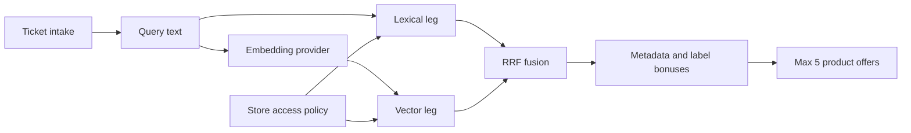

# Spec: Hybrid RFI Search

## Goal

Replace the RFI Search Agent's lexical-only ranking with local-first hybrid
retrieval over the Intelligence Store: PostgreSQL full text, pgvector cosine
similarity, metadata and controlled semantic labels. The default path remains
fully offline and deterministic.

## Retrieval Architecture



Both retrieval legs run inside the Store access boundary. Candidate products
must satisfy product status, clearance and ACG overlap before they can be
ranked, scored, counted or returned.

## Provider Matrix

| Provider | Default | Network | Behaviour |
|---|---:|---:|---|
| `mock` | yes | no | Hashes canonical tokens into a stable 384-dimension vector. Test and local default. |
| `local` | no | no | Uses FastEmbed with `BAAI/bge-small-en-v1.5` from `COEUS_EMBEDDING_MODEL_PATH`. Missing package or model logs once and falls back to lexical-only retrieval. |
| `gemini_api` | no | yes | Uses the configured Gemini API key only when `COEUS_EMBEDDING_PROVIDER=gemini_api`. Requests a 384-dimension output. Failures log once and fall back to lexical-only retrieval. |

`COEUS_EMBEDDING_PROVIDER` is authoritative. A local model, installed package or
Gemini key must never switch the provider implicitly.

## Write Path

The Store projection computes an embedding from `product_semantic_text(product)`
when a product is created, metadata is updated or a QC product is ingested. The
embedding is stored only in `intelligence_store_products.embedding`. The JSON
state store remains the source of product records and does not become an
embedding store.

An idempotent backfill entry point updates products where `embedding IS NULL`.
It is safe to run repeatedly and does nothing when no PostgreSQL projection is
configured.

## Fusion Formula

Each search run builds two top-50 ranked lists:

- lexical: `ts_rank_cd(search_document, websearch_to_tsquery(...))`;
- semantic: cosine ANN over `embedding` using pgvector.

The lists are fused with Reciprocal Rank Fusion:

```text
rrf = sum(1 / (60 + rank)) for each leg where the product appears
normalised = rrf / max_possible_rrf_for_available_legs
```

Metadata and label signals remain as explainable deterministic bonuses after
fusion:

- region match: `+0.04`;
- output format/type match: `+0.02`;
- semantic label match: `+0.02` each, capped at `+0.04`.

The displayed score is capped to `0..1` and rounded to four decimal places.
The offer threshold is `0.34`: a weak rank at the bottom of one list is not
enough on its own, while a strong lexical or semantic rank remains offerable.

## Match Reasons

Reasons preserve the existing transparent strings and add hybrid signals:

- `lexical-rank:N`;
- `vector-similarity:0.83`;
- existing `full-text:*`, `semantic:*`, `metadata:*` and
  `semantic-label:*`;
- `retrieval:lexical-only` when the embedding provider or product embeddings
  are unavailable for that run.

## Fallback Behaviour

- `mock` provider always returns a deterministic vector.
- `local` and `gemini_api` failures never crash search; they log one structured
  warning and continue with lexical, metadata and labels only.
- Products with `embedding IS NULL` remain eligible through the lexical leg.
- CI must not download models or call external APIs.

## Security Invariants

- Store access filtering is a pre-filter on both retrieval legs.
- Hidden products must not appear in vector neighbourhoods, counts, reasons or
  offers.
- Gemini embedding requests are made only when the operator explicitly selected
  `gemini_api`.
- API keys are never logged, returned to the browser or persisted in generic
  state.

## Acceptance Criteria

- Different vocabulary can match through the mock semantic leg, for example
  "boat traffic near St Petersburg" ranking a permitted "vessel movements,
  Gulf of Finland" product above the old lexical-only scorer.
- Removing the access predicate from the vector leg would fail a test.
- Empty or failed embeddings still produce lexical results with
  `retrieval:lexical-only`.
- Admin model state shows the active embedding provider and embedded-product
  count.
- Backend tests, mypy, ruff, frontend tests, typecheck, lint, format and the
  line-limit gate pass.
