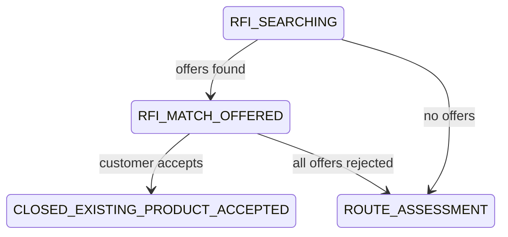
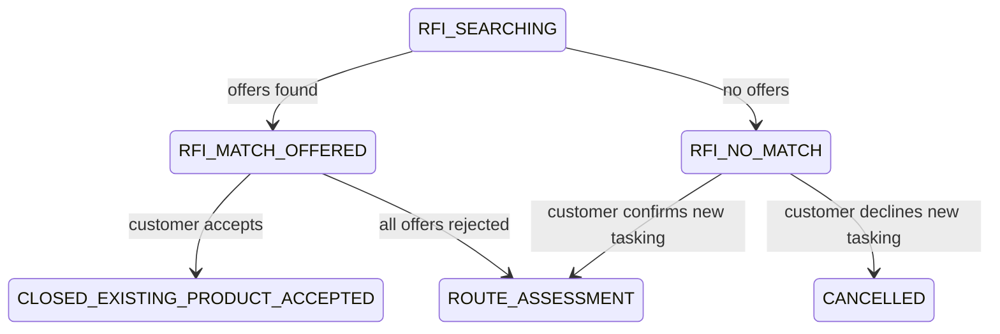

# No-Match Consent

## Status

Part C implementation specification. This document was written before the Part C
code changes.

## Problem

When RFI search finds no existing product offers, Istari currently moves the
ticket directly from `RFI_SEARCHING` to `ROUTE_ASSESSMENT`. That tasks new work
without an explicit customer decision after the "search before tasking" stage has
failed to find reusable intelligence.

The customer needs a clear recorded choice: task this as a new request, or stop.

## Goals

- Add `RFI_NO_MATCH` as an explicit customer decision state.
- Record that no existing product matched on the timeline.
- Ask the ticket owner whether to task the requirement as new work.
- Make the Yes/No decision owner-only, CSRF-validated, audited and deterministic.
- Preserve the existing route-assessment pipeline after a Yes decision.
- Cancel the request with a recorded reason after a No decision.

## Non-Goals

- Do not let the customer choose RFA or Collection. Route choice remains with
  capability agents and managers.
- Do not change existing product-offer accept/reject behaviour.
- Do not change analyst, QC or release workflows.
- Do not add background workers or asynchronous tasking.

## State Flow

Before:



After:



The only exits from `RFI_NO_MATCH` are `ROUTE_ASSESSMENT` and `CANCELLED`.

## Backend Behaviour

### RFI Search

`RfiSearchService.run` keeps the existing candidate search and offer ranking. If
offers are returned, the state remains `RFI_MATCH_OFFERED`. If no offers are
returned, it sets the ticket to `RFI_NO_MATCH` and writes a `rfi_no_match`
timeline entry with the message "No existing product matched this request." The
existing `rfi_search_completed` audit event still records the zero-offer run.

### Consent Endpoint

Add an owner-only endpoint mirroring the current confirm-delivery pattern:

`POST /api/v1/tickets/{ticket_id}/no-match-consent`

Request body:

```json
{ "taskAsNewRequest": true }
```

Rules:

- The signed-in actor must own the ticket. Non-owners receive `403`.
- The ticket must be in `RFI_NO_MATCH`. Other states receive `409`.
- `true` transitions to `ROUTE_ASSESSMENT`, appends `tasking_confirmed` and
  audits `no_match_tasking_confirmed`.
- `false` transitions to `CANCELLED`, appends `tasking_declined` with the fixed
  reason "customer declined tasking after no-match" and audits
  `no_match_tasking_declined`.

## Frontend Behaviour

The customer workspace shows a panel when the selected owned ticket is in
`RFI_NO_MATCH`:

> No existing product matches your request. Task this as a new request?

Controls:

- **Yes, task as new request** calls the consent endpoint with
  `taskAsNewRequest: true`.
- **No, cancel request** calls the endpoint with `taskAsNewRequest: false`.

Both buttons show disabled/pending states and use the shared request action-error
path for failures.

## State Enumeration Updates

Update every exhaustive or user-visible state surface:

- `TicketState` enum and state machine.
- State-machine tests.
- RFI results review states, so managers can inspect zero-match runs while the
  customer is deciding and after the ticket enters route assessment.
- Feedback analytics active-state logic: `RFI_NO_MATCH` counts as active because
  the request is still awaiting a customer decision.
- Web `TicketState` union.
- Request journey stages: `RFI_NO_MATCH` remains in the "Search existing
  intelligence" stage.
- Status formatting/pills use the existing generic state formatter.
- Any test fixtures or exhaustive switch-like assertions discovered by searching
  for `CLOSED_EXISTING_PRODUCT_ACCEPTED`.

## Security And Audit

- Consent is CSRF-validated because it changes state.
- Consent is owner-only, not just visible-ticket based. Collaborators and admins
  cannot make the customer's tasking decision through this endpoint.
- The decline path records a fixed reason to prevent unsanitised reason text from
  becoming an audit or timeline sink.
- The Yes path does not grant any route privilege to the customer.

## Tests

Backend:

- No offers from RFI search lands in `RFI_NO_MATCH` and records `rfi_no_match`.
- Consent Yes moves to `ROUTE_ASSESSMENT`, writes timeline and audit events, and
  route capability review still works unchanged.
- Consent No moves to `CANCELLED` with the fixed reason.
- Non-owner consent gets `403`; wrong-state consent gets `409`.
- State-machine test proves `RFI_NO_MATCH` has only the two allowed exits.

Frontend:

- The workspace renders the no-match consent prompt.
- Yes and No send the correct CSRF-protected payloads and update state.
- Consent failures show the shared action error.
- Journey rendering keeps `RFI_NO_MATCH` in the search stage.

## Documentation

Update `docs/AI_AGENTS.md`, `docs/USER_GUIDE.md`,
`docs/threat-model/hybrid-search-and-duplicate-detection.md` and
`docs/DEVELOPMENT_STORY.md` after implementation so they describe the final
behaviour precisely.
