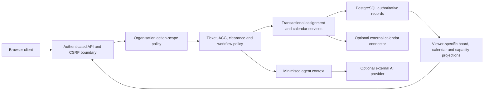

# Threat Model: Hierarchical Teams, Workforce Calendars and Task Boards

## Status and Scope

Implemented and planned controls for the feature contract in
[`hierarchical-teams-workforce-calendars-and-task-boards.md`](../specs/hierarchical-teams-workforce-calendars-and-task-boards.md).
This model covers variable-depth organisation units (initially at most 12
levels), effective memberships, descendant management grants, personal and team calendars, task boards, work
packages, capacity forecasts, assignment reservations, synthetic workforce
seeding and the capacity evidence supplied to advisory agents.

Phase 1 flat-team correctness and the Phase 2 PostgreSQL shadow controls are
implemented. The shadow enforces bounded closure, immutable topology history,
one effective home membership, stale-write rejection and atomic reconciliation
evidence, but it is not an access or workflow authority. Current live team
behaviour remains governed by
[`teams-profiles-calendars.md`](../specs/teams-profiles-calendars.md). Active
hierarchy authority remains blocked behind its cutover gate. Management-mode
commands, calendars, bounded boards and combined package planning/reservation
are implemented but are not yet the active workflow authority.

Phase 3 now includes action-specific grant lifecycle, bootstrap, create/edit,
reparent, membership, scheduled single-home transfer, empty-unit deactivation
and safe nested-unit merge and split commands. Restructure execution runs at serialisable
isolation and binds the actor, exact grants, unit versions, dependency inventory
and every record disposition to one preview hash. It end-dates rather than
deletes, preserves immutable task/profile/capability history and cancels pending
transfers atomically. Each direct child subtree has an explicit move
disposition, bounded result depth, destination-grant broadening check and
immutable path revisions. Split binds source and parent versions, requires
restructure authority for both, creates only declared collision-free successors
and requires an exact kind-safe mapping for every inventoried record. Its
single transaction preserves posting intervals, cancels future postings selected
for termination, prevents delivery records moving into structural units and
rolls back fully when inventory changes. Administrator-only APIs expose those
commands in a separate `management` mode. The UI supports tree and grant
inspection, protected bootstrap, bounded grant delegation/revocation,
previewed unit lifecycle changes, current rosters, single-home posting changes,
exact-boundary transfers and explicit-disposition merge/split. Command inputs
are disabled after assessment, and execution sends the exact stored payload
and preview hash. It states that operational routing is unchanged. Scoped
manager projections and the authority cutover are still gated and must not be
represented as active.

## Security Objectives

1. Organisational authority must not grant intelligence access.
2. Managers may see or change only the teams, people, calendars and work
   covered by an effective action-specific grant.
3. A task board must not reveal more than the underlying ticket and workflow
   policies allow.
4. Calendar availability may support planning without revealing private notes
   or sensitive absence details.
5. Eligibility, capacity and reservation decisions must be deterministic,
   concurrency-safe and independently reauthorised at commit.
6. Agents remain advisory and receive the minimum authorised structured
   context.
7. Reorganisation, delegation, seeding and repair remain auditable and
   recoverable.

## Assets

| Asset                                 | Sensitivity and required protection                                                                                 |
| ------------------------------------- | ------------------------------------------------------------------------------------------------------------------- |
| Organisation structure and rosters    | Personnel association and reporting relationships; object and action-scoped access                                  |
| Management grants and delegations     | Privileged authority; effective dates, least privilege and immutable audit history                                  |
| Profiles and competencies             | Personal data plus controlled assignment evidence; self-description cannot create authority                         |
| Calendar events and working patterns  | Potentially sensitive leave, health, travel and duty information; private detail separated from availability effect |
| Ticket and work-package metadata      | Intelligence-task context; ticket audience, ACG, clearance and workflow policy apply to every projection            |
| Capacity forecasts and reservations   | Operational workload and future availability; bounded detail and transactional integrity                            |
| Assignment decisions and explanations | Personnel and operational decisions; reproducible policy version and safe reason codes                              |
| Agent routing context                 | Minimized decision evidence; no calendar notes, biographies or unnecessary person identifiers                       |
| External calendar credentials         | Secrets; encrypted, provider-isolated and never returned                                                            |
| Synthetic workforce fixtures          | Public-repository-safe exercise data; stable identity and no real personnel claims                                  |

## Actors and Trust Boundaries

- customer and ordinary team member;
- production analyst with one effective home delivery team;
- direct team lead or manager;
- ancestor manager with selected descendant grants;
- JIOC manager and JIOC agent;
- RFA or CM area manager;
- QC reviewer;
- organisation or platform administrator;
- application-owned deterministic policy and projection services;
- optional bounded external AI provider;
- optional external calendar provider; and
- seed, migration and reconciliation operator.

Organisation scope and information-object access are two separate gates. A
successful first gate never short-circuits the second.

## Security Invariants

1. Parentage, membership and a global application role never imply descendant
   action authority.
2. A management grant is bounded by root unit, direct-or-descendant scope,
   action, effective interval and delegating authority.
3. ACG membership, clearance, ticket audience, draft visibility, product
   access and asset access never inherit through an organisation edge.
4. Named-person roster, calendar and workload detail is a stronger permission
   than aggregate visibility.
5. Calendar free text is never needed to calculate capacity and never enters
   an agent prompt.
6. Profiles, biographies and self-described interests cannot satisfy an
   assignment eligibility rule.
7. Board state is a projection of authoritative workflow commands, not an
   independent state machine.
8. Recommendation output is not assignment authority.
9. Assignment commits recheck actor, target, hierarchy, access, capacity and
   expected versions within one transaction.
10. Historical task ownership and assignment retain the organisational context
    that existed when they were committed.
11. Sprint 24 is single-tenant. No API, cache or repository accepts a caller
    supplied tenant selector; multi-tenancy requires a separate threat model.
12. Revocation, suspension and privacy restriction are monotonic and are never
    undone by generic audit compensation.

## Threats and Required Controls

| ID    | Threat or abuse case                                                                                                              | Required control and evidence                                                                                                                                                                                                                                                                                                                                                                                     |
| ----- | --------------------------------------------------------------------------------------------------------------------------------- | ----------------------------------------------------------------------------------------------------------------------------------------------------------------------------------------------------------------------------------------------------------------------------------------------------------------------------------------------------------------------------------------------------------------- |
| HT-01 | An RFA or CM manager uses the current route-wide role check to manage a sibling or unrelated branch.                              | Replace implicit route-area authority with a central action-specific management-grant policy. Add direct, descendant, sibling and unrelated-team deny tests to every manager command.                                                                                                                                                                                                                             |
| HT-02 | A parent manager infers ACG, clearance, product or ticket access from the hierarchy.                                              | Evaluate information-object policy after organisation scope for every row, card, count and mutation. Test parent access with and without independent ACG and ticket authority.                                                                                                                                                                                                                                    |
| HT-03 | Reparenting creates a cycle or exceeds the 12-level hierarchy limit.                                                              | Use adjacency plus closure records, serialisable cycle/depth checks, canonical locks, expected versions and property tests. Reject self-parenting and ancestor-under-descendant moves. Sprint 24 accepts no tenant selector.                                                                                                                                                                                      |
| HT-04 | A reparent or revoked overlapping grant leaves stale detail or aggregate access in a cache.                                       | Advance a monotonic effective-authority epoch (or complete version-set digest), discard scalar projections on mismatch, include object/workflow/privacy versions and reauthorise each sensitive object at final projection.                                                                                                                                                                                       |
| HT-05 | A manager delegates powers they do not possess or dependent cover survives source revocation or account suspension.                      | Validate action/scope as a strict subset, store source-grant lineage, cap delegation depth and reject cycles. At the PostgreSQL commit boundary, lock the account projection for every human grant holder and recorded grant creator in the lineage, then require every row to exist and be active. Only identities in the code-owned service-principal registry bypass the human-account requirement. Test source revocation, missing and suspended holders or grantors, overlapping independent grants and account-update races. |
| HT-06 | Deactivation, split or merge silently rewrites history or partially moves live work.                                              | End-date rather than delete, retain immutable topology/decision snapshots and require versioned preview plus explicit dispositions for child subtrees, memberships, grants, capabilities, tasks, reservations and events in one transaction. Implemented merge and split commands record every changed child path and pre-change task/profile/capability version.                                                 |
| HT-07 | Grant administration confers broader actions, trusts client time or has no safe empty-install root.                               | Enforce the actor's grantable-action ceiling, use PostgreSQL half-open UTC intervals and provide one audited, reauthenticated, single-use root bootstrap that permanently disables after success. Implemented bootstrap requires an admin session, CSRF, current password and deployment nonce; secrets are never persisted or returned.                                                                          |
| HT-08 | A stolen but still-valid administrator session bootstraps the hierarchy or an attacker guesses the setup nonce.                   | Require current-password reauthentication in addition to CSRF and nonce, apply the existing source and account lockout budgets, bind the actor server-side, return generic denials and permanently close bootstrap after success.                                                                                                                                                                                 |
| PR-01 | Team search or hierarchy traversal enumerates profiles outside the actor's scope.                                                 | Object-scope candidate queries, stable pagination, a maximum ten-result search response, generic not-found posture and rate/cardinality limits.                                                                                                                                                                                                                                                                   |
| PR-02 | A self-authored title, biography or specialism makes a user eligible.                                                             | Keep descriptive profiles separate from verified competencies, roles and effective assignment memberships. Test forged profile text against eligibility.                                                                                                                                                                                                                                                          |
| PR-03 | Aggregate views expose a small team's individual status through differencing.                                                     | The initial root-level daily aggregate uses a stable 15-minute snapshot and suppresses cohorts below five, unavailable counts from one to four and all incomplete/truncated totals. Per-child drill-down remains disabled until iterative complementary suppression prevents sibling differencing.                                                                                                                |
| CA-01 | Team members infer health, leave or travel from category/timing even when notes are hidden.                                       | Implemented direct-team availability returns only coarse timing and effect, with no owner identity, category, note or event identifier. Self views retain exact detail. Named, timed or categorised rows require a separate exact `calendar:view_detail` grant; private and summary entries still omit category and note. Denials use a generic not-found response.                                               |
| CA-02 | A manager creates or edits an event outside scope, or overwrites a private subject event.                                         | Recheck grant and membership, enforce the source/action matrix, keep creator/subject separate, notify the subject, provide dispute flow and audit identifiers without note text. The canonical command revalidates exact `calendar:manage` lineage and current home membership inside the serialisable write, and rejects manager mutation of personal-source events. Notification and dispute flow remain gated. |
| CA-03 | Conflicting or duplicate events distort capacity.                                                                                 | One canonical event with source, version and overlap precedence; task reservations are derived records; reconciliation reports unresolved conflicts rather than silently choosing across sources. Implemented owner/event locks, expected versions, actor-bound preview hashes and idempotency collision rejection prevent lost updates and duplicate commands; precedence and reconciliation remain.             |
| CA-04 | Rollback to a global reservation key constraint corrupts or discards legitimate cross-actor idempotency evidence.                     | Migration 0036 preflights for cross-actor key reuse and refuses downgrade transactionally before changing schema or data. Recovery remains forward on 0036 or restores a coherent pre-0036 backup; operators must not rewrite keys or delete reservation evidence.                                                                                     |
| CA-04 | Recurrence expansion or a wide descendant/date query causes resource exhaustion.                                                  | Implemented projections enforce a 100-row page and 366-day personal, 92-day direct or 31-day descendant window, and suppress aggregates if the 101st row proves the result incomplete. Hierarchy depth remains limited to 12. One deterministic reader expands only validated daily or weekly rules within 366 days, preserves local wall time and loads at most 500 capacity candidates. Complete change and cancellation exceptions are unique by ISO occurrence key and applied consistently. Malformed exceptions fail closed. Deployment statement-timeout evidence remains gated.                  |
| CA-05 | Time-zone or daylight-saving conversion makes an analyst falsely available.                                                       | Store instants plus declared time zone for timed events, local dates for all-day events, and test DST gaps, overlaps and team/user zone differences.                                                                                                                                                                                                                                                              |
| CA-06 | An external calendar token, webhook or imported title leaks or an attacker redirects connector traffic.                           | When enabled, require OAuth state/PKCE, strict account binding, redirect/outbound-host allowlists, webhook authenticity/replay control, authenticated ciphertext context and poisoned-cursor recovery. Keep imported text out of AI and logs.                                                                                                                                                                     |
| CA-07 | Calendar free text leaks through audit/outbox or deletion/rewrite of history.                                                     | Store notes only in protected event/version records. Emit bounded IDs, source, version and reason hashes to audit/outbox. Reject event deletion and history update/delete with database triggers. Disposable PostgreSQL tests verify all three controls.                                                                                                                                                          |
| TB-01 | A board card reveals a hidden ticket title, customer, ACG or facet.                                                               | Project each card through ticket audience, ACG, clearance and workflow policy. Aggregate-only views return coarse counts without hidden searchable facets or identifiers.                                                                                                                                                                                                                                         |
| TB-02 | Dragging a card bypasses manager approval, QC or separation of duties.                                                            | Map each move to an existing authorised command with expected version. Do not expose ambiguous moves. Provide equivalent keyboard/menu actions using the same command.                                                                                                                                                                                                                                            |
| TB-03 | A collaborator changes another analyst's package without authority.                                                               | Distinguish ticket collaboration, accountable package ownership, contributor actions and dependency actions. Plan-and-reserve, contributor add/end and dependency add/remove require exact current `task:assign` lineage, matching canonical leg/team ownership and versioned evidence. Contributor mutation also locks the active human Analyst account and sole eligible home posting in the owning leaf, rejects the accountable owner and duplicate participation, and records immutable command/audit/outbox evidence. Dependency mutation locks the bounded full graph, rejects cross-ticket, cross-leg, cross-leaf and cyclic links, and fails closed on graph overflow. Denial is generic. |
| TB-04 | A stale board overwrites concurrent work or loses a transition.                                                                   | Use optimistic versions and idempotency keys, return a safe conflict, refresh the projection and preserve append-only transition history.                                                                                                                                                                                                                                                                         |
| TB-05 | A task-to-Store link acts as a confused deputy and reveals a project or product.                                                  | Reauthorise both objects at link commit and every projection, return generic not-found outside either scope and make links confer no membership or visibility.                                                                                                                                                                                                                                                    |
| TB-06 | A parent manager uses a descendant board, team filter or page cursor to enumerate a child ticket they cannot access.              | Resolve action-specific lineages inside the board's repeatable-read transaction. Return detailed cards only for teams covered by current `task:view`; separately covered `organisation:view_aggregate` teams return grouped team/status counts with no ticket identifier, reference, title, package data or hidden facet, and suppress counts below five. Reject unrelated team filters generically, bind cursors to allowlisted ordering fields, cap pages at 100 and completed history at 90 days. Real PostgreSQL tests prove direct detail, aggregate-only child scope, low-count suppression, sibling denial and stable paging. |
| AS-01 | Two managers assign the same capacity concurrently, a lost response duplicates assignment, a key is reused with changed input, or a suspended owner retains capacity. | The implemented package-planning preview and command lock the canonical identity account, package, ownership and posting evidence in serialisable transactions. They require an active human Analyst account, bind its credential version and source hash into the reviewed preview, and recheck it before replay or mutation. Command and reservation identities remain actor-bound and idempotent. Package update, reservation, immutable history, audit and outbox share one transaction. Full assignment commit remains gated. |
| AS-02 | Managers or coordinators inflate the free headcount despite not being assignable analysts.                                        | Capacity requires an active account, Analyst role and effective assignment-eligible membership. Report roster, active people and assignable analysts separately.                                                                                                                                                                                                                                                  |
| AS-03 | Legacy data or concurrent commands create a second effective posting, manufacturing capacity or cross-team authority.             | Enforce a PostgreSQL non-overlap constraint per user, use serialisable versioned transfer commands, treat unresolved legacy overlap as unknown capacity and block assignment until one home-team disposition is approved.                                                                                                                                                                                         |
| AS-04 | An exclusion response reveals another person's clearance, health, conduct or caveat.                                              | Ordinary managers receive only `not_currently_eligible`, `capacity_unavailable` or `data_unknown`; sensitive cause remains separately authorised and never logged or prompted.                                                                                                                                                                                                                                    |
| AS-05 | A recommendation becomes stale after leave, reparenting, account suspension, access loss or revocation.                           | Treat preview as non-authoritative. Reload and lock session, authority, lineage, canonical account projection, membership, object access and capacity rows in the commit transaction. A changed account projection invalidates the preview even when the account later becomes active again.                                                                                                                                                                                    |
| AS-06 | Reservations remain after cancellation, hold, rework, reassignment, suspension or closure.                                        | Migration 0042 adds database-enforced monotonic reconciliation. Terminal package or ticket states release active/held reservations and end participants; hold moves capacity to held; rework releases future slices; assignment projection ends displaced participants and releases their reservations. Immutable reservation evidence remains. |
| AS-07 | Membership, access, skill, calendar or demand changes after reservation and leaves unsafe work active.                            | Account suspension, membership end and team deactivation revoke participation and capacity immediately. Calendar, estimate, deadline, competency and capability changes create bounded reforecast/review conflicts rather than silently changing committed minutes. A startup scan catches time-driven expiry while offline. |
| AS-08 | Prospective package ownership uses free-text access hints or a stale audience replica.                                           | Do not create a package-level access replica. Require an active same-route, same-team assignment on the authoritative versioned ticket aggregate; lock and decode it during commit. Product clearance and ACG policy remains a separate live object gate, and collaborators never qualify as package owners.                                                                                                               |
| AS-09 | A package owner or contributor is selected from outside the workflow leg's owning leaf.                                           | Recheck the person's sole effective home membership against the owning leaf for every assignment and contributor mutation; transfer or handover the work rather than attaching personnel from another team.                                                                                                                                                                                                       |
| AS-10 | A personnel or work transfer leaves source assignments, contributors, participant access or reservations active.                  | Require one atomic named-work disposition. The same-leaf package handover binds the complete participant, live-reservation, dependency and authoritative ticket-assignment inventory. It releases or capacity-safely replaces source-owner reservations in one serialisable transaction while contributor reservations remain unchanged. It grants no ticket/content access; cross-team or ticket-level reassignment must use the existing assignment workflow. |
| AS-15 | A source manager pushes work into another team, or a target manager accepts stale or partially described work. | Use a durable two-manager proposal. Bind source and target units, target analyst, ownership and ticket evidence, every package and disposition, expiry, and capacity plans. Revalidate both `task:transfer` grants, the receiving manager's `task:assign` grant and all bound evidence under serialisable locks before acceptance. |
| AS-16 | A work transfer is abused to cross-post personnel or retain source-team access after acceptance. | Never mutate membership in the work-transfer transaction. End all active participants on transferred packages, add only the target accountable participant after validating that person's one target-team home posting, release source reservations, and create target team holds and personal reservations atomically. |
| AS-17 | Identifier probing reveals transfer, package, team or analyst existence. | Validate the action-specific manager grant before detailed target or source evidence and map all authority or scope failures to one generic not-found response. Bind actor identity into proposal and command hashes. |
| AS-18 | Concurrent accept, reject, cancel or timeout commands produce split ownership, duplicate capacity or altered proposal evidence. | Use actor-scoped command identities, sorted transaction advisory locks, row locks ordered ticket then ownership then packages, expected versions, database-enforced immutable proposal and command evidence, grant revalidation on replay and one atomic audit/outbox commit. Exactly one terminal transition can win. Refuse destructive migration downgrade while evidence exists. |
| AS-11 | A scheduled transfer boundary leaves warm caches serving stale source access or early target access.                              | Advance the affected authority epoch atomically at activation, invalidate dependent projections and cap every cache lifetime at the next membership or grant boundary.                                                                                                                                                                                                                                            |
| AG-01 | An agent receives roster biographies, calendar notes or named personal data unnecessarily.                                        | Supply a versioned, minimised eligible-team snapshot. Named analyst selection stays with an authorised human. Schema tests forbid private fields.                                                                                                                                                                                                                                                                 |
| AG-02 | Prompt injection or malformed model output changes assignment or hierarchy state.                                                 | Treat output as untrusted advisory data, validate a strict bounded schema, re-run deterministic policy and expose no mutation tool for model-selected people.                                                                                                                                                                                                                                                     |
| AG-03 | Stale or missing capacity evidence produces confident autonomous routing.                                                         | Enforce five-minute freshness, fail to human review for stale/unknown evidence and require the pinned 48-case shadow evaluation plus independent approval before activation.                                                                                                                                                                                                                                      |
| AG-04 | Provider admission, data-region, retention or kill-switch controls regress for the new context.                                   | Inherit the accepted bounded-advisory contract, persist only admitted fields and hashes, and test classification/region allowlists, circuit behaviour and disable mode.                                                                                                                                                                                                                                           |
| SD-01 | Synthetic fixtures accidentally contain real personnel or operational claims.                                                     | Use fictional biographies and exercise-owned identifiers, review all fixtures for public-repository safety, and keep unit parentage configurable rather than asserted as real.                                                                                                                                                                                                                                    |
| SD-02 | A seed refresh overwrites local users, teams, memberships, calendars or tasks.                                                    | Enable reset only in local/test mode, require admin reauthentication and preview, reconcile stable fixture identifiers, preserve local additions and retain backup/restore evidence.                                                                                                                                                                                                                              |
| SD-03 | Duplicate units or a hard-coded analyst bias corrupts demonstrations.                                                             | Enforce seed uniqueness and workload-distribution invariants in tests, report duplicates and missing ownership, and use deterministic scenario assignment rather than a preferred name.                                                                                                                                                                                                                           |
| IN-01 | New descriptions, notes, reasons, templates or exported cells enable stored XSS, log injection or spreadsheet formula execution.  | Enforce contract byte/count/control-character limits, text-only rendering, structured logging and CSV formula escaping.                                                                                                                                                                                                                                                                                           |
| AU-01 | A mutation succeeds while its audit record fails, or compensation restores revoked authority.                                     | Commit domain state and audit outbox atomically. Revocation remains effective while audit delivery retries and is never generically compensated. Test every persistence boundary.                                                                                                                                                                                                                                 |
| MI-01 | Partial migration leaves JSON and relational state inconsistent or rollback restores broad authority.                             | Use one relational write authority per slice, checkpointed idempotent migration and read-only legacy projection. Legacy calendar import is previewed, actor-bound and idempotent, preserves provenance with stable identities, turns invalid/orphaned/colliding rows into blockers, never overwrites or dual-writes, and excludes note text from immutable evidence. After policy cutover, retain new authorisation, freeze incompatible writes and roll forward.                                                                 |
| MI-02 | Restoring an older relational backup resurrects a later grant, account, ACG, task ownership or participant authority.                        | The logical drill locks every access-bearing source table in `SHARE` mode, compares its deterministic recovery-point digest, and holds the writer fence through database and object promotion. Post-backup suspension, revocation or ownership movement fails closed. Restored sessions are invalidated. Any post-import failure truncates all allow-listed target tables; failed quarantine requires target destruction. Production recovery still requires an external monotonic revocation checkpoint and replay. |
| MI-03 | File persistence is enabled for a feature that relies on relational constraints and transactions.                                 | Fail startup when Sprint 24 is enabled with file persistence; support local PostgreSQL for runtime and in-memory adapters only for focused tests.                                                                                                                                                                                                                                                                 |
| MI-04 | A stale or partial approval is reused for different code, schema, routing or projection evidence.                                 | Hash one immutable canonical candidate containing the application release, exact schema head, three parity hashes, routing evaluation, protected checks and security review. Bind append-only approvals to that digest and fail closed on any runtime mismatch.                                                                                                                                                      |
| MI-05 | One privileged operator creates and self-approves a cutover, or fabricates external assurance.                                   | Require fresh password reauthentication, creator/approver separation and a different person for every required approval role. Record externally produced evidence references and digests only; the application never manufactures a protected check, security review or independent approval.                                                                                                                       |
| MI-06 | A route-wide cutover or interrupted migration produces mixed writers, lost work or an unsafe rollback to broad authority.        | Cut over organisation, calendar and task/capacity in order under independent writer fences and bounded quiescence. Commit visibility parity, relational authority, read-only legacy projection and an idempotent checkpoint atomically. Resume after failure and recover forward; never restore legacy route-wide authority.                                                                                           |
| MI-07 | Two workers, a stale browser or an N-1 client executes overlapping or out-of-order slices.                                       | Use candidate-bound previews, predecessor checkpoints, writer-fence generations, database locking and exact expected versions. Reject concurrent execution, stale previews and later slices whose predecessor is incomplete.                                                                                                                                                                                        |
| MI-04 | A partially configured canonical organisation projection blocks or changes the established workflow while the feature is disabled. | Compose assignment ownership and work-package projection only in explicit `management` or `active` organisation mode. Disabled mode retains the established transaction path. Shared stable unit identifiers prevent compatibility seeds and the canonical manifest from naming different teams, while active projection still fails closed on missing authority evidence.                                                                                                      |

## Authorisation Requirements by Surface

| Surface               | Organisation check                                | Independent checks                                                                                                 |
| --------------------- | ------------------------------------------------- | ------------------------------------------------------------------------------------------------------------------ |
| Organisation tree     | Direct/descendant aggregate or roster-view grant  | Field-level roster redaction and enumeration bounds                                                                |
| Hierarchy lifecycle   | Matching create/edit/reparent/restructure grant   | Expected topology version, impact disposition, serialisable integrity and audit outbox                             |
| Personnel transfer    | Roster-transfer grant on source and target        | Non-overlap constraint, work/event disposition, boundary revalidation and no early target access                   |
| Team calendar         | Calendar availability or calendar-detail grant    | Event privacy, subject/creator rules and date-window bound                                                         |
| Team board            | Task-view grant for owning team/descendant        | Ticket audience, ACG, clearance, workflow role and card-field redaction                                            |
| Assignment candidates | Task-assignment grant                             | Analyst role, active account, membership, capability, competency, prospective participant policy, capacity and WIP |
| Assignment commit     | Same grant rechecked transactionally              | Session, idempotency, versions, lineage, analyst/access state and serialised reservation lock                      |
| Parent analytics      | Aggregate-view grant                              | Cohort-size protection, deduplication and no hidden ticket facets                                                  |
| Agent context         | Application-owned evaluated release               | Minimised schema, freshness, object policy and no direct person mutation                                           |
| Store link            | Task-view plus current access to both objects     | Link grants nothing, both sides reauthorised on every projection                                                   |
| Work update           | Current recipient scope at delivery/read          | Idempotent delivery and no hidden task/calendar text                                                               |
| Workspace view/config | Matching workspace view/configure grant           | Row-level policy, owner/scope lifecycle, bounded search and revocation                                             |
| Repair/export         | Explicit repair or export action in current scope | Bounded rows, redaction, handling metadata, audit and formula-safe output                                          |

## Required Verification

### Unit and property tests

- hierarchy cycle, depth, closure and reparent invariants;
- grant subset, effective-date and delegation invariants;
- overlapping grants, source revocation, grantor suspension and delegation
  cycle/depth invariants;
- grantable-action ceiling, database-clock interval and single-use bootstrap
  invariants;
- sole-home membership, exact-boundary transfer and capacity conservation
  invariants;
- recurrence, overlap, time-zone and DST bounds;
- board-column projection for every workflow state; and
- deterministic recommendation replay with identical inputs.

### Integration and concurrency tests

- direct, descendant, sibling and unrelated object access against PostgreSQL;
- immediate revocation and effective-authority-epoch cache invalidation;
- authoritative ticket-assignment create/revoke lifecycle and stale-preview denial;
- rejection of an owner or contributor outside the owning leaf;
- atomic personnel/work-transfer disposition with no residual source authority
  or reservation;
- nested merge with complete named-record dispositions, single-home replacement,
  immutable pre-change history, pending-transfer cancellation, replay and full
  rollback when a dependency appears after preview;
- split with declared successor-only mappings, delivery-target validation,
  preserved posting intervals, scheduled-record cancellation, immutable history,
  replay and full rollback when a dependency appears after preview;
- warm-cache exact-boundary transfer with atomic authority-epoch advancement;
- competing assignment reservations with exactly one safe winner;
- monotonic revocation with audit/outbox and projection failure;
- checkpointed migration, legacy-projection reconciliation, security-safe
  rollback/write freeze and restore; and
- backup, revoke, restore and post-replay denial with all sessions invalidated;
- connector token encryption, rotation, disconnect and deletion when that
  optional phase is enabled.

### Browser journeys

- ordinary member, analyst, direct manager, ancestor aggregate manager,
  ancestor detail manager, JIOC, QC and administrator;
- private calendar detail hidden while availability remains useful;
- board cards and filters redacted for a manager without ticket access;
- stale board and assignment previews producing a recoverable conflict;
- keyboard-only board and calendar operation; and
- synthetic reset preview showing local additions preserved.

### Security tooling

- targeted Semgrep and CodeQL review of recursive queries, object access,
  calendar redaction, board projections and assignment commits;
- DAST against local or authorised staging hierarchy identifiers;
- dependency, secret, container and IaC checks;
- security-diff review for each vertical slice; and
- final repository-wide scan with no unresolved high or critical issue in this
  bounded context.

## Operational Detection and Response

Alert administrators to repeated inaccessible descendant lookups, unusually
wide roster/calendar queries, repeated small-cohort filter changes, grant or
reparent churn, reservation conflicts, orphaned reservations, projection
reconciliation failures, connector token failures and agent-context schema
rejections. Logs use identifiers and safe reason codes, not biographies,
calendar notes, credentials or ticket content.

Runbooks must cover emergency grant revocation, hierarchy rollback,
reservation repair, projection rebuild, connector disconnect, seed drift and
partial migration recovery.

## Residual Risks and Release Gates

- Workforce aggregates remain operationally sensitive even after redaction.
  Small-cohort policy and audit review require product-owner approval.
- Capacity is only as accurate as working patterns, estimates and calendar
  maintenance. Unknown or stale data must remain visible and must not be
  presented as certainty.
- Any external calendar connector creates a new credential and data-egress
  boundary. It remains deferred until the internal calendar is stable.
- Agent explanations may be persuasive despite being advisory. The UI must
  distinguish deterministic eligibility facts from generated explanation.
- Account eligibility used by capacity reads is a minimal relational
  projection committed with the authoritative account snapshot. It excludes
  credentials and personal profile fields. Malformed or duplicate source
  records abort the write, removed accounts are removed from the projection,
  and a missing row is treated as unknown rather than eligible.
- Organisation authority uses that same projection as the current human
  status source. Commit-time lineage validation locks each distinct human
  holder and grant creator in deterministic identifier order and denies the
  entire chain when any holder or grantor is missing or suspended. The lock serialises a concurrent
  suspension against the authority decision, and the next transaction sees
  the suspension immediately. Missing account rows never imply service
  identity. The only Sprint 24 service principal is the stable JIOC agent ID
  in the code-owned registry; adding another service requires an explicit
  reviewed code change.
- Relational JIOC capacity reads run as the stable internal JIOC principal with
  one revocable `recommendation:view` descendant grant. They cannot assign a
  task, inspect named rosters or calendar detail, or mutate organisation data.
  Every mapped leaf revalidates that lineage inside the forecast transaction.
- The relational adapter is selected only for explicit routing `shadow` mode
  combined with organisation `management` mode. A code-level composition test
  proves active routing retains the established context. Unknown mappings,
  revoked grants, partial cohorts and capacity corruption all produce unknown
  rather than optimistic availability.
- The independent 48-case evidence covers every relational delivery leaf and
  exact replay inputs. Demand uses positive 15-minute lower and upper bounds,
  capped at 31 days. Automatic feasibility requires conserved capacity at or
  above the approved upper bound; missing, malformed, below-range and
  inside-range evidence abstains. The distinct release remains unapproved.

Release is blocked until the permission/privacy matrices are approved, all
threat controls for the enabled phases have test evidence, no high or critical
finding remains, migration rollback is proven and the updated user journeys
show no hierarchy-derived information-access inheritance.

Legacy shadow reconciliation marks source-owned organisation units and
delivery profiles with bounded provenance. Omission may deactivate only
records owned by that source. A manually created unit or profile cannot be
claimed through identifier collision, and projection replay verifies that no
omitted source-owned unit remains active. This prevents cleanup of a legacy
snapshot from becoming a cross-authority destructive update.

Empty-install bootstrap is a separate one-shot authority boundary. The
deployment supplies a 32-to-256-character nonce, the application compares it
in constant time, and neither persistence nor audit receives the nonce. The
database serialises the ceremony, permanently records success and audits a
later or concurrent denial. Bootstrap also requires an active platform
administrator and recent reauthentication at the service boundary.

Create/edit lifecycle commands bind their preview digest to the actor and all
admitted fields. Execution rechecks the exact action grant and aggregate
version inside the serialisable transaction. Idempotency replay precedes stale
state reads but cannot change data, while a new command after revocation fails
at the final database boundary. Free-text change reasons are represented in
audit by a digest rather than retained as log content.

Reparent execution is a separate serialisable command boundary. One exact
`organisation:reparent` grant must cover both the source and destination, and
the grant lineage is locked and revalidated before commit. The preview digest
includes the source closure, current topology revision, unit versions and the
identities or versions of affected memberships, grants, capabilities and
active task legs. A move fails if the destination would make any existing
descendant grant newly cover the subtree. Closure deletion is accepted only
inside a transaction that has already written the deferred reparent command
ledger row; direct deletion remains rejected. The transaction reconstructs
the complete subtree closure, appends a topology revision for every changed
path, advances affected authority epochs and emits audit/outbox evidence. The
free-text reason is retained only as a digest in that evidence.

Membership commands use the same process-wide workforce lock as account,
availability and assignment mutations, then use PostgreSQL serialisable
transactions and a user-scoped advisory lock. The account, roster-management
grant, unit and membership version are rechecked before mutation. A PostgreSQL
half-open range exclusion constraint remains the final single-home invariant;
the command cannot create an overlapping posting even under concurrent writes.

Personnel transfers are scheduled commands, not early second memberships. A
pending transfer does not alter the source posting or grant access to the
destination. At the effective boundary, activation rechecks the active account,
the exact `roster:transfer` grant lineage over both endpoints, target version,
source version and the complete membership timeline. It then ends the source
and inserts the target at the same timestamp in one serialisable transaction.
If any check fails, the command becomes blocked with a bounded reason code and
the source membership remains open. Audit and outbox payloads contain IDs,
state and a reason digest, not the free-text transfer justification.

Team-calendar reads select one explicit view action and revalidate the exact
grant identifier, action mask, root lineage, descendant flag and effective
interval inside the same read-only PostgreSQL transaction that reads current
closure and membership. An aggregate grant cannot be replayed for detail. The
projection excludes suspended or inactive accounts and ambiguous overlapping
memberships, redacts direct teammate identity and note content, and returns no
individual rows for descendant availability. Disposable PostgreSQL evidence
proves direct redaction, descendant suppression and the exact-action denial.

Ordinary workspace discovery uses a repeatable-read PostgreSQL snapshot and
database transaction time. Home visibility derives only from one effective
active posting. Managed-unit metadata requires valid `organisation:view` and
`workspace:view` lineages, while calendar flags require their own exact
actions. Descendant scope is the intersection of hierarchy and workspace
grants, unrelated closure branches are excluded, duplicate grants are safely
deduplicated and a multiple-home integrity breach fails with a generic 503.

The board projection is read-only and workflow-derived. Direct detail validates
current `task:view` grant lineage in the same repeatable-read transaction as the
ownership/ticket query. Descendant scope resolves every covered team and keeps
`task:view` detail separate from `organisation:view_aggregate` counts. Cards are
derived from canonical workflow-leg and package ownership through a fixed state
oracle, capped at 100, stably keyset-paged and allowlist only reference, title,
priority, target date, workflow leg, team label and concurrency versions.
Aggregate rows carry only team, board column and a count suppressed below five. Requester identity,
intake narrative, chat, analyst identity, ACGs, products and draft content are
never selected into the response. Unrelated team filters and scope denials are
generic 404s, projection inconsistency is a generic 503, and completed history
defaults to 30 days with a hard 90-day API bound.

Assignment is the sole new ownership writer in this slice. The relational
commit locks the expected ticket, checks the current active organisation unit,
topology revision and route-matching delivery profile, then writes ticket,
ownership, audit and outbox atomically. The non-relational compatibility path
does not claim canonical ownership. Board moves, backfill inference and the
generic repository writer remain outside the runtime command surface.

Historical ownership reconciliation uses a PostgreSQL advisory lock and one
transaction-time snapshot. Its checkpoint identity is derived from the ordered
ticket IDs and canonical aggregate hashes, making replays idempotent. It scans
at most 5,000 active delivery tickets automatically. A route is backfilled only
when every active assignment for that route carries the same non-null team ID
and that unit has a current route-matching delivery profile. Conflicts, missing
IDs, malformed aggregates and inactive authority are blocking findings linked
to the checkpoint. The process never infers a team from a person's name, team
display text, role, recommendation or route-wide manager queue.

Enhanced package projection remains inside the relational ticket assignment
transaction. It accepts accountable candidates only from explicit active
assignments for the same workflow leg and owning unit, locks their current
postings, and requires exactly one eligible home membership in the owning leaf
team. It never derives an owner from a profile, role label, biography or team
name. Package status changes use the expected ticket aggregate, reject
completion while a canonical predecessor is incomplete, append immutable
history and release held or active reservations in the same transaction.
Historical reconciliation uses the same projection writer in missing-only mode,
so it can backfill absent packages and accountable participants while preserving
existing package decisions. Reassignment ends participants no longer present on
the authoritative ticket route and releases only their active or held capacity.
The ticket aggregate remains the sole audience authority: package history,
participants and conflicts never become an access-control replica.

Predecessor cancellation is an explicit serialisable command. It takes an
actor-scoped identity lock and a per-ticket graph lock, row-locks packages in a
stable order, and requires an exact versioned cancel, unlink or replacement
disposition for every direct dependant. The resulting bounded graph must remain
acyclic. A database trigger blocks direct cancellation when undispositioned
dependants remain, and immutable command, package history, audit and outbox
evidence share the successful transaction. Concurrent opposite-edge creation
and competing reservations are covered by real PostgreSQL one-winner tests.

Capacity reservation writes take a user-scoped PostgreSQL advisory lock and a
row lock on the expected package version. The shared reservation transaction,
including its direct store entry point, runs serialisably and locks the named
user's canonical account projection. It requires an active human Analyst who
is an active accountable owner or contributor with one current eligible home posting, a refined remaining
estimate and one working pattern covering the interval. Overlapping working
time, unavailable calendar intervals, existing reservations and capacity
exceptions are conservatively combined in 15-minute units. The request hash is
bound to its actor, idempotency key and reservation identifier. All-day dates
are expanded at local midnight in their validated IANA time zone; bounded
daily and weekly recurrence preserves local wall time. Valid cancellation and
complete-change exceptions alter the exact affected capacity interval, while
malformed exceptions and invalid rules fail closed. The management-mode HTTP
surface exposes only the combined package plan-and-reserve transaction and revalidates exact current
`task:assign` lineage inside it.
The actor is part of the reservation request hash. First execution and replay
both revalidate current lineage, preventing a known idempotency key from
becoming a cross-manager disclosure or post-revocation capability.
Planning also locks and rechecks the accountable owner's canonical account
projection before capacity calculation or any package, reservation, history,
command, audit or outbox write. Missing, suspended, non-human or non-Analyst
owners fail closed even when their team membership remains active. The preview
hash includes the locked account credential version and source hash, so an
account transition between review and execution cannot retain stale authority.
Contributor reservation creation occurs only in the reviewed contributor-add
transaction. Contributor end, package/ticket termination and eligibility loss
release or hold capacity monotonically. Calendar and planning-input changes
create review conflicts rather than silently reallocating a person's time.

Canonical My Work accepts no subject identifier and requires the signed-in
actor's `analyst:work` permission. Its repeatable-read query starts from active
package participation and requires matching package, ownership and ticket
identities. The response excludes requester identity, intake narrative, chat,
notes, products, team and person names. Unsupported or inconsistent state
fails closed with a generic 503. Stable keyset pagination is bounded to 100;
completed work is opt-in and restricted to 30 days. The profile snapshot asks
for five active rows and links through the existing independently authorised
analyst task route.

The manager forecast accepts an explicit grant identifier and revalidates its
complete current `task:assign` lineage against the direct target team in the
same repeatable-read transaction as workforce and capacity evidence. Windows
are limited to 31 days and direct cohorts to 100. It returns aggregate minutes
and generic included/unknown counts only, never user identifiers, names,
calendar categories, notes or exclusion reasons. Invalid recurrence, more
than 500 calendar candidates, missing patterns, identity mismatch and posting
ambiguity cannot produce a ready forecast. Because account identity is not in
the relational transaction, the UI labels this advisory and assignment must
still pass the serialised atomic planning checks.

Synthetic fixture reconciliation is a separate local/test-only administration
ceremony, disabled by default and rejected by runtime security outside those
environments. The HTTP contract accepts no actor identifier, requires the
authenticated platform administrator, CSRF validation and fresh password
authentication, then rechecks that same account's current authority while the
database command commits. Preview and apply are bound by an actor-specific hash
of every relevant stable-ID row, foreign root and overlap. The serialisable
transaction uses one advisory lock, rejects foreign
roots, missing identities and overlapping local postings or working patterns,
and the ordinary apply path never issues an update or delete. A distinct
reconcile command may update only previewed mutable unit, delivery-profile,
membership and working-pattern rows addressed by exact fixture identifiers.
It refuses grant, task, reservation and immutable-evidence drift, never deletes
rows and never selects local additions for repair. Exact command/idempotency
replay is journalled. Audit and outbox evidence contains manifest version and counts,
not passwords, profiles, names or roster details.

The fixture does not infer capability from titles, biographies, display names
or free text. Stable controlled identifiers populate team coverage and verified
analyst competencies, and manifest integrity requires every competency to
belong to the analyst's sole home delivery team. Calendar scenarios write the
same scope, version and command evidence as canonical event creation. Private
event notes remain empty and private visibility is still enforced by the
ordinary calendar projection policy.

Operational fixture tasks use exact stable aggregate, ownership, package,
dependency, participant, history and command identities. Preview rejects an
existing task reference, a changed row or missing supporting package evidence,
so the ceremony cannot silently attach fictional workflow state to operator
work. Scoped grants are explicit per action and root. Parentage, role names and
team labels never imply authority. Settled previews ignore only the identity of
the administrator who originally received the fixture bootstrap grants; they
do not grant those actions to a later administrator.

Deactivation is deliberately fail closed. The preview and final transaction
count active descendants, memberships, direct grants, delivery profiles,
capability coverage, active task legs and pending personnel transfers across
the subtree. Any dependency blocks the command rather than being silently
moved or deleted. The root cannot be deactivated. Successful deactivation
end-dates the unit while retaining its identity, closure and topology history,
advances covering authority epochs and emits reason-digested evidence.

Related decision: [ADR 0049](../adr/0049-hierarchical-organisations-and-canonical-workforce-capacity.md).
